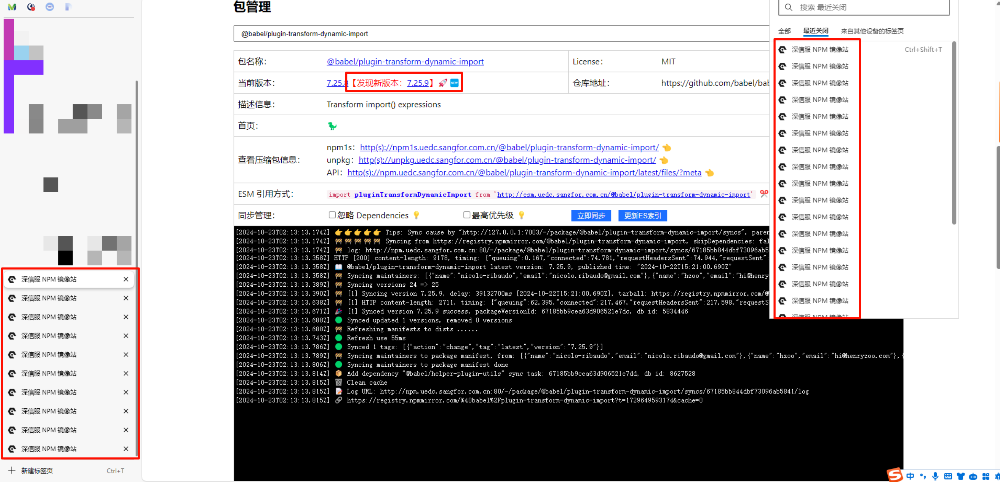
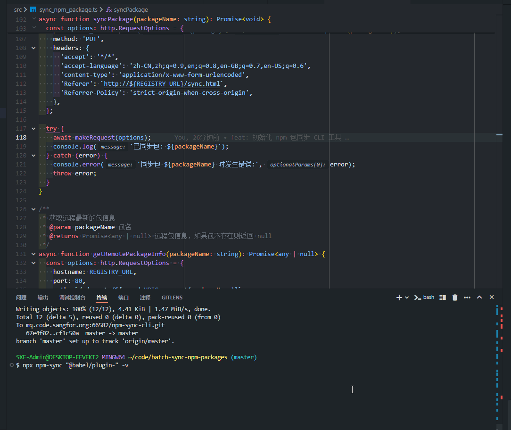
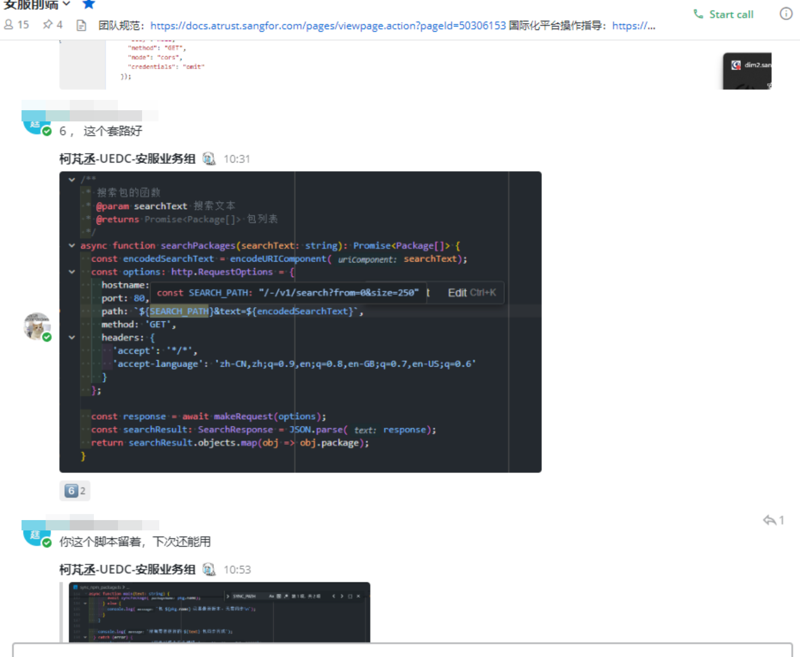

# 自动化 npm 包批量对比和同步：解决内网 npm 源同步问题（CLI）

## 背景

在使用 `@sxf/i18n-next-tool` 做流水线的静态检查时，我们小组的人遇到了一个棘手的问题：该工具没有锁定 `@babel/plugin-` 相关包的小版本。当在内网环境中安装时，镜像源发现了新版本，但这些新版本并未同步到内网镜像源中，根据排查发现有几十个包出了最新版本，需要同步更新。


## 问题分析

手动同步几十个包是一项繁琐且容易出错的工作。



要反复执行以下繁琐且低效率的流程：

1. 执行安装 `npm i -g @sxf/i18n-next-tool`
2. 安装失败，发现有最新包没同步
3. 去 npm 源网站更新安装失败的包的最新版，等待同步成功
4. 循环执行安装 `npm i -g @sxf/i18n-next-tool` 这个操作。失败了回到第二步同步下一个包
5. 直到安装成功，重新运行流水线

这个过程非常耗时且容易出错，因此我决定编写一个自动化脚本来解决这个问题。

## 解决方案

编写一个自动化脚本来解决这个问题。以下是我解决过程的关键步骤：

1. 获取包列表

首先，我实现了一个搜索函数来获取所有 `@babel/plugin-` 相关的包：

```javascript
/**
 * 搜索包的函数
 * @param searchText 搜索文本
 * @returns Promise<Package[]> 包列表
 */
async function searchPackages(searchText: string): Promise<Package[]> {
  const encodedSearchText = encodeURIComponent(searchText);

  // 首先获取总数
  const initialOptions: http.RequestOptions = {
    hostname: REGISTRY_URL,
    port: 80,
    path: `${SEARCH_PATH.replace('{text}', encodedSearchText).replace(
      '{size}',
      '5'
    )}`,
    method: 'GET',
    headers: {
      'accept': '*/*',
      'accept-language': 'zh-CN,zh;q=0.9,en;q=0.8,en-GB;q=0.7,en-US;q=0.6',
    },
  };

  const initialResponse = await makeRequest(initialOptions);
  const initialResult: SearchResponse = JSON.parse(initialResponse);
  const totalPackages = initialResult.total;

  // 使用总数作为 size 再次请求
  const fullOptions: http.RequestOptions = {
    ...initialOptions,
    path: `${SEARCH_PATH.replace('{text}', encodedSearchText).replace(
      '{size}',
      totalPackages.toString()
    )}`,
  };

  const fullResponse = await makeRequest(fullOptions);
  const fullResult: SearchResponse = JSON.parse(fullResponse);
  return fullResult.objects.map((obj) => {
    return {
      name: obj.package.name,
    };
  });
}
```

1. 对比版本

然后，我编写了两个函数来分别获取远程和本地的包信息：

```typescript
/**
 * 获取远程最新的包信息
 * @param packageName 包名
 * @returns Promise<any | null> 远程包信息，如果包不存在则返回 null
 */
async function getRemotePackageInfo(packageName: string): Promise<any | null> {
  const options: http.RequestOptions = {
    hostname: REGISTRY_URL,
    port: 80,
    path: `/-/remote/${encodeURIComponent(packageName)}`,
    method: 'GET',
    headers: {
      'accept': '*/*',
      'accept-language': 'zh-CN,zh;q=0.9,en;q=0.8,en-GB;q=0.7,en-US;q=0.6',
      'Referer': `http://${REGISTRY_URL}/sync.html`,
      'Referrer-Policy': 'strict-origin-when-cross-origin',
    },
  };

  try {
    const response = await makeRequest(options);
    const parsedResponse = JSON.parse(response);

    if (parsedResponse.error && parsedResponse.error.includes('NOT_FOUND')) {
      console.log(`包 ${packageName} 在远程源中不存在`);
      return null;
    }

    return parsedResponse;
  } catch (error) {
    console.error(`获取远程包 ${packageName} 信息时发生错误:`, error);
    throw error;
  }
}

/**
 * 获取当前私有源上的包信息
 * @param packageName 包名
 * @returns Promise<any> 当前私有源上的包信息
 */
async function getLocalPackageInfo(packageName: string): Promise<any> {
  const options: http.RequestOptions = {
    hostname: REGISTRY_URL,
    port: 80,
    path: `/${encodeURIComponent(packageName)}`,
    method: 'GET',
    headers: {
      'accept': '*/*',
      'accept-language': 'zh-CN,zh;q=0.9,en;q=0.8,en-GB;q=0.7,en-US;q=0.6',
    },
  };

  try {
    const response = await makeRequest(options);
    return JSON.parse(response);
  } catch (error) {
    console.error(`获取本地包 ${packageName} 信息时发生错误:`, error);
    throw error;
  }
}
```

1. 单个同步和批量同步

最后，我实现了同步函数和主控制流程：

```typescript
/**
 * 同步单个包的函数
 * @param packageName 包名
 */
async function syncPackage(packageName: string): Promise<void> {
  const options: http.RequestOptions = {
    hostname: REGISTRY_URL,
    port: 80,
    path: SYNC_PATH.replace('{package}', encodeURIComponent(packageName)),
    method: 'PUT',
    headers: {
      'accept': '*/*',
      'accept-language': 'zh-CN,zh;q=0.9,en;q=0.8,en-GB;q=0.7,en-US;q=0.6',
      'content-type': 'application/x-www-form-urlencoded',
      'Referer': `http://${REGISTRY_URL}/sync.html`,
      'Referrer-Policy': 'strict-origin-when-cross-origin',
    },
  };

  try {
    await makeRequest(options);
    console.log(`已同步包: ${packageName}`);
  } catch (error) {
    console.error(`同步包 ${packageName} 时发生错误:`, error);
    throw error;
  }
}

/**
 * 主函数，协调整个同步过程
 */
async function main(text: string, verbose: boolean = false) {
  try {
    console.log(`\n📦 开始搜索包含 "${text}" 的包...\n`);
    const packages = await searchPackages(text);
    console.log(`✅ 找到 ${packages.length} 个包\n`);

    for (let i = 0; i < packages.length; i++) {
      const pkg = packages[i];
      console.log(`[${i + 1}/${packages.length}] 处理包: ${pkg.name}`);
      try {
        const remoteInfo = await getRemotePackageInfo(pkg.name);

        if (remoteInfo === null) {
          console.log(`  ℹ️ 包 ${pkg.name} 只存在于内网私有源，无需同步\n`);
          continue;
        }

        const localInfo = await getLocalPackageInfo(pkg.name);

        const remoteVersion = remoteInfo['dist-tags']?.latest;
        const localVersion = localInfo['dist-tags']?.latest;

        if (verbose) {
          console.log(`  📡 远程最新版本: ${remoteVersion}`);
          console.log(`  🏠 本地当前版本: ${localVersion}`);
        }

        if (remoteVersion !== localVersion) {
          console.log(`  🔄 正在发起同步...`);
          await syncPackage(pkg.name);
          console.log(`  ✅ 同步完成\n`);
        } else {
          if (verbose) {
            console.log(`  ✅ 已是最新版本，无需同步\n`);
          }
        }
      } catch (error) {
        console.error(`  ❌ 处理包 ${pkg.name} 时发生错误:`, error);
        console.log(`  ⏭️ 继续处理下一个包...\n`);
      }
    }

    console.log(`✅ 所有 "${text}" 包的同步过程已完成\n`);
  } catch (error) {
    console.error('❌ 同步过程中发生错误:', error);
  }
}

// 导出主函数
export { main };
```

1. CLI 工具封装

为了使这个脚本更易于使用,我将其封装成了一个 CLI 工具并发布在内网源中。

以下是 CLI 入口文件的代码:

```javascript
#!/usr/bin/env node

import { program } from 'commander';
import { main } from './sync_npm_package';

program
  .version('1.0.0')
  .description('一个用于同步 npm 包的 CLI 工具')
  .argument('<search-text>', '要搜索的包名文本')
  .option('-v, --verbose', '显示详细输出')
  .action((searchText: string, options: { verbose: boolean }) => {
    main(searchText, options.verbose);
  });

program.parse(process.argv);
```

1. 运行效果



## 使用方法

文档地址:  [http://npm.uedc.sangfor.com.cn/sync.html#@sxf/npm-sync-cli](http://npm.uedc.sangfor.com.cn/sync.html#@sxf/npm-sync-cli)

通过 npx 临时调用：

```javascript
npx npm-sync <search-text>
```

全局安装：

```javascript
npm install -g @sxf/npm-sync-cli
```

使用:

```javascript
npm-sync <search-text>
```

选项:

- -v, --verbose: 显示详细输出

示例:

```javascript
npm-sync "@babel/plugin-" -v
```

这个命令会搜索并同步所有包含"@babel/plugin-"的包,并显示详细输出。

## 技巧与经验

在解决这个问题的过程中，我运用了以下技巧：

1. **利用浏览器开发工具**：从浏览器的 Network 面板复制出 fetch 请求，然后将其转换为 Node.js 代码。
2. **借助 AI 辅助编程**：使用 Claude 等 AI 工具帮助转换和优化代码。
3. **渐进式开发**：从基本功能开始，逐步添加更复杂的逻辑，最终满足所有需求。
4. **模块化设计**：将不同功能拆分为独立的函数，提高代码的可读性和可维护性。
5. **CLI 工具封装**: 将脚本封装成 CLI 工具,提高使用便利性和通用性。

## 心得体会

通过这次经历,我深刻体会到了自动化的重要性。用自动化脚本代替重复的人工工作不仅提高了效率,还大大降低了出错的可能性。将脚本封装成 CLI 工具更是提高了其通用性和易用性,使得团队中的其他成员也能方便地使用这个工具。这再次证明了"懒惰是程序员的美德"这句话的正确性。

## 启发与帮助

这个解决方案对其他开发者有以下启发：

1. **通用性**：这个脚本是通用的，可以用 `ts-node` 直接运行，适用于任何需要批量同步 npm 包的场景。
2. **问题解决思路**：面对复杂问题，可以将其拆解为小步骤，逐个击破。
3. **工具的灵活运用**：善用浏览器开发工具、AI 辅助工具等，可以大大提高开发效率。
4. **自动化思维**：对于重复性的工作，要养成编写自动化脚本的习惯。
5. **易用性思维**：相比于提供脚本代码给别人使用，更好的做法事将脚本封装成 CLI 工具，提高使用便利性和通用性。

## 结论

通过这个项目，我不仅解决了当前的同步问题，还创造了一个可以长期使用的工具。它提醒我，在日常开发中，我应该时刻思考如何通过自动化来提高效率，减少人为错误。希望这个经验能够帮助到其他面临类似挑战的开发者。

## 价值



