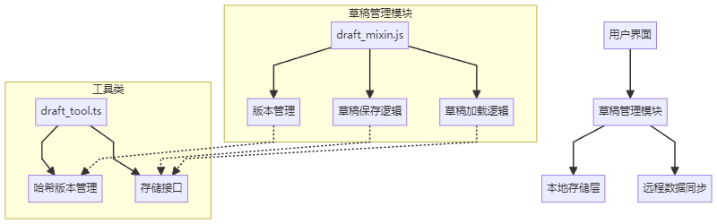

# MSS 报告中心自动保存草稿功能解密

## 背景

在 MSS 报告中心中，服务经理经常需要编辑复杂的报告。由于报告编辑过程可能比较耗时，我们需要一个可靠的草稿保存功能，防止服务经理因意外情况（如浏览器崩溃、网络中断）而丢失编辑内容。

## 技术方案

使用 `Vue mixin` ，配合 `localStorage` 来实现自动保存。下面是整体架构：



### 核心实现

#### 1. 存储结构

按用户和模板 ID 来存储草稿数据：

```typescript
interface DraftStorage {
  [templateID: string]: {
    formValue: object;          // 表单数据
    editorContent: any;         // 富文本编辑器内容
    pptReportData: object;      // PPT报告数据
    params: object;             // 请求参数
  }
}
```

#### 2. 防抖保存策略

为了不频繁保存，设计两种防抖方式：

```javascript
// 普通防抖：5秒后保存
this._draftMixin_debounceSave = debounce(this._beforeSave, 5000);

// 快速防抖：50毫秒后保存，用于重要场景
this._draftMixin_immediateDebounceSave = debounce(this._beforeSave, 50);
```

#### 3. 版本管理机制

通过版本哈希比对，确保草稿数据能和当前系统一起使用：

```javascript
// 根据UI组件版本生成哈希值
const uiName = ['ui-base', 'ui-report', 'ui-efficiency'];
versionHash = uiName.map((name) => versionMap[name]).join('-');

// 版本比对
if (storedHash !== currentHash) {
  // 清空不匹配的草稿数据
  localStorage.removeItem(draftKey);
  localStorage.setItem(versionKey, currentHash);
}
```

## 实现难点及解决方法

### 1. 保存时机控制

**问题**：什么时候保存草稿最合适？既要保证性能，又要保证数据安全。

**解决方法**：用不同的延迟时间：

- 普通编辑：5 秒后保存
- 重要操作（如编辑 echarts 图表）：50 毫秒快速保存
- 选数据面板组件加载状态结束后强制保存

```javascript
// 编辑内容时触发
handleContentChange() {
  this.$_draftMixin_debounceDraft();
}

// 重要操作时触发
// 父组件
Bus.$on('save-draft-immediate', this.$_draftMixin_immediateDraft);
// 图表编辑组件
Bus.$emit('save-draft-immediate');
```

### 2. 版本兼容性

**问题**：版本更新后，旧草稿数据可能无法使用。

**解决方法**：用 UI 服务的版本哈希标记，版本不同时清空旧草稿：

```javascript
// 检查版本并处理兼容
$_draftMixin_initDraftStorage() {
  const storedHash = localStorage.getItem(this._versionKey);
  const currentHash = this._getCurrentVersionHash();

  if (!storedHash || storedHash !== currentHash) {
    // 版本不同，清空草稿
    this.$_draftMixin_emptyStorage();
    localStorage.setItem(this._versionKey, currentHash);
  }
}
```

### 3. 用户体验优化

**问题**：草稿保存应该不打扰用户的正常操作。

**解决方法**：用简单的提示，短暂显示保存成功的提示：

```javascript
// 保存成功后的小提示
_notifySaveSuccess() {
  this.$message({
    message: '自动保存成功',
    type: 'success',
    duration: 1000,
    showClose: false
  });
}
```

## 实施效果

这个功能上线后，很好地解决了内容丢失的问题，这大大提升了用户体验。

## 后续改进方向

1. **远程存储**：把草稿存到云端，支持在不同设备上使用
2. **增量保存**：只保存变更部分，减少存储开销
3. **草稿管理界面**：让用户可以查看和管理草稿

## 技术总结

通过 `Vue mixin` 和 `localStorage` 实现了一个简单但有效的草稿保存功能。这种方案容易加入到项目中，对性能影响小，用户体验也很好。在实现类似功能时，合理的防抖策略和版本管理机制是保证功能稳定性的关键。
