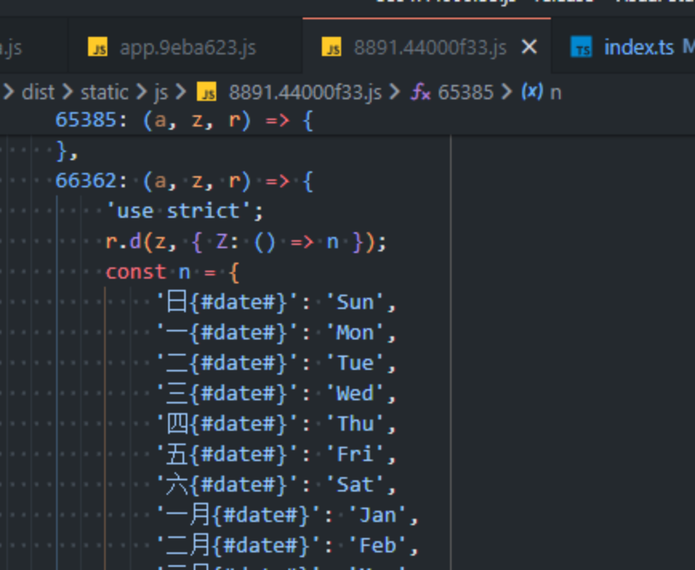

# 动态 import 和静态 import 之间的差异

## 背景

回顾一下上周四的登录页词条加载失败的线上问题：用户在刷新平台回到登录页后，页面上不能正常展示中文，全都是词条，这时候控制台报错：“词条包加载失败”。

线上环境经常能复现。在测试环境非常难复现，只有一两个测试发现了这个问题。本地环境更是一次都复现不了。


这篇分享，主要是为了让自己捋清问题的原因、涉及到的原理和排查过程中的收获，并分享给有兴趣的人。

## 排查过程

### 初步分析

由于之前经常出现升级后页面白屏需要强刷的情况，所以同事和运维优先跟用户反馈：“Ctrl + F5 强制刷新就好了”。经过实践确实大多数这个 bug 出现的时候都能通过强制刷新解决。

也正是由于“强刷能解决”，导致我一开始判断问题的原因是：**缓存问题**。

先**提前说明往失效的缓存去排查是一个错误的方向**，但是我还是做了一些尝试。写了个 demo 研究了下 webpack 打包生成 hash 和 contenthash 的区别，没发现什么毛病。而 MSS 工单的 webpack 打包配置的输出是 file.[contenthash].js，引用 ChatGPT 的回答，讲一下 contenthash 的好处：

> 在 Webpack 中，hash 和 contenthash 都是用于生成文件名的哈希值。它们的区别在于，hash 是基于整个项目的构建过程生成的哈希值，而 contenthash 是基于文件内容的哈希值。
> 使用 contenthash 有以下好处：
>
> 1. 缓存优化：当文件内容发生变化时，contenthash 会发生变化，从而可以让浏览器重新请求新的文件，避免缓存旧的文件。
> 2. 文件粒度控制：使用 contenthash 可以让我们对每个文件进行粒度控制，而不是整个项目的构建过程。这样可以避免因为一个文件的变化而导致整个项目的构建过程重新执行。
> 3. 长期缓存：使用 contenthash 可以让我们实现长期缓存，因为只有当文件内容发生变化时，才会生成新的哈希值，从而让浏览器重新请求新的文件。
>    综上所述，使用 contenthash 可以让我们更好地控制文件的缓存和粒度，从而提高项目的性能和可维护性。

那么问题到底出在哪呢？先说一下根源：国际化会在页面的 `xx_entry.js` 执行之前先执行 `i18n/init.js`，`i18n/init.js` 的作用就是加载所有的词条，挂载到 window 下。如果 `xx_entry.js` 已经开始执行的时候，`i18n/init.js` 还没有被执行，`new Vue` 的时候就会发现词条还没有加载好，就只能以一个空对象去创建国际化了，所以页面上全都是词条。

根源清楚了，但是还是不知道为什么执行 `xx_entry.js` 的时候还没执行 `i18n/init.js`。当时内心就来了一个 一键三连.jpg


### 反复分析

经过我对比上周四合入的国际化相关可疑代码，找到了这样一段逻辑，给大家看一下。事先说明 `i18n/init` 完全是同步，用来加载词条，不存在异步任务。


诶，大家可能一看，有的人可能看出问题了，有的人的想法会跟我当时一样：感觉没毛病。

说说我的想法：因为国际化的词条加载必须先于真正 entry 的加载，所以我按照 `import('./main_entry');` 的写法，也写了一个 `import('i18n/init');` 放在前面。

我知道，import()会返回一个 promise，是异步的；require()是同步的。但是我想到，`new Promise` 接收的 executor 函数会立即执行，既然 `i18n/init` 里面的代码是完全同步的，怎么会有问题呢？🤡 当时就**以为**它最终会是这样的，这样写没什么问题，加载 main_entry 的时候 init 早就执行完了。

```javascript
new Promise(()=>{
  // 加载framework/i18n/init
});
new Promise(()=>{
  // 加载main_entry
});
```

但是线上复现这个问题的频率很高，已经被十几个用户反馈过了，所以我感觉出问题也只能出在这个地方，也就是说：**连续的 import()并不能控制好加载的先后顺序**。

于是我开始分析打包后的产物，找到词条加载的逻辑到底在哪一个 js 中。


从打包产物可以看到 `i18n/init` 的一部分逻辑被打包成了 `7097.40d468a.js`，再去找一下引用这个 js 的地方。


可以看见 app.js 和每个入口 js 都引入了 `7097.40d468a.js`，与它同时加载的 `8891.44000f33.js`，内容是引入 polyfill。



所以一行 `import('framework/i18n/init');` 最终打包完变成了一行 `Promise.all([r.e(7097), r.e(8891)]).then(r.bind(r, 37097))`，而 `import('./main_entry');` 则变成了另一个 `Promise.all([])`

这么看好像还是没什么毛病，第一个 Promise.all 执行的都是同步代码，那么第二个 Promise.all 开始执行的时候，第一个已经执行完了对不对？

然鹅出现问题的，恰恰就是第一个 Promise.all，`r.e(7097)` 会去调用运行时的代码，因为 import()的核心作用是按需加载，防止首屏一下子请求过多的 js 文件，而是执行到这个 js 的时候才去请求这个 js。


所以 `r.e(7097)` 并不会变成我想象中的，`new Promise(()=>{加载framework/i18n/init});`，而是会像下面这样


wtf，好好地同步代码怎么给我丢到.then()里面变成微任务去执行了？？问题根源一下就找到了 🤡

修改方案也呼之欲出，有两种修改方法：

```javascript
import 'framework/i18n/init';
import('./main_entry');
```

或者在 vue.config.js 中将 entry 配置成数组

```javascript
// vue.config.js
config.entry = {
    app: ['framework/i18n/init', './src/framework/index.ts'],
}

// src/framework/index.ts
import('./main_entry');
```

这时候可能有人问，前后有什么差异，我们采用第一种写法再次分析打包的产物


再查找一下引用 `chunk-common.f576c8c.js` 的地方


一下子豁然开朗。。。这两个脚本的执行顺序按照它们在 HTML 中出现的顺序执行，自然而然就很好的控制了加载的时机。

### 间接因素

MSS 的缓存策略是：html 不缓存，js 强缓存，指定文件协商缓存。

`i18n/init` 加载了全量的词条，整个 js 打包完会达到 1.7M，但是我们开启了 br 压缩，传输过程只有 200k


传输完毕后会解压，并设置为强缓存，当用户访问平台的时候，浏览器会自行判断把这个 js 缓存在内存中还是磁盘中。

一旦 `i18n/init` 比 `main_entry` 加载返回的得慢，就会导致 `main_entry` 开始执行了，init 还没开始，所以这时候就会报错："国际化词条包加载失败"。

当 `i18n/init` 是通过接口或者内存缓存来响应的，几乎都是比 `main_entry` 来的要快的，毕竟请求的发出也有先后顺序，这两种情况能做到先发请求的先执行。


然鹅有时候浏览器会把 `i18n/init` 放在磁盘中，磁盘的读写比较慢；再把 `main_entry` 放在内存中，就会导致 `i18n/init` 先请求后执行，所以用户页面上出现了词条的 key。

## 总结

这是一个对于静态导入和按需动态导入的原理不熟悉导致的一个问题。

排查过程分析了缓存策略、webpack 的 contenthash、entry、chunk，还有不同缓存策略之间带来的差异性，最终找到问题代码和“为什么偶现”的原因。
