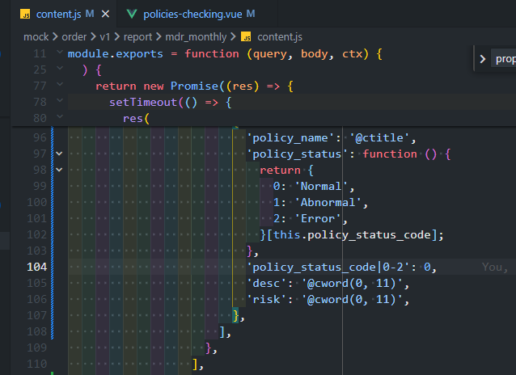
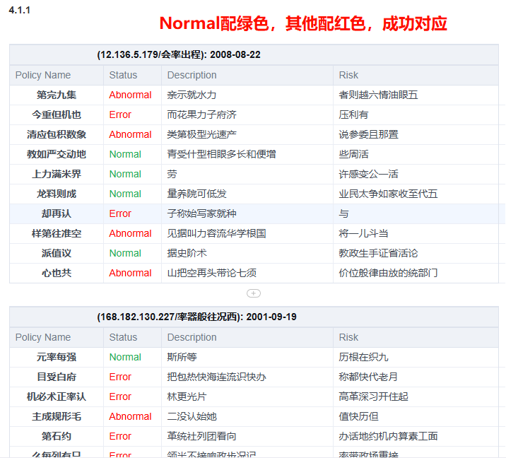

# 怎么在 Mock.js 中优雅实现枚举映射？

## 问题背景

在前端开发中，我们经常需要处理状态码与状态描述之间的映射关系，尤其是在模拟数据时。Mock.js 作为一个流行的模拟数据生成工具，如何在其中实现优雅的枚举映射是一个值得探讨的话题。

## 常见的枚举映射场景

最典型的场景是状态码与状态文本的对应关系。例如，在一个需求的后端接口中，同时返回了 `policy_status` 和 `policy_status_code`，两个字段都为枚举值，并且成映射关系：

<table>
<tr>
<td>policy_status_code<br/></td><td>policy_status<br/></td></tr>
<tr>
<td>0<br/></td><td>Normal<br/></td></tr>
<tr>
<td>1<br/></td><td>Abnormal<br/></td></tr>
<tr>
<td>2<br/></td><td>Error<br/></td></tr>
</table>

前端需要根据不同的 `policy_status_code`，展示不同的颜色。而 `policy_status_code` 和 `policy_status` 是呈现一一对应的关系的。

那么怎么在 Mock 的时候，让 Mock 数据按照这种映射规律生成我们预期的响应呢？

## Mock.js 中实现枚举映射的三种方式

### 1. 使用函数返回映射对象

```javascript
'policy_status': function() {
  return {
    0: 'Normal',
    1: 'Abnormal',
    2: 'Error',
  }[this.policy_status_code];
},
'policy_status_code|0-2': 0
```

这种方式的优点是直观明了，缺点是映射关系写在函数内部，不易复用。

### 2. 使用外部常量映射

```javascript
// 定义映射关系
const POLICY_STATUS_MAP = {
  0: 'Normal',
  1: 'Abnormal',
  2: 'Error',
};

// 在Mock中使用
Mock.mock({
  'list|5': [{
    'policy_status_code|0-2': 0,
    'policy_status': function() {
      return POLICY_STATUS_MAP[this.policy_status_code];
    }
  }]
});
```

这种方式将映射关系提取出来，便于复用和维护。

### 3. 使用 Mock.Random 扩展

```javascript
// 扩展Random对象
Mock.Random.extend({
  policyStatus: function(code) {
    const map = {
      0: 'Normal',
      1: 'Abnormal',
      2: 'Error',
    };
    return map[code] || 'Unknown';
  }
});

// 在Mock中使用
Mock.mock({
  'list|5': [{
    'policy_status_code|0-2': 0,
    'policy_status': function() {
      return Mock.Random.policyStatus(this.policy_status_code);
    }
  }]
});
```

这种方式更加灵活，可以在多个 Mock 模板中复用。

## 实际效果



通过上述方法我们实现了 `Mock.js` 中两个枚举字段的映射关系。



## 最佳实践

对于复杂项目，我推荐以下最佳实践：

1. **集中管理枚举映射**：创建专门的枚举配置文件

```javascript
// enums.js
export const POLICY_STATUS_TEXT = {
    0: 'Normal',
    1: 'Abnormal',
    2: 'Error',
};
```

1. **创建 Mock 辅助函数**：

```javascript
// mock-helpers.js
import { POLICY_STATUS_TEXT } from './enums';

export function getStatusText(code) {
  return POLICY_STATUS_TEXT[code] || 'Unknown';
}
```

1. **在 Mock 模板中使用**：

```javascript
import { getStatusText } from './mock-helpers';

Mock.mock({
  'list|5': [{
    'policy_status_code|0-2': 0,
    'policy_status': function() {
      return getStatusText(this.policy_status_code);
    }
  }]
});
```

## 总结

在 Mock.js 中实现枚举映射有多种方式，选择哪种方式取决于项目的复杂度和团队的偏好。对于大型项目，建议将枚举映射集中管理，并创建辅助函数来提高代码的可维护性和复用性。这样不仅能保持 Mock 数据的一致性，还能与实际业务代码共享枚举定义，减少维护成本。
