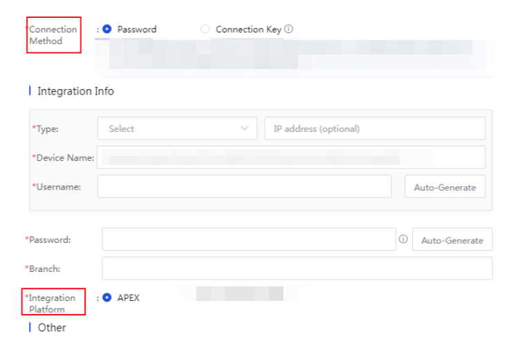

# 一次 Code Review 引发的思考：CSS 变量与 LESS 变量的区别

## 问题背景

在近期一个版本发布前的国际化（i18n）检视中，翻译团队和视觉设计师提了一个中英文布局的适配问题。具体场景是，同一个表单标签，在中文环境下需要 `100px` 宽度，而在英文环境下需要 `124px` 才能保证 UI 对齐，避免 Label 换行。



## 方案探索与决策过程

#### 第一步：初步方案 - 采用 CSS 变量

我的第一反应是，这是一个典型的“动态样式”问题。利用 Vue 的数据绑定和现代 CSS 的特性，我很快想到这样实现：

- **思路**：在 JS 中通过计算属性（`computed`）判断当前语言环境，动态生成宽度值。然后，通过内联 `:style` 将这个值注入到一个 CSS 自定义属性（CSS 变量）中，供样式表消费。
- **实现 (V1.0)**：

```html
<template>
  <sf-form :style="{ '--label-width': labelWidth + 'px' }">
    <!-- ... -->
  </sf-form>
</template>
<script>
import { $isEn } from 'framework/i18n';
export default {
  computed: {
    labelWidth() { return $isEn ? 124 : 100; }
  }
};
</script>
<style lang="less" scoped>
.some-child-element {
  width: var(--label-width);
}
</style>
```

- 这样代码能跑，能满足需求，逻辑也看似清晰。提交 PR 后，我收到了雷导的 Code Review。

#### 第二步：收到 Review - 代码受到质疑

雷导负责审核我的 PR，看完以后评论了一个 Review 问题：

> **“同样是定义变量，这里为什么突然用 CSS 变量**
> **下面是用 LESS 常量不可以吗？使用 CSS 变量的意义是什么？**
> **此项目中这种写法几乎不存在，不建议在这里突然新增写法，除非好处非常明显。”**

这条评论让我停下了脚步。我意识到，我可能陷入了某些误区，为了用新技术（CSS 变量），又或者是直接抄老写法，而没有深入思考其必要性和对团队的影响。

#### 第三步：分析根源 - 两种变量的本质区别

我开始重新分析这个场景和两种技术的本质：

1. **LESS 变量 (****@variable****)**: 它是 **编译时** 的。在项目构建时，变量就会被替换成静态的值。它更像是一个代码书写阶段的“宏”，用来统一管理固定的设计规范。
2. **CSS 变量 (****--variable****)**: 它是 **运行时** 的。浏览器在渲染时才去解析它的值，并且可以被 JS 随时修改，实现页面动态响应。

回看我的需求：语言环境是在页面加载时就确定的，后续不会改变。这是一个“一次性”的动态场景，而非“持续性”的动态交互。因此，使用编译时的 LESS 变量结合 CSS 属性选择器，是更对症的方案。

另一个关键点是雷导提到的**团队一致性**。在一个大型项目中，引入一个不常见的编码模式确实会增加后续的维护成本，甚至给维护同事带来疑惑。为了代码的长期健康，遵循既定规范比展示个人技术偏好更重要。

#### 第四步：修改代码

基于以上分析，我重构了代码，将样式逻辑完全收敛在 `<style>` 块内部。

- **实现 (V2.0)**：

```html
<style lang="less" scoped>
// 统一定义静态变量
@label-width-zh: 100px;
@label-width-en: 124px;

.some-child-element {
  width: @label-width-zh; // 默认中文样式
}

// 假设根元素有 lang 属性，通过它覆盖英文样式
[lang='en_US'] .some-child-element {
  width: @label-width-en;
}
</style>
```

- 这个方案职责更清晰，也更符合项目的技术栈习惯。我还顺便把项目里另一处类似的历史代码（原来我抄的那一个文件）也一并重构了。

## 经验总结

这个 Code Review 问题让我收获良多，总结如下：

1. **理解技术边界是前提**：必须清晰地区分技术的适用场景。CSS 变量为“运行时”的持续动态交互而生（如主题切换、用户自定义 UI）；而 LESS/Sass 变量则服务于“编译时”的静态代码组织和复用。
2. **工程化中，一致性大于技巧性**：在团队协作中，代码的可读性和可维护性至关重要。遵循既有的编码规范，比引入一个“更酷但非必要”的写法更有价值。
3. **动态需求的分类**：要区分“一次性”动态（如 i18n 环境）和“持续性”动态（如用户交互）。前者更适合用纯 CSS 方案（如属性选择器）解决，后者才是 CSS 变量的主场。
4. **重视 Code Review 的价值**：一个有深度的 Review 是发现个人知识盲区、提升工程思维的绝佳机会。

## 结论

这次经历提醒我，作为工程师，我们不仅要追求“实现功能”，更要深入思考“为何这样实现”。对技术方案进行严谨的评估和权衡，并充分考虑其对团队和项目产生的长期影响，才是专业精神的体现。
