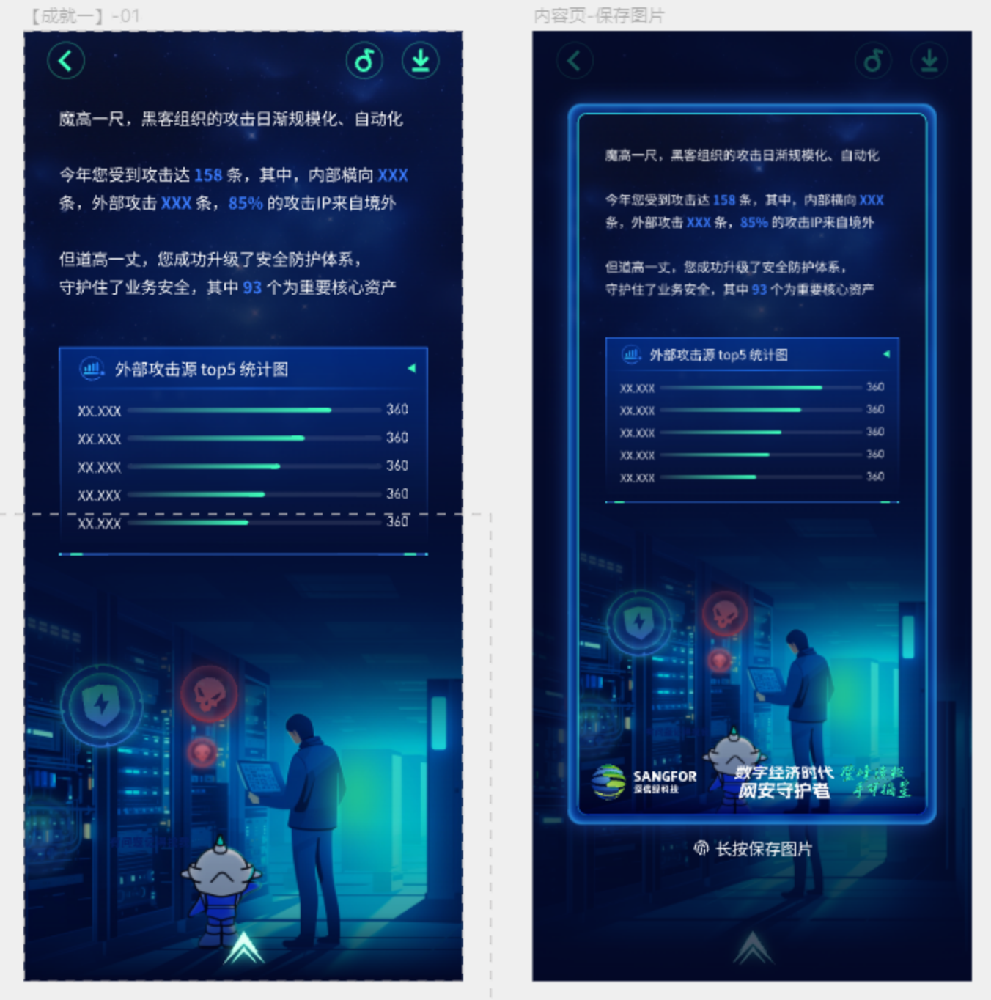
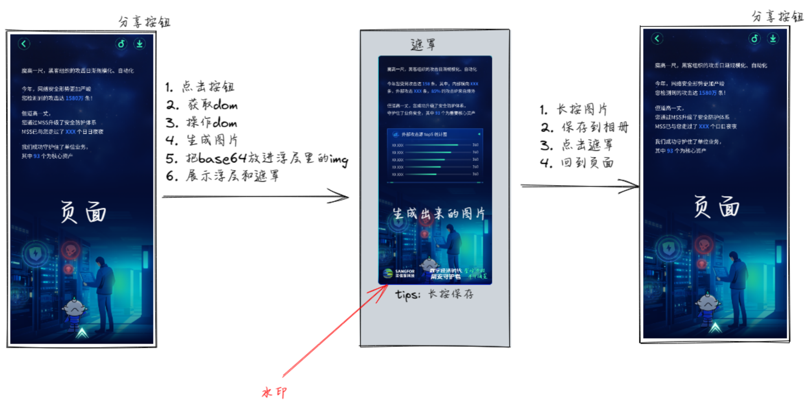
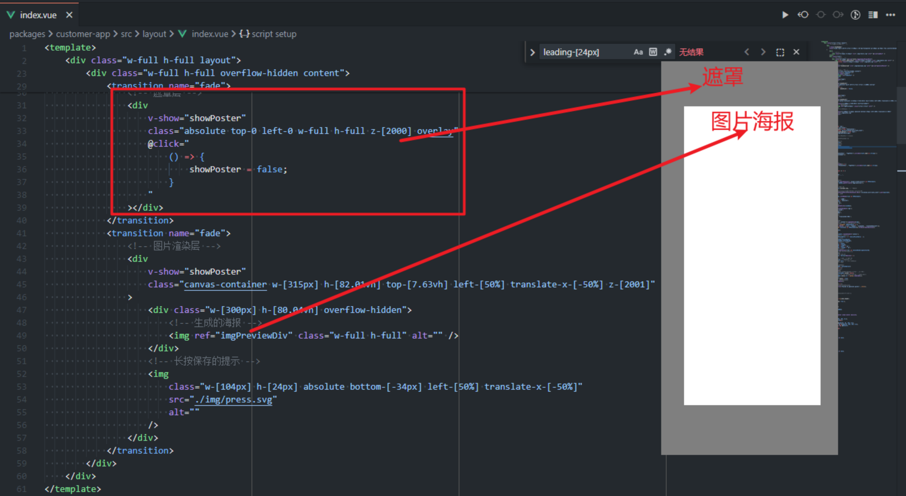

# html2canvas 生成移动端海报

# 前言

移动端业务裂变业务最大的难点就是移动端缺少快速裂变的渠道，仅靠搜索引擎的导流，获得的流量和客户引流是极其有限，这也是 SEO 优化逐渐被人忽视的根本原因。我们的业务肯定希望在微信、微博、抖音等渠道进行快速裂变，但是这些渠道对移动端等网页的引流做了很强的限制，例如二跳限制、合规限制，巧妇难为无米之炊啊。

最常用的解决方案则是依赖图片分享转发来绕开流量平台的 URL 限制，常见的就是各种海报、截图，形式多种多样。这样一来就给开发带来了更高的要求，分享图必须拟合客户画像，内容丰富且依据客户深度定制，表现的张力很强，才能吸引客户去分享。

# 背景

在做年度账单 h5 项目的时候，由于微信 h5 不存在和微信底层通信的能力，没法发起朋友圈分享，只能退而求其次选择生成海报功能：用户进行账单回顾的时候，每一页都给一个保存按钮，用于生成当前页面的海报图片，供用户保存。

# 方案

常规的方案：前端生成和后端生成。

1. 前端生成则是指在前端浏览器端生成，一般可以选择 html2canvas 或者直接使用 HTML5 canvas 的 API 直接绘制。
2. 后端生成是指在 Nodejs 服务端中，通过调用 chrome 内核来加载对应的页面，然后使用浏览器等内置 API 进行截图，例如使用 puppeteer 生成 pdf。通过后台服务生产的图片在清晰度和字体显示的平滑程度方面效果是最好的，并且开发方式简单，Nodejs 服务器前端可以自己开发和维护，但缺点是服务端生成依赖 Nodejs 服务，增加额外的服务器环境维护工作和开发工作。

考虑到熟悉程度 + 上线时间，后端生成的方案直接被 pass 了。本文主要关注 html2canvas 的前端生成方案，实现这个功能的大致思路和具体实现

# 介绍

html2canvas 是很成熟的 JavaScript 库，拥有 2.9W+ 的关注，经过长时间的迭代其性能和使用体验可以得到很好的保障。其实 html2canvas 底层是使用 canvas API 实现的，因此也可以直接使用 canvas API 来进行效果绘制，优点就是性能高，不必依赖于 DOM 结构的渲染，可以直接绘制 canvas 生成图片，也可以摆脱 DOM 的限制，做出一些酷炫的效果；缺点就是实现的难度太大，普通开发学习成本高，难以很快上手。

# 视觉稿



# 实现思路

可以看到场景比较简单，就是获取当前页面展示的内容，然后绘制出一张图片，以浮层的形式展示在页面上。

#### 流程比较简单，大致如下：

1. 点击按钮
2. 找到要生成图片的那个 dom
3. 克隆一个新的，删掉上划箭头，添加水印，把新 dom 放到原 dom 的父节点最后
4. 调用 html2canvas 的 API，生成图片，将 base64 的值赋给浮层中 img 的 src
5. 移除克隆出的新 dom
6. 展示遮罩层和浮层
7. 长按保存
8. 点击遮罩层关闭浮层

#### 图解:



# 模板代码



# JS 代码

```javascript
// 定义响应式变量控制海报的显示
const showPoster = ref(false);
// 定义响应式变量用于存储图片预览的DOM元素
const imgPreviewDiv = ref<HTMLImageElement>();

// 定义生成海报的函数
const generatePoster = async () => {
    // 打开加载提示弹窗
    showLoadingToast({
        message: '图片生成中...',
        forbidClick: true,
        duration: 0,
    });
    // 获取当前页面上显示的dom
    const domObj = document.querySelector('.swiper-slide-active') as HTMLElement;
    const page_position = domObj.getAttribute('page-position');
    // 请求参数
    const payload = {
        page_position, // 页面位置
        customer_key: store.customer_key, // 客户秘钥
    };
    // 使用自定义的fetch方法发送post请求，并解构出execute函数
    const { execute } = useCustomFetch<PostSaveCount.Res>('/v1/annual_bill/save_count').post(payload);
    await execute(); // 执行请求
    // 克隆这个dom
    const cloneDom = domObj.cloneNode(true) as HTMLElement;
    // 设置不可见样式
    cloneDom.style.zIndex = '-1000';
    cloneDom.style.position = 'absolute';
    cloneDom.style.top = '0';
    cloneDom.style.left = '0';
    // 添加到同一个父元素下
    domObj.parentNode?.appendChild(cloneDom);
    // 创建 img 标签
    const img = document.createElement('img');
    img.style.position = 'fixed';
    img.style.width = 'auto';
    img.style.height = '49px';
    img.style.bottom = '0';
    img.style.left = '50%';
    img.style.transform = 'translateX(-50%)';
    // 设置 src 属性
    img.src = waterMark;
    // 将 img 标签添加到页面中
    cloneDom.querySelector('.content')?.appendChild(img);
    // 遍历cloneDom的所有后代，删除每个dom元素上的动画类名
    const removeAniClass = (element: HTMLElement) => {
        element.classList.remove(...['ani', 'fadeIn', 'animated', 'rotateInDownLeft']);
        (Array.from(element.children) as HTMLElement[]).forEach(removeAniClass);
    };
    removeAniClass(cloneDom);
    if (domObj) {
        // 创建画布元素
        const canvas = document.createElement('canvas');
        // 获取设备的像素比，用于高清显示
        const dpi = devicePixelRatio > 1 ? devicePixelRatio : 1;
        // 获取DOM元素的原始宽高
        const width = cloneDom.offsetWidth;
        const height = cloneDom.offsetHeight;
        // 设置画布的大小，考虑设备像素比
        canvas.width = dpi * width;
        canvas.height = dpi * height;
        canvas.style.width = width + 'px';
        canvas.style.height = height + 'px';
        // 获取画布的2D渲染上下文
        const ctx = canvas.getContext('2d') as CanvasRenderingContext2D;
        // 根据设备像素比放大画布，以便高清显示
        ctx.scale(dpi, dpi);
        // 设置html2canvas的配置选项
        const canvasOptions: Partial<Options> = {
            canvas,
            useCORS: true, // 允许加载跨域图片
            allowTaint: true, // 允许污染画布
            backgroundColor: null, // 画布背景色透明
            scale: 1, // 缩放比例
        };
        // 使用html2canvas生成海报
        html2canvas(cloneDom, canvasOptions)
            .then((canvas) => {
                // 关闭加载提示
                closeToast();
                // 如果图片预览的DOM元素不存在，则不执行后续操作
                if (!imgPreviewDiv.value) return;
                // 将生成的画布转换为DataURL，并设置为图片预览的src
                imgPreviewDiv.value.src = canvas.toDataURL();
                // 显示海报
                showPoster.value = true;
                // 移除用于生成海报的dom
                cloneDom.remove();
            })
            .catch((error) => {
                // 生成海报失败时的错误处理
                console.error('Failed to generate poster:', error);
            });
    }
};
```

# 总结

这个需求场景还算比较简单，就是**获取 dom→ 操作 dom→ 生成图片 → 移除克隆的 dom→ 展示图片**的过程。

图片的尺寸、容器大小，需要考虑好小屏适配的问题，避免生成的图片被不按比例的拉伸，影响美观（不过这是移动端适配的话题，和生成海报无关）

由于生成的图片需要带上水印、删掉箭头，操作原 dom 会很不方便，所以我选择了克隆一个新的 dom，并添加到页面中。

要注意的是克隆出来的 dom 需要让它保持不可见状态，不能 `display: none`，可以用绝对定位或者 zIndex 来实现。

之所以要添加到页面中，是由于 canvas API 无法接受一个不在 document 文档流中的 dom 节点，不支持虚拟 dom，不支持不可见的 dom。

下一篇 html2canvas 分享会写一下：凭空生成一个样式比较丰富的海报我是怎么做的（不是寻找 dom 然后截图）。
