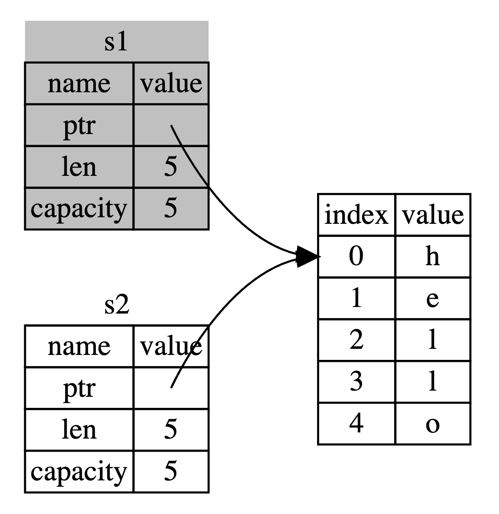

# 2. Rust 所有权系统

所有权是 Rust 最独特的特性，它使 Rust 能够在不需要垃圾回收的情况下保证内存安全。

## 2.1 所有权规则

1. Rust 中每个值都有一个所有者（变量）
2. 一次只能有一个所有者
3. 当所有者离开作用域，值会被丢弃

```rust
{                      // s 不可用，尚未声明
    let s = "hello";   // s 可用
    // 可以使用 s
}                      // s 的作用域结束，不再可用
```

### 内存与分配

字符串字面值（`&str`）是硬编码到程序中的，但不是所有字符串都可以在编译时确定：

```rust
let s = "hello"; // 硬编码字符串，不可变
let s = String::from("hello"); // 可变字符串
```

`String` 类型在堆上分配内存，具有以下特点：

- 运行时请求内存
- 使用完后需要返回内存
- 所有权系统通过"移动"控制内存使用

## 2.2 移动语义

当一个值被赋给另一个变量时，Rust 不会复制数据，而是"移动"所有权：

```rust
let s1 = String::from("hello");
let s2 = s1; // s1 被移动到 s2，s1 不再有效
// println!("{}", s1); // 编译错误：使用了移动后的值
```



这避免了"二次释放"的问题，也就是释放同一块内存两次的错误。

### 栈上数据的复制

实现了 `Copy` trait 的类型在赋值时会进行复制而不是移动：

```rust
let x = 5;
let y = x; // x 仍然有效，因为整数实现了 Copy trait
println!("x = {}, y = {}", x, y); // 正常工作
```

以下类型实现了 `Copy` trait：

- 所有整数类型（u32，i32 等）
- 布尔类型（bool）
- 浮点类型（f64, f32）
- 字符类型（char）
- 包含以上类型的元组，例如 `(i32, i32)`

## 2.3 克隆

如果需要进行深度复制（不仅是栈上的数据，还有堆上的数据），可以使用 `clone` 方法：

```rust
let s1 = String::from("hello");
let s2 = s1.clone(); // 深拷贝，s1 和 s2 都有效
println!("s1 = {}, s2 = {}", s1, s2);
```

克隆可能会很消耗性能，所以应该谨慎使用。

## 2.4 所有权与函数

将值传递给函数时，所有权会被转移：

```rust
fn main() {
    let s = String::from("hello");  // s 进入作用域
    
    takes_ownership(s);             // s 的值移动到函数里
    // println!("{}", s);           // 错误！s 已经无效
    
    let x = 5;                      // x 进入作用域
    
    makes_copy(x);                  // x 应该移动到函数里，
                                    // 但 i32 是 Copy，所以可以继续使用 x
    println!("{}", x);              // 这行能正常工作
}

fn takes_ownership(some_string: String) { // some_string 进入作用域
    println!("{}", some_string);
} // some_string 离开作用域并调用 `drop` 方法，内存被释放

fn makes_copy(some_integer: i32) { // some_integer 进入作用域
    println!("{}", some_integer);
} // some_integer 离开作用域，没有特殊操作
```

函数返回值也会转移所有权：

```rust
fn main() {
    let s1 = gives_ownership();         // gives_ownership 将返回值
                                        // 移给 s1
    let s2 = String::from("hello");     // s2 进入作用域
    let s3 = takes_and_gives_back(s2);  // s2 被移动到函数中，
                                        // 函数返回值移动给 s3
} // s3 离开作用域并被丢弃，s2 已被移动，s1 离开作用域并被丢弃

fn gives_ownership() -> String {
    let some_string = String::from("yours"); // some_string 进入作用域
    some_string                              // 返回 some_string 并移动给调用函数
}

fn takes_and_gives_back(a_string: String) -> String { // a_string 进入作用域
    a_string  // 返回 a_string，将所有权移动给调用函数
}
```

## 2.5 引用与借用

为了避免每次都需要返回所有权，我们可以使用引用：

```
fn main() {
    let s1 = String::from("hello");
    let len = calculate_length(&s1); // 传递引用而非所有权
    println!("'{}' 的长度是 {}.", s1, len); // s1 仍然有效
}

fn calculate_length(s: &String) -> usize { // s 是对 String 的引用
    s.len()
} // 这里，s 离开作用域，但因为它不持有所有权，所以什么也不会发生
```

将引用作为函数参数称为**借用**。引用默认是不可修改的。

### 可变引用

如果要修改借用的值，需要使用可变引用：

```rust
fn main() {
    let mut s = String::from("hello");
    change(&mut s); // 可变借用
    println!("{}", s); // 输出 "hello, world"
}

fn change(some_string: &mut String) {
    some_string.push_str(", world");
}
```

### 引用规则

1. 在任意给定时间，只能有**一个**可变引用或**任意数量**的不可变引用
2. 引用必须总是有效的（避免悬垂引用）

这些规则防止数据竞争：

- 两个或更多指针同时访问同一个数据
- 至少有一个指针被用来写入数据
- 没有同步访问数据的机制

不可变引用和可变引用不能同时存在：

```rust
let mut s = String::from("hello");

let r1 = &s; // 不可变引用 1
let r2 = &s; // 不可变引用 2
// let r3 = &mut s; // 错误！不能在有不可变引用的同时使用可变引用
println!("{} and {}", r1, r2);
// r1 和 r2 在这里不再使用

let r3 = &mut s; // 现在可以使用可变引用
println!("{}", r3);
```

### 悬垂引用

Rust 编译器确保引用永远不会变成悬垂引用：

```rust
fn main() {
    let reference_to_nothing = dangle();
}

fn dangle() -> &String { // 错误！返回了一个离开作用域的值的引用
    let s = String::from("hello");
    &s // 我们返回字符串 s 的引用
} // s 离开作用域并被丢弃。它的内存被释放。返回的引用指向无效的 String！
```

正确做法：

```rust
fn no_dangle() -> String {
    let s = String::from("hello");
    s // 返回所有权，而不是引用
}
```

## 2.6 切片

切片允许你引用集合中的一部分连续序列，而不是整个集合：

```rust
let s = String::from("hello world");

let hello = &s[0..5]; // 或 &s[..5]
let world = &s[6..11]; // 或 &s[6..]

// 整个字符串的切片
let whole = &s[..]; // 等同于 &s[0..s.len()]
字符串切片类型表示为&str：
fn first_word(s: &str) -> &str {
    let bytes = s.as_bytes();

    for (i, &item) in bytes.iter().enumerate() {
        if item == b' ' {
            return &s[0..i];
        }
    }

    &s[..]
}
```

其他类型也有切片：

```rust
let a = [1, 2, 3, 4, 5];
let slice = &a[1..3]; // 类型是 &[i32]
```

## 2.7 所有权与迭代器

迭代器借用或消费集合，取决于迭代方法：

```rust
let v = vec![1, 2, 3, 4, 5];

// 借用集合中的每个元素
for i in &v {
    println!("引用: {}", i);
}

// 借用可变集合的每个元素
let mut v = vec![1, 2, 3, 4, 5];
for i in &mut v {
    *i += 50; // 需要解引用才能修改值
}

// 消费整个集合
for i in v {
    println!("获取所有权: {}", i);
}
// v 在这之后不再可用
```
