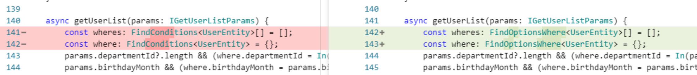

# Nestjs v7 升级至 v9

# 背景

UEDC 部门中台之一的 U&Me 平台，经过了长期的开发和维护以后，基于 nestjs 编写的后台服务在开发的时候项目编译重启的速度非常慢。

项目原本依赖的是 v7 版本的 nest 和 0.2.x 版本的 TypeORM，并且使用 webpack 进行编译，webpack 在每次监听到文件改动的时候会全量的编译一遍所有项目文件，然后再重启服务，导致项目体量越大编译耗时越久。

由于 23 年 uandme 平台有一些新的需求，在后台服务的选型上我们决定在 U&Me 平台原有的后台服务上进行开发，可以复用很多日志、鉴权等能力，节省时间和人力，但是考虑到当前的后台服务重启耗时非常久，开发体验很差，所以决定切换到 tsc 编译，并且进行一次框架和依赖的升级，将 nest 升级到最新的 v9 版本。

# 过程

由于 nestjs 不像 Vue 这样有着广大的用户群体，在网上很难找到 7 到 9 的真实的升级案例，官方文档的迁移指南太残缺（因为官方文档只写了 nest 框架本身的迁移指南，相关的依赖如 typeorm 这些都没有迁移指南），只好依赖 ChatGPT。

以下是操作步骤：

1. 寻找 webpack 插件的替代品，因为从 webpack 编译切换到 nest-cli 自带的 tsc 编译，我们需要寻求一种方法，替代 CopyWebpackPlugin，用于复制我们的.proto 文件，GRPC 中依赖这个文件，但是它不能被 tsc 编译和识别。

1. 升级依赖版本

1. 修改各种报错，将报错信息发给 ChatGPT

### 还有很多破坏性的改动和 API 的变更，都是通过 ChatGPT 来帮助修复的，就不一一列举了。

### 主要是给大家提供一个思路，平时开发如果遇到有升级框架和包的版本的时候，多问问 ChatGPT，有时候它比文档、Google 都好用，说的不一定对但是再不济也能给一个方向，大部分报错能给出正确答案。

# 结果

经过 ChatGPT 的帮助，升级后的项目已经可以正常跑起来

前端页面也正常渲染，没有接口报错。

修改代码后编译重启服务的速度极快，速度提升了 90+%

很多时候在遇到升级库、框架的时候都退缩了，因为怕一堆报错，但是现在有个 ChatGPT，报错一下子能解决掉大部分，所以我们以后不妨勇敢一点，拥抱新版本、新技术，ChatGPT 就是迁移助手。
