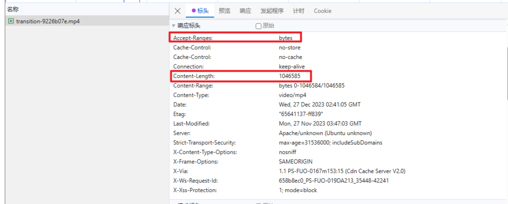
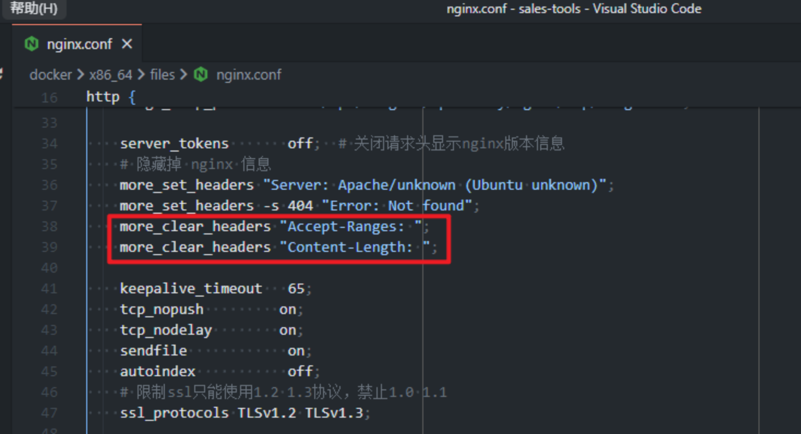

# ios 无法播放视频问题排查记录

# 起因

最近开发的 H5 项目中有一个过场动画是以视频的形式展示的。先将视频作为 H5 首页的背景图，然后点击按钮后调用视频播放。项目上线以后发现 ios 会直接白屏，但是在 web 端模拟和安卓端是正常的，只不过由于视频较大（9M）加载会慢一点。

# 经过

1. 一开始怀疑是前端代码写的兼容性不行，就反复对比以前写的代码，查找纰漏（以前我做过两次类似的需求）。
2. 排查以后发现绝对不是前端代码的问题。这时候后端跑过来跟我说后台日志里看到视频太大了，阻塞了加载。（我差点就相信了，如果是真的的话 ios 稍微等等也能加载出来，而不是直接白屏）
3. 尝试在 ios 上直接通过路径在浏览器中访问这个 mp4，发现是灰色的禁止播放状态，就开始怀疑视觉导出的视频有问题，不支持在 ios 上播放。


1. 于是视觉改了 1 天的视频格式，前端也换了一天的视频-打包-部署验证。。。发现还是不行！！！视觉要疯掉了。。。


1. 控制变量法，已知前端没问题，那就保证视频不变，来确定是哪方面的问题。如果在视频不变的情况下，还不能播放的话，一定是后端问题。于是我直接把老项目的视频复制，放在了新项目里面去引入，打包部署验证发现也是不能播放的。。。。
2. 然后我开始对比上半年做的项目中，那些能正常播放的视频响应头长什么样。。。对比了一下终于发现了根本原因。相比 ios 正常播放视频的响应头，ios 无法播放的视频响应头里有一些字段是没有的。



1. 问题查到这，感觉锅应该在后端。就去看了下 nginx 的代码，看到了元凶。。。



# 结果

让 ChatGPT 解释下这个关键字起到了什么作用


首先，HTTP 中的 range 请求允许我们从服务器上只发送 HTTP 消息的一部分到客户端。这样的部分请求对于大型媒体、具有中断和恢复下载进度的下载文件请求很有帮助。如果请求一个资源时， HTTP 响应中出现如下所示的 'Accept-Ranges'， 且其值不是 none， 那么服务器支持范围请求。但是这行代码删掉了 Accept-Ranges，客户端会认为服务端不支持。

在安卓手机的浏览器中，浏览器对视频的处理，既可以一次性下载，也可以使用分段传输。但是在苹果的 safari 浏览器中就不一样，浏览器首先会请求 0-1 字节，然后多次分段请求视频数据。。。

**分段传输用到以下字段：Accept-Ranges、Content-Length、Content-Type、Content-Range，用于获取本次请求的数据的初始位置、末端位置以及请求的数据大小。**

**"Content-Type"必需明确指定视频格式，有"video/mp4", "video/ogg", "video/mov"等等。**

**"Content-Range"格式是 "bytes start-end/total"，其中 start 和 end 必需对应 request header 里的 range 字段，total 是文件总大小，不是返回的数据长度。end 是指本次传输到文件的哪一段，不能超过文件总长度，像上图 total=20472584 意味着文件长度是 20472584 ，而 end 最大数值为 20472583。**

**"Content-Length"指定返回的二进制长度，图中请求的是 0-1 字节，但是返回的 2 个字节，即 0、1 两个字节数据。Content-Length：(end-start+1）。**

**"Accept-Ranges"设置为 bytes。**

ios 之所以分多次请求也有深层次原因。比方说先请求 0-1 字节（其实是 2 个字节），返回的时候数据并不多，但是可以通过分析"Content-Range"来获取文件总长度。然后分段请求。这样做有个好处就是，只有当用户点击播放了才请求完整文件，对于 PC 还好，对于手机这类数据传输需要收费的设备来说，必须要节省流量。另外在 iphone 上 chrome 也用的是 apple 提供的内核，导致他们的行为基本上一致。（这是苹果的规定）

# 结论

注释掉 nginx.conf 中这两行配置就可以了。。

```javascript
# more_clear_headers "Accept-Ranges: ";
# more_clear_headers "Content-Length: ";
```

ios 的 safari 在播放媒体的时候强制使用范围分段请求，服务端必须支持，且不能隐藏范围请求用到的响应头字段，否则在 iPhone 和 Mac 上就会播放失败。

这个线上问题排查了快两天才得到解决，占用了很多原本的前后端开发时间、还有视觉重新导视频的时间。而问题的表象（白屏、直接访问也无法播放）很容易让人往前端、和视频编码格式去排查，而不是后端和 nginx 的响应头。如果没有移动端开发经验、或是没开发过移动端视频的人（排查的时候还找了一个在 4 年移动端经验的朋友帮忙看，也没想到是 nginx 的问题），真的算一个大坑。所以记录一下，希望后面有类似需求的人不要踩到这个坑。


