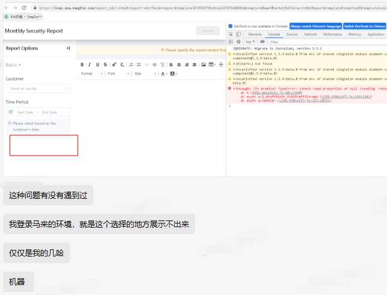
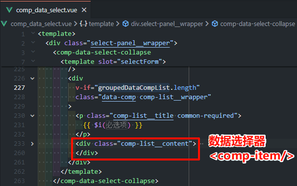
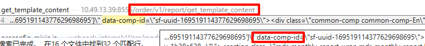
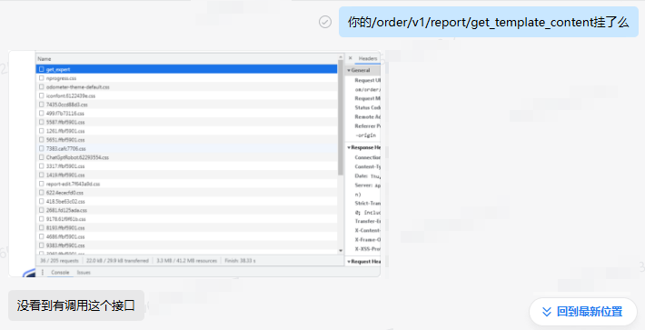
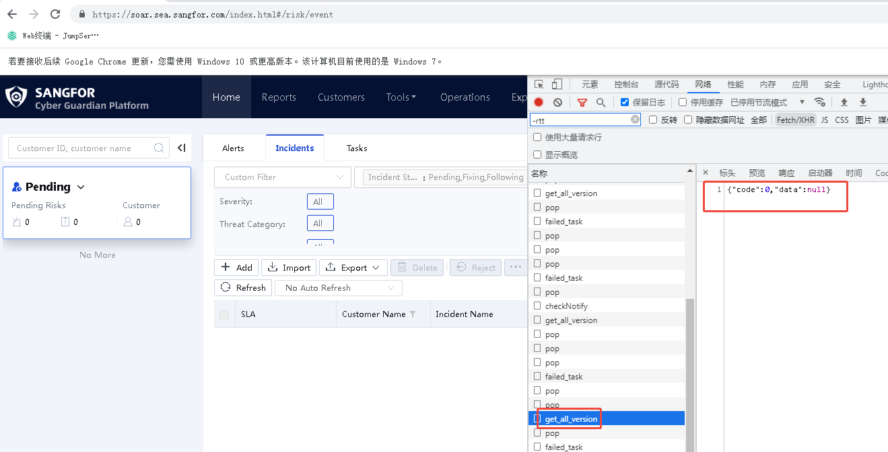
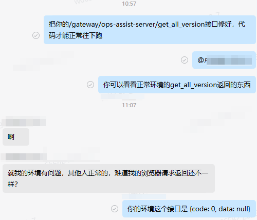

# 前端异常链路分析：从组件加载失败到接口异常的全链路排查

## 问题现象：数据选择器神秘消失



在报告生成场景中，用户点击生成报告后，进入编辑器。发现编辑器界面中的**数据选择器组件**未正常加载。

通过开发者工具检查发现：控制台存在一条不明报错。

## 技术排查路径：逆向追踪数据链路

### 第一阶段：组件渲染逻辑分析



**分析数据选择器未渲染原因：**

- 组件渲染条件 `v-if="groupedDataCompList.length"` 未满足
- `groupedDataCompList` 计算属性依赖 `dataCompList`
- 所以 `dataCompList` 数据源为空数组
- `dataCompList` 通过 Vuex 状态管理获取

### 第二阶段：数据源追踪

查看 **report_center.ts **中更新 `dataCompList` 的函数

```typescript
setDataCompList(state, data: CompMetaData[]) {
    state.dataCompList = data;
}
```

查找函数调用位置 **report_template.vue：**

```
readCompConfig() {
  // 导出模式下，读取已配置的数据组件列表回显到左侧必选项栏
  let compDomList = document.querySelectorAll('[data-comp-id]');
  let dataCompList = [];

  for (let item of compDomList) {
    if (matchComp.haveSubSelect) {
      let data = { ...metaData };
      dataCompList.push(data);
    }
  }

  this.setDataCompList(dataCompList);
},
```

**发现**：

- `dataCompList` 的来源是 `compDomList`
- `compDomList` 是所有包含 `data-comp-id` 属性的 DOM 元素 数组

在开发者工具里搜索 `data-comp-id` 发现这个 DOM 是接口返回的，长这样：



询问后端



这个接口都没调用！那就有意思了，开始排查这个接口的相关代码。

### 第三阶段：接口调用链路追踪

找一下 `get_template_content` 在哪里调用的

**report_template.vue ：**

```
watch: {
  'userinfo._id': {
    handler() {
      this.$_draftMixin_initDraftStorage(); // 草稿初始化
      this.initTemplate(); // 模板初始化
    },
    immediate: true
  }
}
async initTemplate() {
    vm.$ajax({
        url: '/order/v1/report/get_template_content',
        data: {
          template_id: templateID,
        },
    });
}
```

在开发者工具中 debug，给对应的函数添加断点调试，发现：

- `$_draftMixin_initDraftStorage`，有执行。
- `initTemplate` 方法未执行，所以接口未调用
- 执行链路在 `$_draftMixin_initDraftStorage` 中断，并报错。

### 第四阶段：异常根源定位

接下来看一下 `$_draftMixin_initDraftStorage` 函数中做了些什么：

**draft_mixin.js**

```typescript
async $_draftMixin_initDraftStorage() {
  let draftHash = getDraftHash();
  let newHash = await getCurHash();

  // 存在hash值，并且一样，表示没有升级
  if (draftHash === newHash) {
    return;
  }

  // 升级或者没有hash值，清除草稿; 重置hash值
  setDraftHash(newHash);
  this.$_draftMixin_emptyStorage();
},
```

**draft_tool.ts**

```
// 根据get_all_version的接口返回镜像版本作为当前版本
export async function getCurHash() {
  if (versionHash) {
    return versionHash;
  }
  // 需要复用再抽公共方法
  let { data = [] } = await Vue.prototype.$ajax({
    url: '/gateway/ops-assist-server/get_all_version',
    type: 'get',
    showLoading: false,
    abortSameXhr: false,
  });
  const uiName = ['ui-base', 'ui-report', 'ui-efficiency'];
  // data每次顺序不定，先转成map处理
  const versionMap = data.reduce((obj, version) => {
    obj[version.service_name] = version.versions?.[0];
    return obj;
  }, {});
  versionHash = uiName.map((name) => versionMap[name]).join('-');
  return versionHash;
}
```

看到这里依赖了一个接口：`get_all_version`，而这个接口的返回值是 `null`



查看代码可知，当 data 是 undefined 的时候会赋值为空数组，但是当 data 是 null 的时候，不会变成空数组。

所以代码会在 `data.reduce` 这一行抛出一个 `Cannot read properties from null`，最终导致 `$_draftMixin_initDraftStorage` 函数在 await 执行时抛出了一个未捕获的异常，中断了后面代码的运行，直接进入了 reject 状态。所以 `initTemplate` 方法未执行，接口未调用，最终草稿加载失败，数据选择组件也加载失败。



**根本原因**：

1. 微服务接口 `/get_all_version` 异常返回 `{ code:0, data:null }`
2. `data.reduce()` 操作在 null 上抛出未捕获异常
3. 导致 `$_draftMixin_initDraftStorage` 方法执行中断
4. 后续的 `initTemplate` 方法未被执行
5. 模板内容未正确渲染，`data-comp-id` 属性缺失

### 补充说明：

**数据选择组件的渲染失败**，为什么和 **版本查询接口挂了 **有关呢？事情是这样的：

1. 进入报告编辑器，首先会判断你本地有没有草稿，有的话要加载草稿。这也就是 `$_draftMixin_initDraftStorage` 这个函数在干的事情。
2. 这里就延伸出了草稿有效性的概念，如果你的草稿是平台的上一个版本创建的，这个版本很有可能编辑不了。
3. 所以我们在开发这个功能的时候，通过 `get_all_version` 来查询当前前端微服务的版本是否和草稿保存时的微服务版本有差异。
4. 如果没有差异，皆大欢喜可以加载草稿；如果有差异，草稿就作废了~~
5. 走完加载草稿的逻辑以后才会开始加载数据选择组件。也就是 `initTemplate` 在干的事情~

## 技术解决方案：构建防御性代码体系

在版本接口异常时代码逻辑的处理：紧急修复，增加容错

修改后代码：

```
const { data } = await Vue.prototype.$ajax(...).catch(() => ({ data: [] }));
const versionMap = (data ?? []).reduce(...);
```

**防御策略**：

- 空值合并运算符处理 null/undefined
- catch 捕获网络异常
- 默认值保证后续流程

## 经验总结与最佳实践

### 关键教训

1. **异常传播链**：单个未处理的接口异常可能导致看似无关的组件故障
2. **防御性编程**：所有外部数据源都应视为不可靠数据

### 团队实践建议
