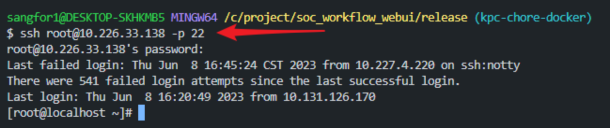
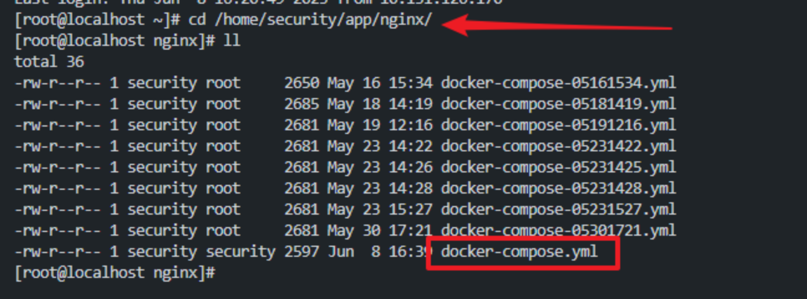
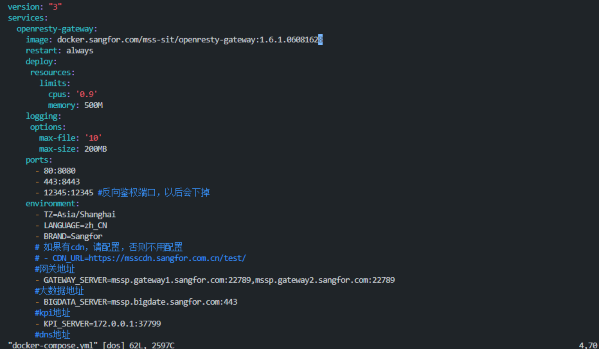
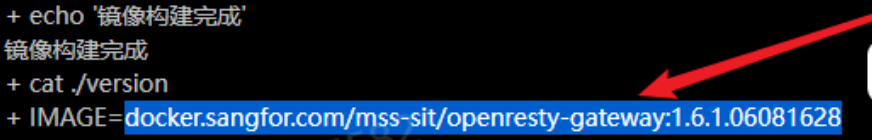
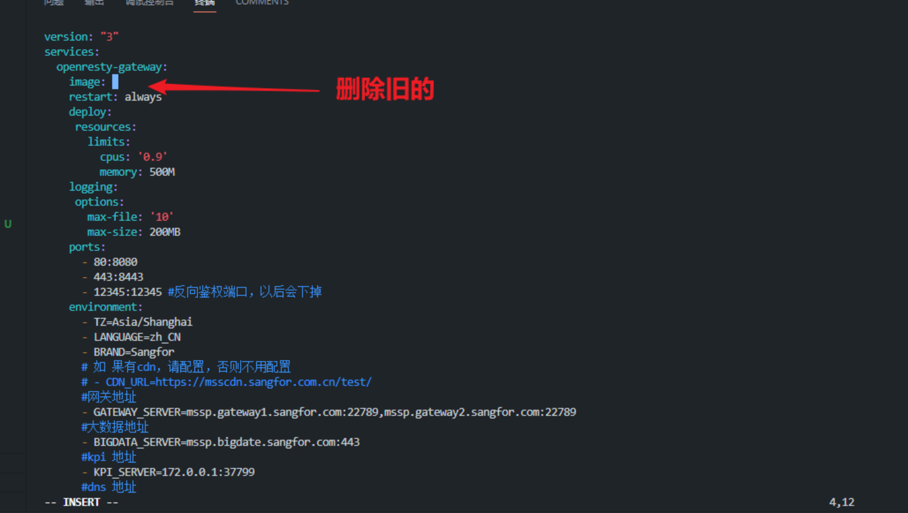
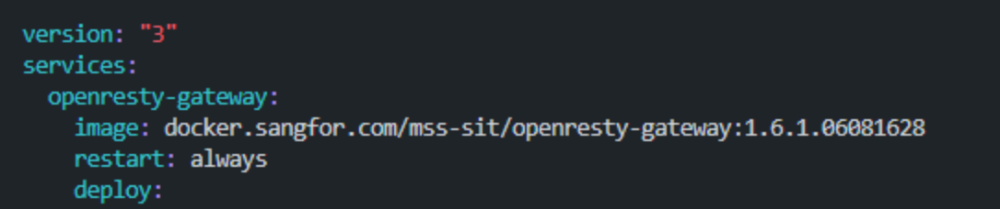
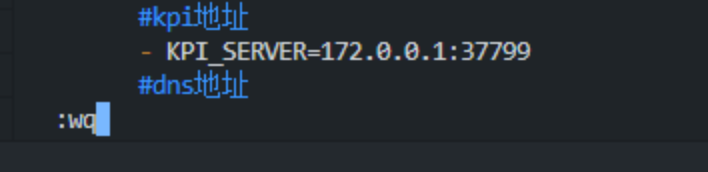
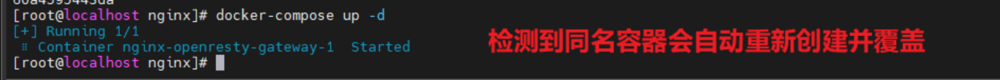
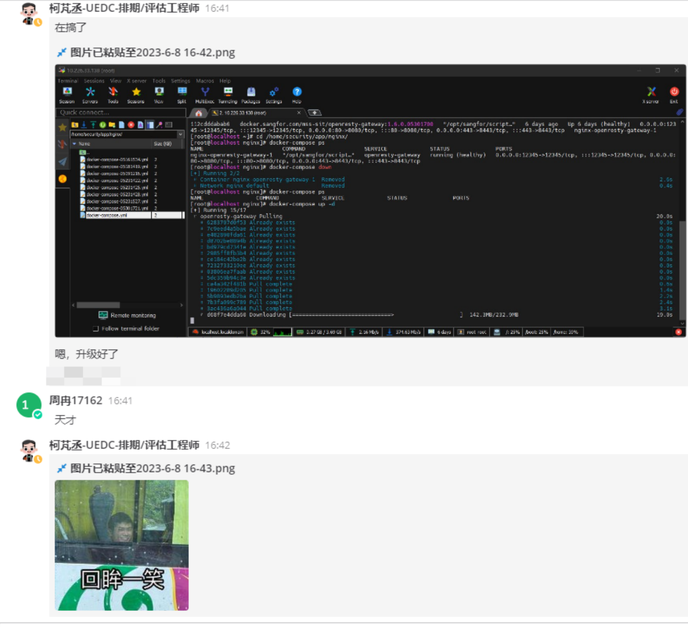

# Docker 实战分享（一）

今天业务组新搭了一套中文环境，用于迭代内的需求验证。但是这套环境**没有接入流水线**，没有办法通过流水线的“部署 Dev”来升级，可它又安装了 docker，是以 docker 的形式部署的。

今天分享一下作为前端，在这种情况下该怎么升级这个新环境的 nginx，内容涉及 ssh、docker-compose、vim 操作，步骤非常简单。

### 构建镜像

首先我们必须制作成功我们需要部署的镜像

### 登录机器

然后找后端要一下机器的密码

直接在 Git Bash 中登录这个机器

`ssh 用户名@ip -p 端口`

然后输入密码就可以登上了

### 修改配置文件

登上以后我们访问 docker 配置文件的目录，`cd /home/security/app/nginx/`

可以看到有一个 docker-compose.yml 文件

然后我们使用 vim 编辑器打开这个 yml 文件，就可以看到文件的内容了

然后我们移动光标，来到 docker 的版本号处（vim 中：上是 K，下是 J，左是 H，右是 L）

在键盘上按一下 i，进入 vim 的“插入”模式，左下角会看到 INSERT，将旧的版本号删除，将自己构建好的镜像版本复制到这个位置

将光标停留在目标位置，单击右键就是粘贴。（缩进不能变，变了会导致 yml 结构错误，docker 解析不了）

然后保存退出，先按 ESC，然后输入冒号，在输入 wq，回车即可保存退出

这样我们就成功更新了 docker-compose.yml

### 重建容器

此时我们在处于 `/home/security/app/nginx/` 的目录下，直接执行 `docker-compose up -d`

docker-compose up 表示启动服务，会根据当前目录下的 docker-compose.yml 来启动（我们刚刚修改的），-d 参数表示后台运行。检测到同名容器会自动覆盖。

### 总结

到这里整个流程就结束了，前端包已经被更新成了最新的镜像版本。

同理，如果需要针对的将某个环境修改其他的配置，也可以这么操作。

考虑到不是所有人都安装了 MobaXtrem，所以直接用 Git bash 做讲解，实际上不管用什么终端工具都一样。

由于一步步分解内容导致可能阅读起来会觉得流程繁琐，但是实际上不到 1 分钟就能完成上面的所有步骤。

