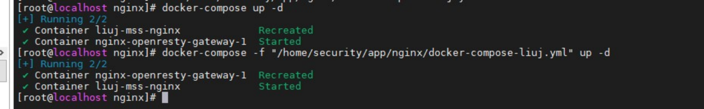
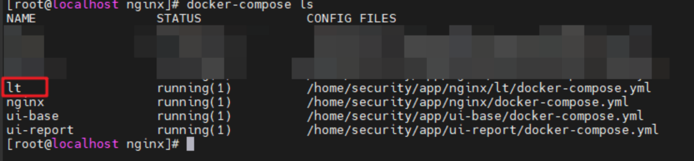
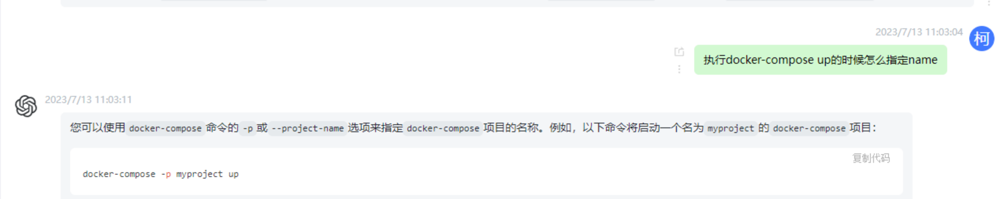
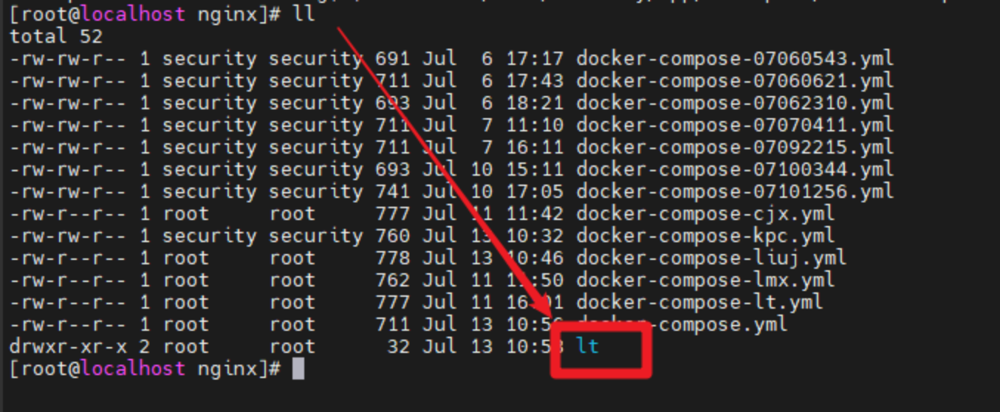
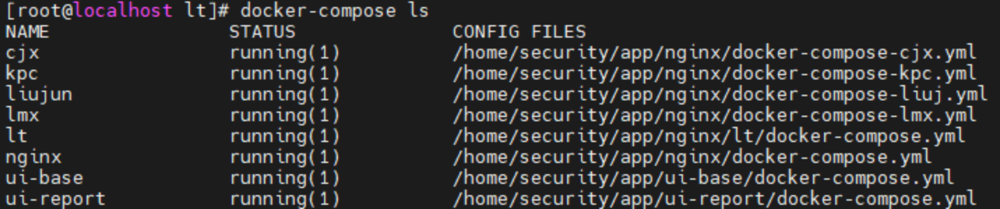

# Docker 实战分享（三）

继昨天的分享后，有同学发现自己用 docker-compose 启动服务被人覆盖了，重启的时候又覆盖了别人的，就算端口号不一样也有冲突。昨天是嘉兴和民心的互相覆盖了，今天是宇航和刘俊又开始互相覆盖，然后我排查了一下原因，分享一下启动服务时需要注意的一个点。



从图上的 Recreated 可以看到自己在启动服务的时候，别人的容器被重新创建了，然后别人的服务就挂球了。通过 `docker ps` 查看发现并没有存在端口号层面的冲突，我一开始出于尝试的心态还是在反复的修改端口号，发现并没有什么卵用。。。

后来我看了一眼 `docker-compose ls`，发现了一个奇怪的东西。为什么雷导起的 docker-compose 服务有个名字叫 lt，我们启动的服务名字叫 nginx？



然后问了一下 GPT，得知：“您可以使用 docker-compose 命令的-p 或--project-name 选项来指定 docker-compose 项目的名称”



当时心想：雷导看起来应该没有用-p 参数，那么为什么他起的服务 NAME 叫 lt 呢？然后发现雷导的 docker-compose.yml 被他放在了新建的一个 lt 文件夹下（他想偷懒只执行 `docker-compose up -d`，不想带-f 参数）。



这样就突然豁然开朗了，docker-compose 在启动的时候默认会以当前文件夹作为项目名称，也就是 `docker-compose ls` 中看到的 name。所以当我们没有指定项目名称的时候，看到的 NAME 和 yml 的文件夹名是可以一一对应的。但是这个 NAME 必须是唯一的，所以当我们在同一个文件夹下放了多个 docker-compose.yml，多次启动不同的 yml 却又不制定 NAME 的时候，这些容器就会开始相互覆盖，去争抢名为“nginx”的项目名称，这大概是一种命名空间的概念。

找到原因后就很好解决了，默认端口仍然使用 `docker-compose up -d` 启动，使用其他端口的同学在使用-f 制定文件路径的同时还需要使用-p 来指定项目名称，如：

```bash
docker-compose -f http://uandme.sangfor.com/docker-compose-kpc.yml -p kpc up -d
docker-compose -f http://uandme.sangfor.com/docker-compose-lmx.yml -p lmx up -d
```

这样启动就不会有冲突和覆盖了，并且我们输入 `docker-compose ls` 能看到新的服务和 name


