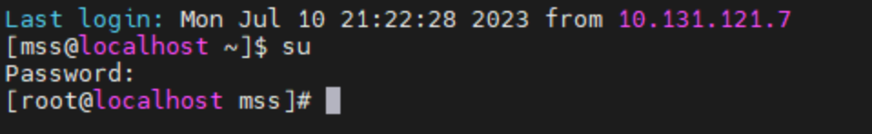

# Docker 实战分享（二）

众所周知，我们前端有一套自己的 nginx 机器：10.226.22.52 52soar.sangfor.com.cn，用于验证以前纯前端、体验优化的问题，（从 @ 郑燏辉 93565 组抠过来的一台机器），来之不易。

一开始是够用的，后来大家都知道了这台机器，好几个人都需要用 52 这台机器的时候，就显得捉襟见衬了。这时候我们可以通过手动部署的方式，开启新的端口，来达到多人共用一台机器的目的。

下面是操作步骤

# 步骤

首先你得有 10.226.22.52 的账号密码，通过 mss 用户登录以后输入 `su` 并输入密码，切换到 root 用户



然后直奔核心配置文件

```bash
cd /home/security/app/nginx
```


通过复制的方式，创建一个你自己的配置文件。输入：

```bash
cp http://uandme.sangfor.com/docker-compose.yml http://uandme.sangfor.com/docker-compose-wuyanzu.yml
```

可以看见成功复制出了一份吴彦祖的配置文件，cp 是复制命令。


科普一下，其实 mv 也可以复制，为什么不用 mv？因为 mv 更多的作用是移动和重命名，当路径不变的时候就会重命名，当目标路径和源路径不一致的时候才会是复制（或复制 + 重命名）。也就是说如果你输入 `mv ``http://uandme.sangfor.com/docker-compose.yml`` ``http://uandme.sangfor.com/docker-compose-wuyanzu.yml`，最终会发现文件被重命名而不是复制。

接下来说说配置文件该怎么修改，首先打开 vi 编辑器。输入：

```bash
vi http://uandme.sangfor.com/docker-compose-wuyanzu.yml
```

为什么不能可视化的点开？因为远程终端通过 `SFTP协议` 打开文件的权限和你初次登录的账户权限是一样的，我们通过 mss 登录，mss 用户没有编辑这个文件的权限，远程终端软件的 `SFTP协议` 也不能可视化的点开文件进行编辑。

至于 vi 的使用我就不教了，和 vim 是差不多的，平时 bash 用的多的同学应该都会操作。

下面说说有什么是需要修改的


首先是镜像号，需要你从流水线构建出你想要验证的镜像并上传

其实是端口号，左侧是宿主机端口，右侧是容器内的进程端口。听不懂？没关系。所谓“左侧是宿主机端口”，其实很好理解，把我们前端的物理机看做是宿主机，我们本地跑的 vue-cli 项目就监听着 8555 或者 8999 端口，这就是左侧的端口号代表的意思。

那么右侧的端口号是用来做什么的呢？因为每个 docker 容器都可以看做一个和宿主机隔离的小型虚拟机，容器内的环境是 linux 系统，和宿主机是完全隔离的，这就涉及到一个概念——“端口映射”。比如容器内有一个 nginx 进程，在监听容器内的 8443 端口，我们希望通过浏览器访问宿主机的 ip 的时候，能自动的找到 这个容器中 - 这个 nginx 进程 所在的端口，我们就需要通过端口映射的方式来完成这个转发。

已知 http 默认是 80 端口，https 默认是 443 端口，所以我们的端口映射就可以写成：

```bash
ports:
  - 80:8080
  - 443:8443
```

这样我们在通过 http 和 https 的时候就可以自动映射到这个容器中的 nginx 进程。

回到正题，我们需要解决的是多人共用一套环境，所以我们只需要修改宿主机的端口号即可，也就是左侧的数字：

```bash
ports:
  - 82:8080
  - 4431:8443
  - 12346:12345
```

至于右侧为什么不能改，是因为我们修改的是镜像启动时候的端口映射，镜像内的代码是没有修改的，比如镜像内是一行 `app.listen(8443)` 的代码，如果修改右侧端口号映射到 8444 端口的话，肯定是找不到的这个进程的，无法正常访问。

顺便说一句可以加一行 `container_name`，比如：

```bash
restart: always
    container_name: wuyanzu-mss-nginx
    ports:
    ......
```

然后我们保存并退出 vi 编辑器。

接下来我们需要通过刚刚修改好的配置来启动 docker-compose，默认的启动命令是：

```bash
docker-compose up -d
```

`docker-compose up` 用于启动 docker-compose 配置文件中定义的服务，`-d` 参数表示后台启动，这条命令会自动在当前目录下查找名为 `docker-compose.yml` 或 `docker-compose.yaml` 的文件。

但是我们刚刚复制了一份新的 yml 文件并修改了内容，所以需要使用 `-f` 或 `--file` 选项来指定文件的位置：

```bash
docker-compose -f http://uandme.sangfor.com/docker-compose-wuyanzu.yml up -d
```

然后等待启动完毕，就可以通过指定端口号的形式在浏览器中访问刚刚启动的服务了，如：[https://52soar.sangfor.com.cn:4430/index.html#/risk/pending_overview](https://52soar.sangfor.com.cn:4430/index.html#/risk/pending_overview) 。
