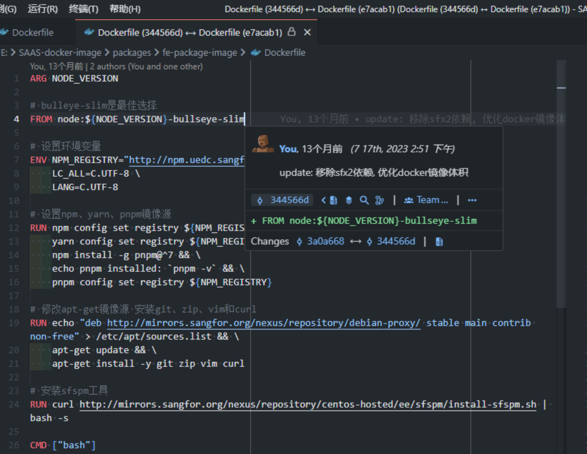
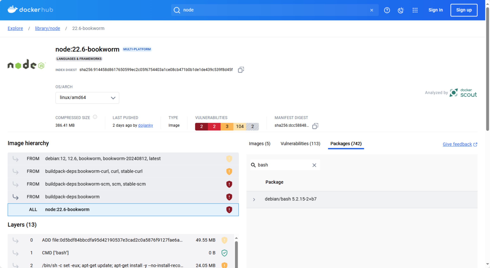

# 搞容器化的时候怎么选择 Nodejs 镜像

这是去年我做流水线改造的时候，优化 Nodejs 镜像时遇到的一个知识点，现在总结一下分享出来，做个科普。

# Nodejs 官方镜像构成

node 官方提供了如下三类镜像：

1. `node:<version>`：基于 Debian 当前稳定版构建，这是官方默认镜像，可指定的版本有：

   - Debian 12（bookworm） — 当前的稳定版（stable）
   - Debian 11（bullseye） — 旧的稳定版（oldstable）
   - Debian 10（buster） — 更旧的稳定版（olderstable）
2. 这些镜像是基于 [buildpack-deps](https://hub.docker.com/_/buildpack-deps/) 进行构建的，这里可以查看 [Dockerfile](https://github.com/nodejs/docker-node/blob/main/22/bookworm/Dockerfile)，此类镜像的优点是安装的依赖很全，例如 `curl`、`wget` 、`bash`，可以用作构建源码使用，缺点是体积过大。
3. `node:<version>-slim` ：基于 Debian 当前稳定版构建，这是删除冗余依赖后的精简版本镜像，体积上比默认镜像小很多，删除了很多默认公共的软件包，只保留了最基本的 node 运行环境。除非你有空间限制，否则推荐使用默认镜像。-slim 可以和 Debian 版本名结合，如 `bullseye-slim` 就是使用 Debian 11 构建（我们现在在千流上使用的大部分 node 镜像都是这个 tag），这种结合方式会得到一个只包含 Node 运行在 Debian 11 所需最基本文件的 slim 版本。
4. `node:<version>-alpine`：基于 Alpine 构建，比 Debian 的 slim 版本还要小，可以说是最小的 node 镜像。虽然体积小，但是功能不少，普通的 Node.js 应用都能跑起来，但是如果项目中用到了 c++ 扩展的话，就不要用这个了，因为 Alpine 使用 musl 代替 glibc，只有对依赖了 glibc 的包有影响比如 grpc 之类的。

可以在官方的 dockerhub 看到搜索对应镜像是否包含所需要的软件包

# 不同 tag 的镜像区别

不同 tag 的镜像区别如下，以 16.20.0(arm64)为例

这个表格可以看出

- alpine 与 slim 体积最小，bullseye、bookworm 及 node:version 镜像体积相对 alpine 与 slim 都大上来好几倍
- alpine 与 slim 的漏洞数相对最少，bullseye、bookworm 及 node:version 漏洞数相对 alpine 与 slim 多上好几倍

# Debian 与 Alpine 的差异

- 空间大小差异，alpine 默认 5M 左右，debian 等都在 200M 左右。
- 默认软件包差异，alpine 选用 busybox，debian 等则是 bash+coreutils 几件套。
- alpine 中，国际化组件被优化掉了。
- glibc 差异，alpine 选用 musl，centos 等选用 glibc，其他的倒还好，libc 的差异对开发很重要。
- 等等。。。

# 怎么选择 Nodejs 镜像

1. Web 项目：可以使用 alpine 镜像，如果没有依赖底层工具库、没有进入容器的需求，则可以使用这个镜像。如果使用 alpine 报错了则说明需要用到底层工具，或者有进入容器使用终端的需求，可以选择 slim。
2. BFF 项目：构建推荐 alpine，运行部署推荐 slim。
3. 发 npm 包：推荐 alpine or slim 镜像，原因是不依赖工具包，但是如果用了 lerna 这种库则需要依赖 Git。可以在这两个镜像基础上安装 Git。

# 总结

Nodejs 官方镜像主要由三部分组成 **linux 版本 + 工具包合集 + Nodejs 运行时**，三部分可以组合成不同的 tag，每种组合都有其应用的场景，我们可以根据大小、安全、功能来进行选择

一般项目推荐使用：alpine or slim 镜像，不推荐使用完整镜像。

特殊项目推荐根据 alpine or slim 镜像进行二次封装，解决公司的通用问题，提高研发效率。比如可以在镜像内做这些事：

1. 设置公司自己的 npm 代理源
2. 设置 npm 包的第三方依赖环境变量，比如 node-sass、puppeteer 等
3. 安装 pnpm
4. 解决 CI 场景因为 buildkit 缓存问题导致的 install 失败或者 build 失败
5. bff 启动之前的前置检查等

当然如果对镜像大小追求极致的，可以在去删减镜像内的工具包，或者通过 copy 的方式只拷贝工具的执行文件等方式去缩减镜像大小。

最后通过选择合适的镜像，可以帮助我们构建高效的 CI/CD 流程
