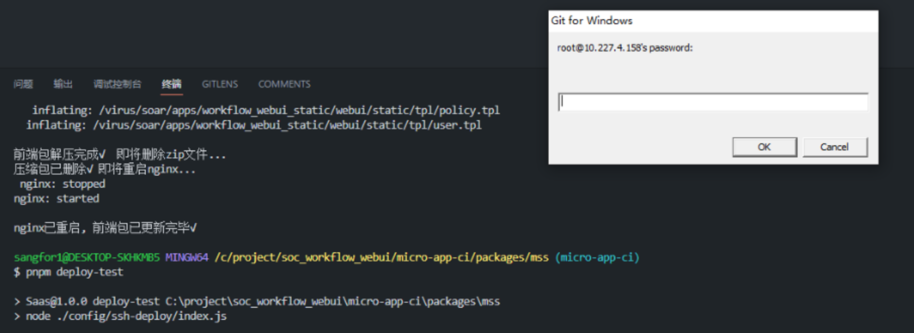
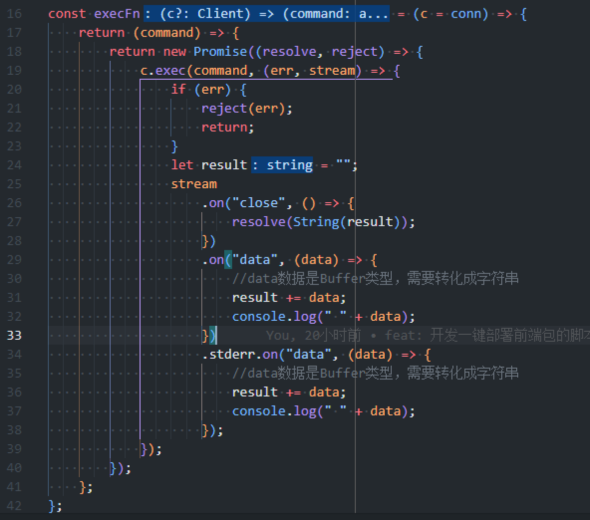
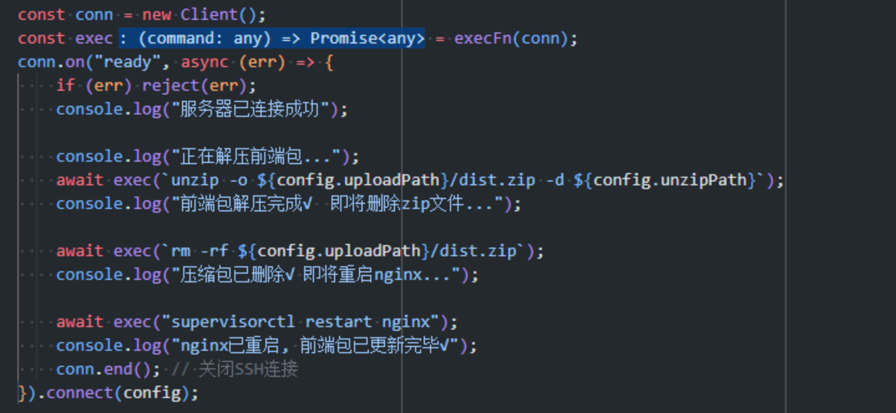
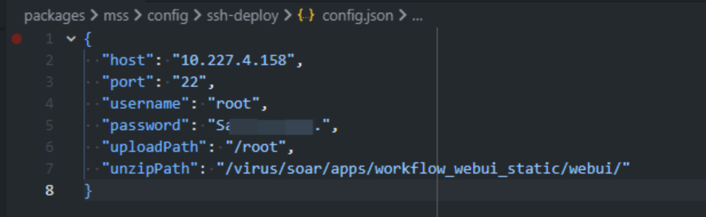

# 使用 Nodejs 一键部署测试环境前端包

## 前言

在平时使用测试环境或者后端的开发环境的过程中，有时候会遇到一些急需解决（阻塞开发）的 TD，需要马上修复后 -> 合入代码 -> 打包构建 -> 走流水线升级对应的环境，整个流程非常的繁琐。

又或者说遇到一些在前端本地环境正常，部署后异常的 TD，也需要在代码改动后临时出包去升级环境来验证是否修复。

以前的流程经常出现如下的对话：

```javascript
A: 快看看xx环境，前端报错了，xx功能用不了
B：好的我修一下

A：好了吗（几十分钟过去）
B：好了，代码合入了，正在打包，你等会升级一下

B：打包好了
A：xx环境升级（几十分钟过去）

可能出现两种情况
A：升级好了，能用了
或者
A：升级完了，还是有问题
B：我再看看（重复以上流程 1小时+）
```

其实我们前端在开发过程中，修复 TD 一般只需要更新前端包，但是走流水线升级会进行后端代码打包、进程的启停，所以可以通过单独替换前端包的形式，来加快整个流程。假设开发了一种替换前端包的方法，以后遇到问题就会出现以下的对话：

```javascript
A: 快看看xx环境，前端报错了，xx功能用不了
B：好的我修一下（定位问题中）

B：修好了，正在打包（几分钟），等会我升一下xx环境的nginx
A：好
B：（执行脚本中...）升级完了（1分钟不到）

可能出现两种情况
A：升级好了，能用了
或者
A：升级完了，还是有问题
B：我再看看（重复以上流程，几分钟）
```

## 效果

为了缩短在遇到上述问题时，整个协作流程的耗时，所以开发了一种脚本，在打包出 `dist.zip` 后直连 nginx 服务器并上传，解压前端包，重启 nginx，整个操作行云流水。这个脚本用习惯了能在开发过程中节省非常多的时间，包括升级测试环境让测试同学回归 TD 等等。

## 思路

思路简单，如下：

本地程序上传包到远程服务器 → 本地程序连接登陆远程服务器 → 本地 shell 命令远程执行（解压缩、重启进程）→ 链接断开

实现过程中主要有以下三个难点：

- Node.js 本地运行程序如何将 `dist.zip` 上传到远程
- Node.js 本地运行程序如何登陆远程服务器

## 实现

#### 解决 Node.js 本地运行程序如何将 `dist.zip` 上传到远程：

通过 scp 命令以加密的方式在本地主机和远程主机之间复制文件，scp 命令是 linux 下的命令，那么如何在本地 windows 执行呢？

##### 调起 shell 的几种方式介绍（不限于这几种）

- `child_process`：node 的一个子进程 api，可创建一个子进程用于执行命令行。
- [shelljs](https://github.com/shelljs/shelljs) ： 基于 node 的 api 封装的一个 shell 执行插件，比原生的 child_process 的兼容性更好，使用更灵活，这个插件的使用率很高。

我选择使用 [shelljs](https://github.com/shelljs/shelljs) 在 nodejs 环境下执行 scp 命令，将 `dist.zip` 上传到远程服务器。

例如：`scp ./test.zip root@10.10.10.10:/opt/soft/scptest`

将本地的 `./test.zip` 上传到 `10.10.10.10` 机器上的 `/opt/soft/scptest` 位置

##### 实现代码如下：

```javascript
const shell = require("shelljs");
const config = require("./config.json");

// 上传dist到服务器
shell.exec(
    `scp -P ${config.port} dist.zip ${config.username}@${config.host}:${config.uploadPath}`
);
```

##### 缺点：

执行的时候会弹出一个服务器密码的输入框，这是 scp 命令无法解决的问题 0.0



#### 解决 Node.js 本地运行程序如何连接登陆远程服务器：

社区已有的方案 [ssh2](https://github.com/mscdex/ssh2)，它是用纯 JavaScript 为 Node.js 编写的 SSH2 客户端和服务器模块。可以使用它连接到远程服务器，并且 [ssh2](https://github.com/mscdex/ssh2) 提供了方法可以在远程服务器执行 shell 命令。

##### 官方案例：

```javascript
//...
const { Client } = require('ssh2');
const conn = new Client();
conn.on('ready', () => {
  console.log('Client :: ready');
  //执行uptime（第一条命令）
  conn.exec('uptime', (err, stream) => {
    if (err) throw err;
    stream.on('close', (code, signal) => {
      console.log('Stream :: close :: code: ' + code + ', signal: ' + signal);
      // 这里执行下一条命令
      conn.end(); // 关闭ssh连接
    }).on('data', (data) => {
      //监听数据
      console.log('STDOUT: ' + data);
    }).stderr.on('data', (data) => {
      console.log('STDERR: ' + data);
    });
  });
})
//...
```

ssh 目前的缺点就是命令的执行顺序问题，需要在 close 事件的回调中执行下一条命令，嵌套写法会很麻烦。使用 Promise 的封装，可以解决嵌套问题。再使用 async / await 就可以解决全部难点了。





## 收尾

脚本依赖 `**/config.json` 来工作，所以我们需要在 postinstall 中添加一个钩子和一个命令，钩子用来创建 `**/config.json`，命令用来执行我们的部署脚本 `pnpm deploy-test`。



`package.json`：

```javascript
{
    "scripts": {
        "postinstall": "node build/postinstall/index.js --unsafe-perm",
        "deploy-test": "node ./config/ssh-deploy/index.js",
    },
}
```

`packages/mss/build/postinstall/index.js`：

```cpp
const fs = require("fs");

if (!fs.existsSync("./config/ssh-deploy/config.json")) {
    console.log(
        "即将生成部署脚本的配置文件, 路径: packages/mss/config/ssh-deploy/config.json\n"
    );
    fs.writeFileSync(
        "./config/ssh-deploy/config.json",
        `{
          "host": "测试环境nginx服务器的ip, 问后端或测试要",
          "port": "22",
          "username": "用户名, 默认是root",
          "password": "密码",
          "uploadPath": "上传到服务器上的路径, 不填默认是'/root'",
          "unzipPath": "解压路径, 默认是/virus/soar/apps/workflow_webui_static/webui/"
        }`,
        {
            encoding: "utf8",
        }
    );
} else {
    console.log(
        "部署脚本的配置文件已存在, 路径: packages/mss/config/ssh-deploy/config.json\n"
    );
}
```

密码不能推送到仓库上，所以需要添加 `.gitignore`

```
# .gitignore
packages/mss/config/ssh-deploy/config.json
```

## 总结

懒惰是程序员的第一生产力。使用 `ssh2 + shelljs + nodejs` 来进行一键部署，格局打开的话还能放到流水线上，这种方案还能做很多事情，比如同时更新多台服务器的前端包、自动化巡检、检查进程、容器状态等等，希望对大家有帮助。

## 相关 PR 的地址

[http://mq.code.sangfor.org/SS/SOC/soc_workflow_webui/merge_requests/15564#](http://mq.code.sangfor.org/SS/SOC/soc_workflow_webui/merge_requests/15564#)
