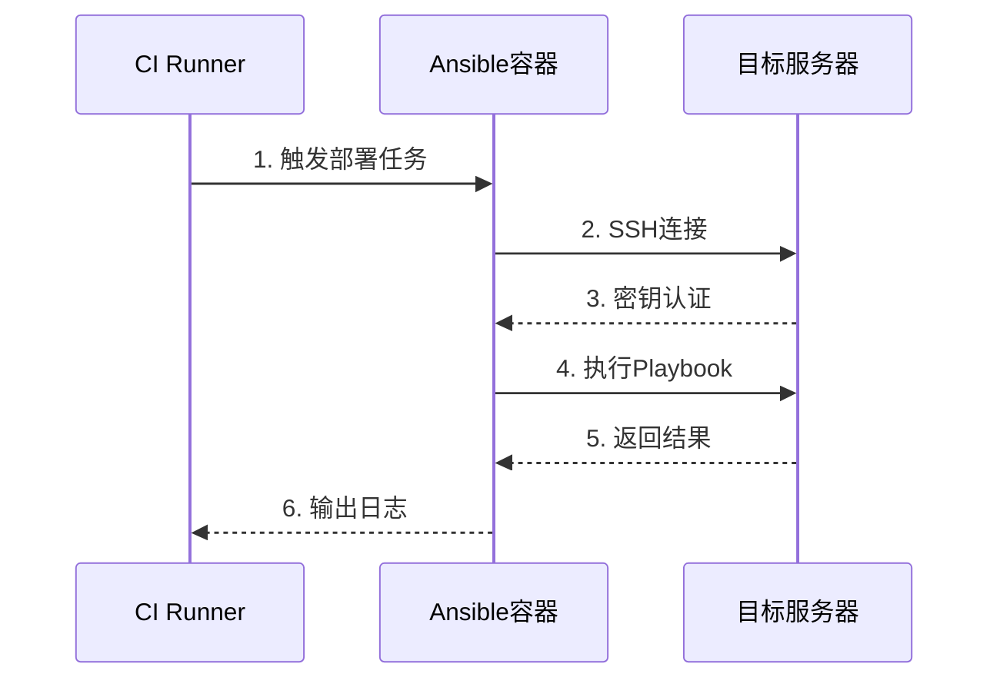
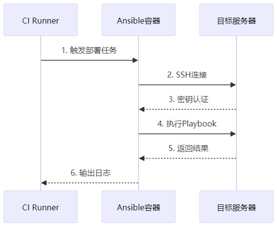
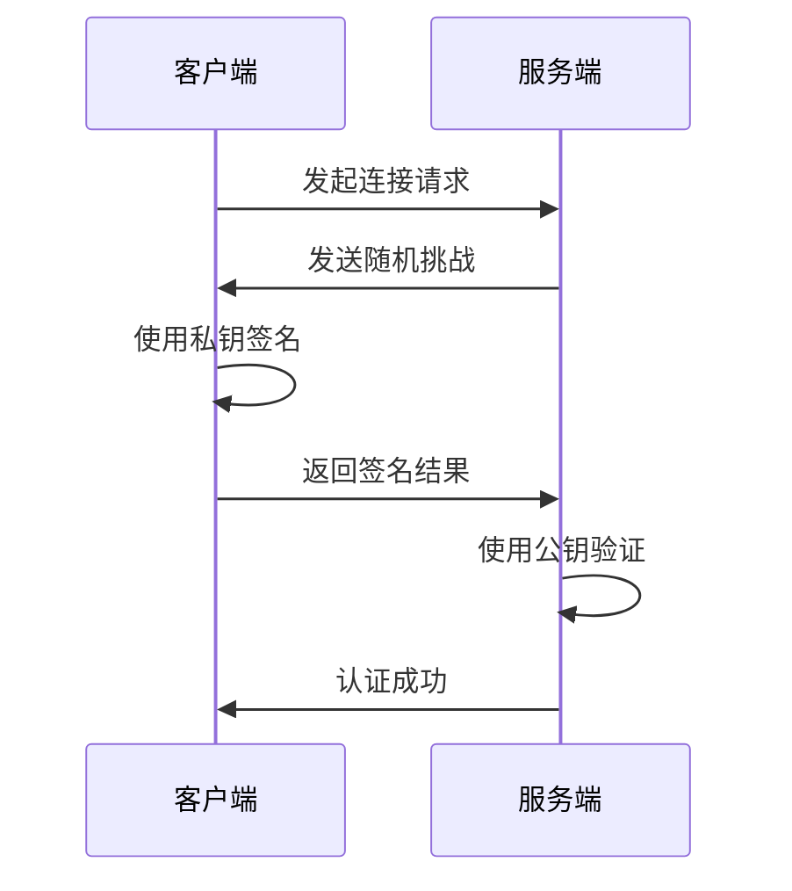
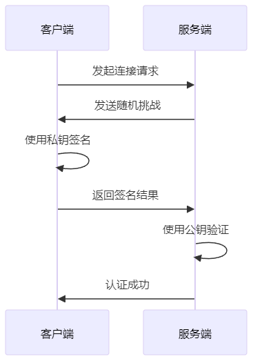

# 剖析 Devops 自动化部署：从架构设计到 SSH 免密实现

## 一、背景与挑战

在微服务架构下，前端部署面临着诸多挑战。MSS 前端流水线需要管理 8 个微服务的自动化构建、部署和 e2e 测试，这带来了以下问题：

### 1.1 传统部署的痛点

1. 安全风险

   - 密码硬编码在脚本中
   - 权限管理粒度不够细致
   - 缺乏审计追踪机制
2. 运维效率

   - 手动部署容易出错
   - 多环境配置难以统一
   - 部署过程缺乏标准化
3. 可追溯性

   - 部署记录不完整
   - 操作日志分散
   - 问题排查困难

### 1.2 Ansible 优势

- **无代理架构**：通过 SSH 协议直接管理节点，无需在目标主机上安装额外服务
- **安全性高**：基于 SSH 密钥认证，避免传统脚本中密码明文传输的风险
- **声明式配置**：自动判断执行步骤，减少错误风险
- **幂等性保障**：无论执行多少次 Playbook，结果始终一致，避免重复执行导致配置冲突（例如多次运行不会重复添加防火墙规则）

今天我们来聊聊流水线上的自动化部署环节到底做了什么，是怎么实现的。

## 二、技术架构设计

### 2.1 部署流程

```markdown


```



### 2.2 关键组件


## 三、实现细节

### 3.1 基础镜像构建

```dockerfile
# 后端封装了一个ansible基础镜像，里面包含了可以访问所有服务器的SSH秘钥。我们再次基础上封装一个ansible:frontend前端用镜像
FROM xxxx/ansible
# 把我们写好服务器配置的Host文件复制到镜像中
RUN mv /etc/ansible/hosts /etc/ansible/hosts.bak
COPY hosts /etc/ansible/
# 把写好的剧本复制到镜像中
COPY playbook/ /etc/ansible/playbooks/
```

### 3.2 服务器配置 host 文件

```
# /etc/ansible/hosts
# 开发环境
[FrontendDev]
10.227.4.158 ansible_ssh_user=security ansible_ssh_port=22345
10.74.145.102 ansible_ssh_user=security ansible_ssh_port=22345

# 长沙测试环境
[FrontendSitErzu]
10.64.20.90 ansible_ssh_user=security ansible_ssh_port=8001
```

### 3.3 部署任务

```
# playbook-compose.yml
---
- name: Create directory if not exists
  hosts: "{{ target_host }}"
  remote_user: "{{ execute_user }}"
  tasks:
    - name: Check if directory exists
      stat:
        path: "{{ dir_path }}"
      register: dir_stat

    - name: Create directory
      file:
        path: "{{ dir_path }}"
        state: directory
      when: not dir_stat.stat.exists

- name: Replace Docker Compose Image Tag and Start Docker Compose
  hosts: "{{ target_host }}"
  remote_user: "{{ execute_user }}"
  vars:
    new_image_tag: "{{ IMAGE }}"
  tasks:
    - name: Check if Docker Compose file exists
      stat:
        path: "{{ dir_path }}/docker-compose.yml"
      register: compose_file

    - name: Backup Docker Compose file
      command: cp "{{ dir_path }}/docker-compose.yml" "{{ dir_path }}/docker-compose-{{ ansible_date_time.month }}{{ ansible_date_time.day }}{{ ansible_date_time.hour }}{{ ansible_date_time.minute }}.yml"
      when: compose_file.stat.exists

    - name: Replace Image Tag in Docker Compose
      replace:
        path: "{{ dir_path }}/docker-compose.yml"
        regexp: 'docker\.sangfor\.com/[^:]+:[^"\n]+'
        replace: "{{ IMAGE }}"
      when: compose_file.stat.exists

    - name: Start Docker Compose
      command: docker-compose up -d
      args:
        chdir: "{{ dir_path }}"
```

### 3.4 任务编排

这个 playbook 剧本是 ansible 做的事情的核心实现，可以看到剧本里其实只做了两件很简单的事情：

1. 创建文件夹

   - 检查文件夹是否存在
   - 不存在就创建文件夹
2. 替换 Docker 镜像的版本号并启动 Docker 容器

   - 检查 `docker-compose.yml` 是否存在
   - 备份 `docker-compose.yml`
   - 替换镜像版本号
   - 启动 Docker 容器

## 四、SSH 免密登录解析

上面提到登录服务器的操作是通过 `xxxx/ansible` 这个基础镜像来做的，镜像中预先配置了 SSH 私钥。

那么我能不能使用这个镜像，让我的电脑也可以免密登录这些服务器呢？答案是 Yes！

**Q：Ansible 镜像不包含服务器密码，如何实现认证？**

答案隐藏在两个关键配置中：

1. **SSH 密钥对**：镜像中预置的 `/root/.ssh/id_rsa` 私钥
2. **Hosts 文件配置**：`hosts` 文件中定义的服务器连接参数

### 4.1 从 Ansible 镜像中提取 SSH 密钥

要实现本地免密登录，我们需要从基础镜像中提取 SSH 私钥。具体步骤如下：

```bash
# 1. 启动一个临时容器
docker run -d --name temp_ansible xxx/ansible sleep 3600

# 2. 从容器中复制SSH私钥
# SSH密钥通常在以下位置之一
docker cp temp_ansible:/root/.ssh ~/ansible_ssh_keys
# 或者
docker cp temp_ansible:/home/ansible/.ssh ~/ansible_ssh_keys
# 或者检查其他可能的用户目录
docker exec temp_ansible find / -name "id_rsa" 2>/dev/null

# 3. 设置正确的密钥权限
chmod 600 ~/ansible_key

# 4. 清理容器
docker rm -f ansible-tmp
```

这一步，主要是为了从 docker 容器中把我们需要的密钥文件拷贝出来。

### 4.2 验证 SSH 连接

获取密钥后，我们可以通过以下命令验证连接：

```bash
# 基本连接测试
ssh -i ~/ansible_ssh_keys/id_rsa security@10.64.4.41 -p 22345

# 执行远程命令测试
ssh -i ~/ansible_key \
    security@10.64.4.41 \
    -p 22345 \
    "docker ps"
```

当我们成功提取密钥，并且正在尝试和服务器建立连接的时候。首次连接到服务器会出现安全提示：

```bash
[root@localhost ~]# ssh -i ~/ansible_ssh_keys/id_rsa security@10.64.20.90 -p 8001
The authenticity of host '[10.64.20.90]:8001 ([10.64.20.90]:8001)' can't be established.
ECDSA key fingerprint is SHA256:FQfU+Q1rMNLgAfrZIAhupnp21ggvNINCUH81m1ibNxc.
Are you sure you want to continue connecting (yes/no/[fingerprint])?
```

这是 SSH 的安全机制，用于防止中间人攻击。输入"yes"后，主机信息会被添加到~/.ssh/known_hosts 文件中，后续连接将不再提示。

成功连接后，你可以继续：

- 执行命令确认你拥有正确的权限
- 尝试连接其他服务器确认密钥的通用性

## 五、SSH 密钥认证的工作原理

SSH 密钥认证基于非对称加密技术，包含两个关键文件：

- 私钥：保存在客户端，用于生成签名
- 公钥：保存在服务器的~/.ssh/authorized_keys 文件中

认证过程如下：

1. 客户端向服务器发送连接请求，表明希望使用密钥认证
2. 服务器生成一个随机挑战并发送给客户端
3. 客户端使用私钥对挑战进行签名，并将签名发回服务器
4. 服务器使用存储的公钥验证签名
5. 如果验证成功，服务器允许连接

```markdown


```



这一机制的优势在于：

- 私钥从不传输，降低了被截获的风险

- 基于密码学原理，几乎不可能被暴力破解

- 可以轻松集成到自动化流程中

## 六、最佳实践

从CI/CD镜像中提取SSH密钥虽然方便，但也带来安全风险。一套真正的企业级CI/CD系统通常采用以下策略管理SSH密钥：

- 使用强密钥（RSA 4096位）

- 为不同环境使用不同的SSH密钥

- 权限最小化：为CI/CD系统使用的账户分配最小必要权限

- 定期轮换密钥（建议90天），尤其是在人员变动后

- 密钥加密：在镜像构建过程中加密密钥，运行时解密

## 七、总结

综上，实现了安全可靠的自动化部署和标准化的环境配置管理。还解析了SSH密钥认证机制，通过提取CI/CD镜像中的SSH密钥，实现了对远程服务器的无密码访问。不仅剖析了SSH免密登录的原理，也展示了现代DevOps实践中自动化部署的关键技术。


```
