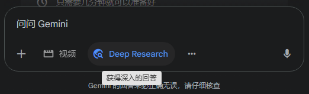
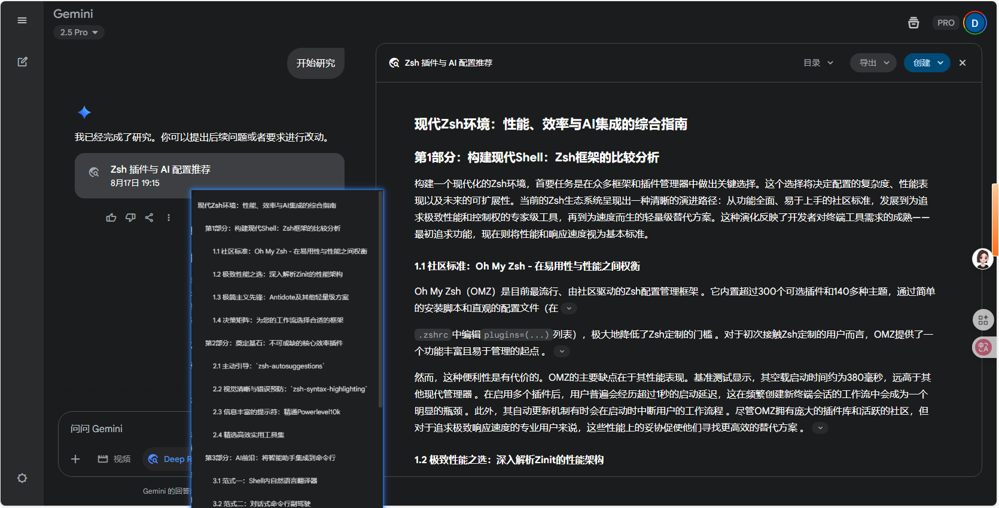

# 由 Gemini 2.5 pro 驱动的 Deep Research 初体验

## 引言

在过去两个月里，**Gemini 2.5 Pro 是我使用的最多、也是最好用的 AI 模型，没有之一**。

> ps: 其实也不是 Claude 4 Sonnet 不行，写代码用的最多还是 Claude 4 Sonnet，但是偏科生和三好学生还是有区别的，Gemini 2.5 Pro 驱动的一切功能实在是强的可怕。不完美，但是不妨碍它现阶段是我心里的水桶型王者。

我深度体验了它的绝大多数功能，从对话、文生图、文生视频，到能够撰写文档和运行应用代码的 Canvas。它持续不断地给我带来惊喜，一度达到了让我叹为观止的程度，迅速成为了我工作生活中离不开的主力模型。

但是我一直没有尝试过它的 **Deep Research** 功能，直到上周末在家的时候，我想给自己的 Zsh 终端扩展一些新的插件和配置，就问了 Gemini 一个问题：“现在有什么最新的 zsh 插件和配置推荐？最好有 ai 功能”，我希望它能自行搜索并根据最新的结果来给我推荐，所以我点开了 **Deep Research** 这个开关。

然后它给我扔了一个特别详细的研究方案回来。我：？？？至于吗

我什么都没改，就点了开始研究。过了 10 分钟它扔了一个这样的报告给我：

它陈述的所有观点都可以找到引用链接：

这是我第一次被深度研究功能震撼到。

## 聊天、搜索与研究的区别

体验了几次深度研究功能以后，我思考了一下，这种“深度研究”和我们熟悉的 AI 对话究竟有什么不同。

**生成式聊天 **的知识来源于其 **静态的、预先训练好的**模型，这意味着它的信息可能已经过时，并且容易产生被称为“幻觉”的凭空捏造的错误信息。相比之下，深度研究通过实时访问和分析动态的互联网信息，将其答案建立在当前可验证的数据基础之上，从而显著降低了不准确性。

**深度搜索（Deep Search） **本质上是一种 **增强的信息检索**过程。它通过更深刻地理解用户的查询意图，来寻找更优质、更相关的原始资料。可以将其比作一位专业的图书管理员，能够精准地为你找到最合适的书籍。

而**深度研究（Deep Research） **则是一个 **综合分析 **的过程。它不仅能找到这些书籍，还会去“阅读”和“理解”它们，并最终为你撰写一份全新的总结报告。

## 实际体验

OpenAI 提供的 Deep Reseach 我没有实际使用过，因为我并不是 OpenAI 的付费用户，看过很多人的测评：贵且慢，但是很好用，并且报告质量来看可能暂时是行业顶尖水平。

Gemini 提供的 Deep Reseach，这两天用了几次，依旧是惊叹的水平，对于普通人和普通开发者来说能在现有使用场景达到天花板级别的表现。

之前因为订阅了一年的 Lenny 社区，捆绑包里送了一个 Perplexity AI 的会员。Perplexity AI 是一个 AI 驱动的搜索引擎，挑战传统搜索引擎，在权威性和准确性上遥遥领先，用过感觉是吊打 Google 搜索的级别。

附上这三个通用深度研究工具功能与定价对比

<table>
<tr>
<td>特性 </td><td>ChatGPT 深度研究 (OpenAI) </td><td>Gemini 深度研究 (Google) </td><td>Perplexity AI </td></tr>
<tr>
<td>核心功能 </td><td>深度、详尽的报告生成，强调高级推理 </td><td>快速、广泛的概览式报告，适合趋势分析 </td><td>实时、准确的“答案引擎”，提供直接回答 </td></tr>
<tr>
<td>主要AI模型 </td><td>OpenAI o1-Pro, o3 </td><td>Gemini 2.5 </td><td>多模型可选 (GPT-4, Claude 3, Llama 3等) </td></tr>
<tr>
<td>关键差异化 </td><td>卓越的推理能力；强大的PDF/代码/数据文件处理 </td><td>极快的速度；与谷歌生态系统（如Docs）无缝集成；音频摘要功能 </td><td>严格的引文和来源透明度；“焦点”搜索模式；高性价比 </td></tr>
<tr>
<td>数据处理能力 </td><td>网页、PDF、代码、电子表格 </td><td>网页、部分文件格式 </td><td>网页、PDF、文本文件 </td></tr>
<tr>
<td>定价层级 </td><td>专业版 (Pro): $200/月 (含100次查询) </td><td>免费提供 </td><td>免费版；专业版 (Pro): 20/月或200/年 </td></tr>
<tr>
<td>显著局限性 </td><td>成本高昂，速度较慢 </td><td>报告深度有时不足，引文质量不稳定 </td><td>创意生成能力较弱，团队协作功能待完善 </td></tr>
</table>

## 核心价值

我觉得大家都可以去试一试这种深度研究工具，享受效率的提升和分析能力的平权，这些工具通过模拟人类研究分析师的工作流程，自主分解问题、浏览网络、评估信源并生成结构化报告，极大地降低了获取和提取复杂信息的门槛，**将过去需要数小时甚至数天才能完成的研究工作，缩短至几分钟**。

无论是普通消费者、专业人士还是程序员，都能轻易地利用这种过去只有少数专家才具备的能力，去做出更明智的决策，或是解决更复杂的技术难题。

## 应用场景

那么，作为前端工程师，我们该如何利用这种分析能力？想象一下，在软件开发的全生命周期中，它都能成为你的得力助手。

有一天你在工作和职业生涯需要深入了解一个不熟悉的领域，比如 GIS、WebGL、Threejs 或是某个新的技术栈，就应该想到它。

**在架构设计阶段**，当你需要进行技术选型时，它可以为你生成一份包含性能基准、社区活跃度、长期维护成本等维度的综合对比报告，帮助你做出数据驱动的、更稳健的决策。**在具体的开发实现中**，面对一个文档不全的新 API，你可以让它综合分析所有可用资源，**生成一份包含最佳实践和代码示例的集成指南**，从而大幅缩短学习曲线，减少试错成本。

**在测试与调试环节**，当遇到复杂的 Bug，它可以分析错误日志和代码上下文，从海量的网络信息中（如 GitHub issues、StackOverflow）寻找类似问题的根本原因和解决方案，显著缩短定位和修复问题的时间。

**在维护与优化阶段**，它可以分析现有代码，并根据最新的编程范式和性能优化技术，提出具体的重构建议。

甚至**在个人学习与提升方面**，它也能为你规划出一条结构化的学习路径，包含核心概念、关键 API、最新特性、常见陷阱和高质量的学习资源推荐。

以前你需要连着好几天下班在 Google、论坛和社区中不断搜寻、筛选和甄别信息，才能写出一个很潦草的预研或者分析报告出来，现在你只需要一个深度研究工具，就可以帮你搞定一个你感兴趣的陌生领域或概念的前世今生乃至未来发展。

> 借用守望先锋安娜的台词：“你被强化了，快上！”
> 祝愿大家都能在 AI 时代成为超级个体。
