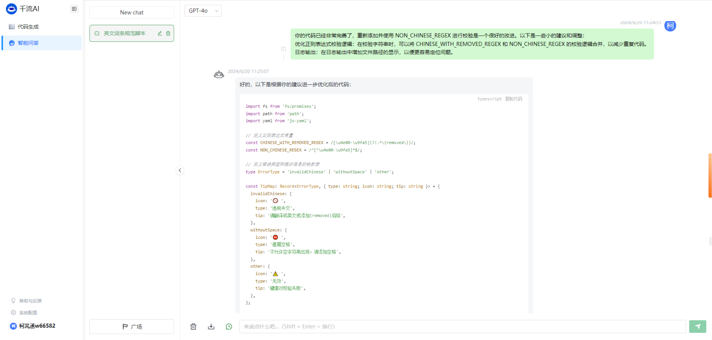

# 利用 GPT-4o 协助开发流水线质量脚本

# 背景

之前有开发同学在开发需求的时候，会有一些不规范的词条上库，例如：

1. 直接把中文词条复制到英文的欧洲词条包下，以为 xanadu 平台可以识别多语言，最终漏翻译导致**欧洲平台出现中文**。

1. 在一些词条为空的场景，没有手动留下空格，而是直接使用空字符串导致**文案报错无法正常渲染**。

1. 直接把中文词条复制到英文的词条包下，没有添加 `(removed)` 标记，直接上库合入主线，导致其他组的成员提交翻译的时候，词条包中包含了很多没有翻译被识别出的词条。这个现象**增加了翻译人员的心智负担，导致开发同学需要手动处理词条包，将需要翻译的内容标黄，产生了不必要的工作量**。

# 思路

和组长商量了一下，决定建一个技术需求，写一个脚本来完善国际化的质量基建。

# 收益

1. **扫描出了 5 个没有预留空格而写空字符串的词条**，避免文案渲染失败的低级问题出现在线上，提升开发质量。
2. 降低后续海外平台出现未翻译中文的概率
3. **扫描出了 1700+ 个没有添加****（removed）****标记却滞留在英文词条包下的中文**，提升后续各个特性组在和翻译协作时候的效率
4. 完善团队的国际化相关基建

# 过程

找千流 AI 写个脚本

1. 编写好完整的提示词，将边界情况和要求描述清楚

1. 根据 AI 的回答写一点优化建议

1. 再提供一点优化建议

1. 最后让 AI 自己模拟运行一下这个脚本

1. 收工

# 接入项目

在静态检查流水线上新增了一个任务卡点：“英文词条规范检查”，所有合入 release、master、hotfix 的代码中都不允许在英文词条目录下写纯中文和空字符串

最后再将项目中的所有存量词条问题修改好，添加好 `(removed)` 标记或添加遗漏的空格。

