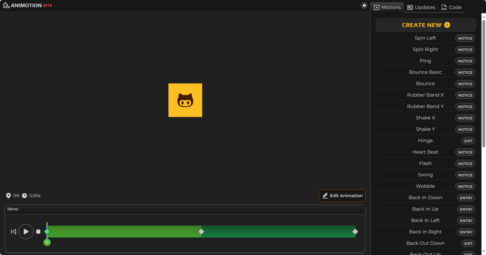
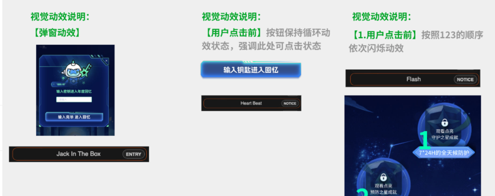
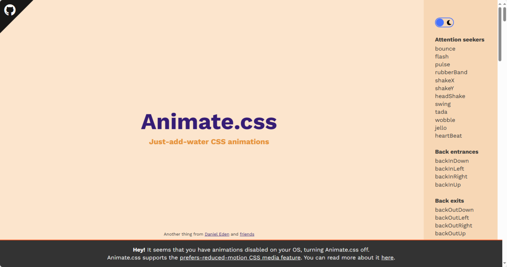
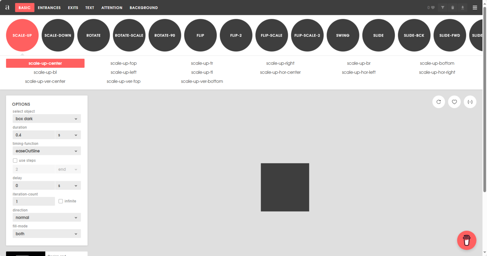
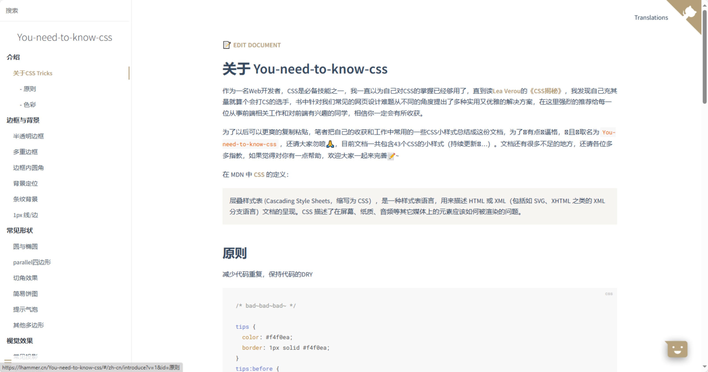
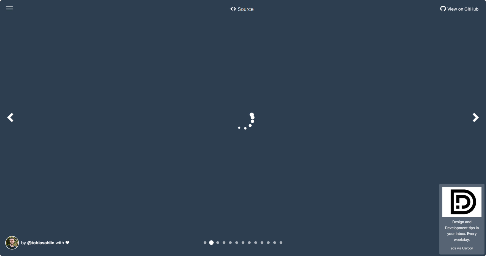
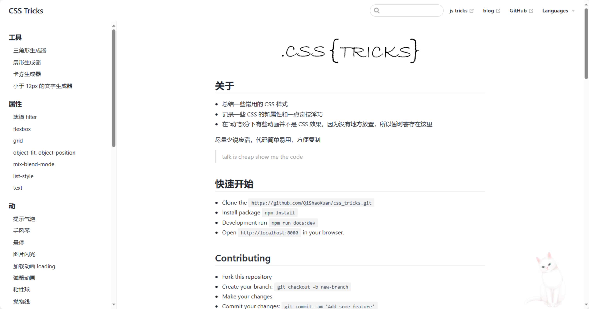

# CSS 的工具物料文档推荐

承接 MSS 年度账单 H5 项目的时候，由于 To C 的特性，对页面展示效果和 css 动画要求比较高。如果采用常规的 lotte-web 方案会导致负担过大，视觉需要用 AE 做特效然后导出 SVG 给前端，前端使用一个空 DIV 渲染 json 动画，并且无法控制动画的宽高。所以动画方面最好使用原生 CSS 来实现动画效果，性能也比较好。

以下是我个人在用的一些 CSS 的工具/物料文档推荐。

1. [https://animotion.dev/](https://animotion.dev/)

> **这个已经推广给两个视觉设计师去使用了**。动画种类很多，添加关键帧、时长、进度条、缩放大小、旋转之类的都是可视化控制，效果也比较好，可以直接出码。 视觉在调整好效果以后会标注在视觉稿上面
> 
> 

1. [https://animate.style/](https://animate.style/)

> 这个比较传统，需要引入 animate.css，都是一些很常用的 PPT 动画
> 

1. [https://animista.net/](https://animista.net/)

> 这个也不错，动画更多、分类更细，但是使用起来没有第一个好。
> 

1. [https://lhammer.cn/You-need-to-know-css/#/zh-cn/](https://lhammer.cn/You-need-to-know-css/#/zh-cn/)

> 文档类网站，收集了一些 CSS 的各种效果实现，很多动画效果，可以收藏
> 

1. [https://tobiasahlin.com/spinkit/](https://tobiasahlin.com/spinkit/)

> CSS 代码片段 汇集了各种加载效果的 CSS 代码片段
> 

1. [https://qishaoxuan.github.io/css_tricks/](https://qishaoxuan.github.io/css_tricks/)

> 
