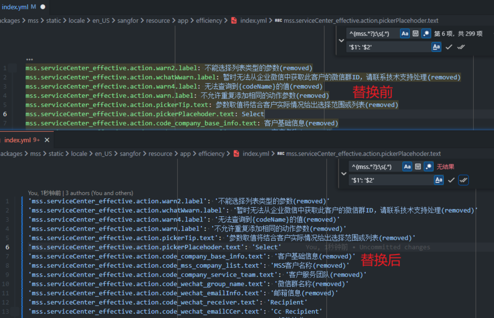

# 正则小技巧之捕获组

在处理流程 IT 化词条的时候遇到 yml 文件格式不统一的问题，需要把所有的键值对添加上引号

一个一个手动添加引号就很麻烦，在 vscode 里可以使用它的搜索替换工具

查找框中可以输入：`^(mss.*?):\s(.*)`，这个正则用于匹配每一行词条，并捕获左右两侧

替换框中输入：`'$1': '$2'`，使用捕获到的内容生成新的内容（添加引号）。

在正则匹配中 `()` 是起到捕获匹配的作用，每一对括号会被从左到右编号，正则引擎会记住每对括号匹配的内容，并允许在结果中获取它，按照捕获的顺序可以用 $1~N 来使用捕获组。

例如

```javascript
let str = "John Bull";
let regexp = /(\w+) (\w+)/;

console.log(str.replace(regexp, '$2, $1')); //输出 'Bull, John'
```

vscode 中的查找替换也支持这样操作


