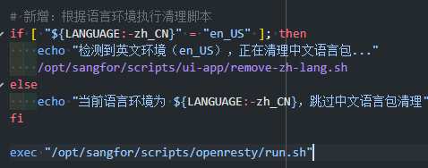

# Webpack 模块依赖分析与国际化资源优化实践

# **问题背景**

在做海外合规整改的时候，发现代码部署到中文环境后，中文语言包无法正常加载，导致界面显示原始 key 而非翻译后的文本。经过排查，发现不论是开发环境还是生产环境，相关的 `lang_zh_CN` 的 chunk 文件都未被正确生成。这个问题的根源在于 Webpack 无法正确识别我们的中文语言包依赖关系，导致没有生成相应的 chunk 文件。

问题的演变过程是这样子的：

最初的实现中，我们同时加载了所有语言包：

```typescript
const langPkgModules = {
 en_US: () => require('./pkg/en_us'),
 zh_CN: () => require('./pkg/zh_cn'),
};
```

这导致不管用户选择哪种语言，系统都会加载所有语言资源，造成不必要的网络请求和资源浪费，并且无法满足测试中心的合规要求：网络请求面板不能看到中文。


为了优化资源加载，我引入了 `safeRequire` 函数来避免加载不需要的语言包：

```typescript
const safeRequire = (path: string) => {
 try {
   return require(path);
 } catch {
   return { default: {} };
 }
};

const langPkgModules = {
 en_US: () => require('./pkg/en_us'),
 zh_CN: () => safeRequire('./pkg/zh_cn'),
};
```

同时在英文环境下添加了一个脚本来删除中文语言包文件，在 docker 容器启动时会做环境检查。




在英文环境下的测试，是符合预期的，因为 chunk 会正确的生成并加载，中文语言包也会被删掉。


然而，这种实现方式会导致 webpack 无法正确识别中文语言包依赖，进而无法生成对应的 chunk 文件，最终使中文环境下应用无法正常显示翻译文本。

# **深入分析：webpack 的依赖处理机制**

webpack 通过静态分析来识别和处理模块依赖关系。在构建过程中，webpack 会：

1. 从入口文件开始，分析代码的 AST（抽象语法树）
2. 识别 `import` 语句和 `require` 调用
3. 根据这些导入语句构建依赖图谱
4. 按照配置进行代码分割和优化

然而，webpack 的静态分析能力是有限的。当模块导入函数的参数是一个变量、当导入被包裹在条件语句、函数定义或 try-catch 块中时，webpack 会面临困难：

```javascript
// webpack能可靠识别的依赖
import moduleA from './moduleA';
const moduleB = require('./moduleB');
// webpack可能无法可靠识别的依赖
function loadModule(path) {
  return require(path); // 路径是变量，webpack无法静态分析
}
```

# 问题的核心：safeRequire 的局限性

回到我们的问题，`safeRequire` 函数存在 1 个关键问题：

1. **变量路径的限制**：我们忽视了一个关键事实：webpack 的静态分析对于变量路径的处理能力有限。正如注释中所说："require 和 import 一样，导入函数都不能接收一个变量"。

这个问题导致 webpack 在构建时无法识别中文语言包的依赖关系，从而没有生成相应的 chunk 文件。

## 解决方案：根据环境判断的模块加载策略

我们采用了一种根据代码运行环境判断的解决方案，既确保 webpack 能正确识别依赖，又保留了错误处理的能力：

```javascript
const langPkgModules = {
  en_US: () => require('./pkg/en_us'),
  zh_CN: () => {
    // 开发环境直接require确保webpack正确识别
    if (process.env.NODE_ENV === 'development') {
      return require('./pkg/zh_cn');
    }
    // 生产环境使用try-catch防止运行时错误
    try {
      return require('./pkg/zh_cn');
    } catch (error) {
      console.warn('中文语言包加载失败，使用空对象替代');
      return { default: {} };
    }
  },
};
```

这个解决方案有几个优势：

1. **正确构建**：使用直接的文件路径调用 `require`，确保 webpack 能够正确识别依赖关系并生成相应的 chunk。
2. **生产环境的错误容忍**：在生产环境中保留 try-catch 机制，避免因语言包文件不存在而导致应用崩溃。
3. **明确的错误提示**：添加了警告日志，便于问题排查和监控。

## 更完善的优化策略：国际化资源按需加载

除了修复当前问题，我们还可以考虑更完善的国际化资源优化策略：

开启顶层 await 特性，使用动态 import 来做运行时的异步加载

```javascript
const langPkgModules = {
  en_US: () => import('./pkg/en_us'),
  zh_CN: () => import('./pkg/en_us'),
};
```

这种方式使用 webpack 的动态导入特性，可以实现真正的按需加载，并且 webpack 会正确处理这种导入方式。

### 实现**障碍**

**初步尝试以后发现暂时无法通过这种方式来实现我们的目的，发现一个抽屉打开白屏了。初步怀疑是 vue-cli 和 webpack5 的模块联邦机制在开启顶层 await 以后会出现部分子应用组件功能异常的 bug，暂时没看出原因，无奈选择了放弃这个方案。**


# 教训与最佳实践

这次问题修复给我们带来了几点重要启示：

1. **了解构建工具的工作原理**：webpack 等工具的静态分析能力有其局限性，需要了解这些局限并编写工具能够正确理解的代码。
2. **保持一致性**：对于类似的模块，应该尽量使用一致的导入方式，避免因处理方式不同而导致意外问题。
3. **区分环境**：开发环境和生产环境往往有不同的需求和约束，应当针对不同环境采取适当的策略。
4. **透明的错误处理**：错误处理机制应该让问题变得可见而不是掩盖问题。在这个案例中，我们保留了错误处理但增加了明确的警告日志。
5. **写代码时考虑构建过程**：在编写代码时，不仅要考虑运行时行为，还要考虑构建时的行为，特别是涉及模块依赖时。

# 总结

通过深入理解 webpack 的依赖处理机制，成功解决了语言包加载问题。这个案例展示了前端工程化中一个常见但又容易被忽视的问题：构建工具的静态分析能力与代码编写方式之间的微妙关系。

在国际化资源处理方面，我们需要在资源优化和系统稳定性之间找到平衡点。通过环境感知的加载策略，我们既满足了按需加载的需求，又确保了系统的正常运行。

对于类似问题，建议团队成员加深对构建工具工作原理的理解，并在代码评审中特别关注模块依赖的处理方式，以避免在未来的开发中重蹈覆辙。

# 参考资料

1. [Webpack Module Methods](https://webpack.js.org/api/module-methods/)
2. [Code Splitting](https://webpack.js.org/guides/code-splitting/)
3. [Dynamic Imports](https://webpack.js.org/guides/code-splitting/#dynamic-imports)
