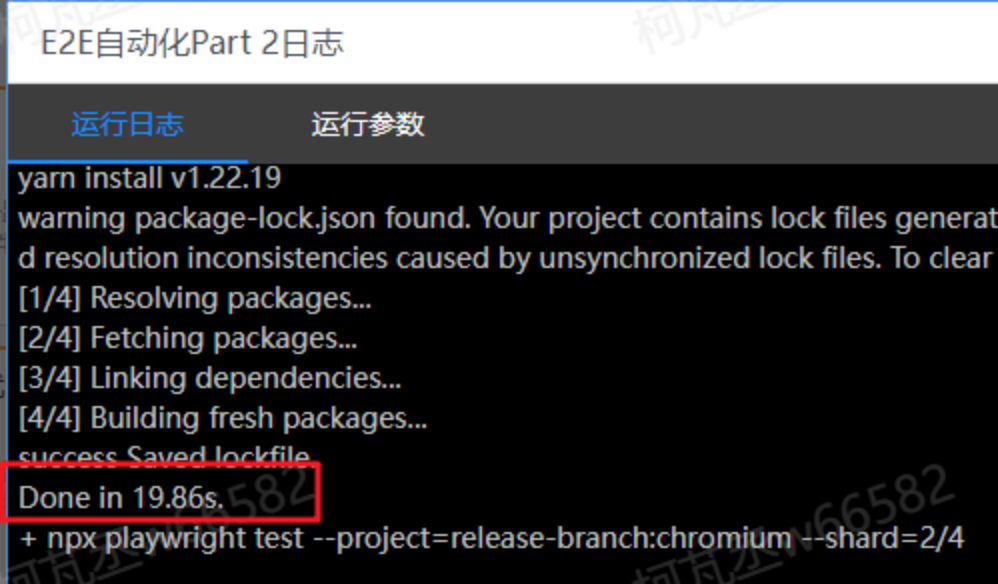
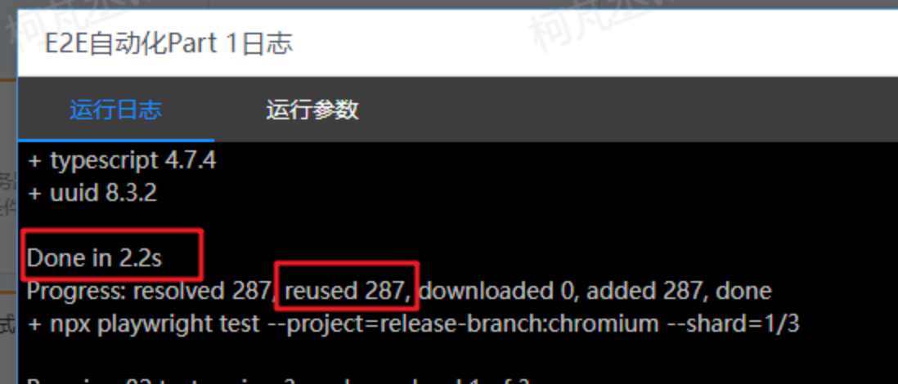

# 包管理器迁移：从 Yarn 到 Pnpm

关于软件包的管理工具，大家比较熟知的是 `npm` 和 `Yarn`，在自动化测试的代码中，使用的也一直是 yarn 作为包管理工具，今天给大家介绍一个新的包管理工具 [pnpm](https://pnpm.io/)。

## pnpm 是什么？

> 节约磁盘空间并提升安装速度

`pnpm` 代表 `performant npm`（高性能的 npm），同 `npm` 和 `Yarn`，都属于 `Javascript` 包管理安装工具，它较 `npm` 和 `Yarn` 在性能上得到很大提升，被称为**快速的，节省磁盘空间的包管理工具**。

当使用 `npm` 或 `Yarn` 时，如果你有 100 个项目使用了某个依赖（dependency），就会有 100 份该依赖的副本保存在硬盘上，而在使用 `pnpm` 时，依赖会被存储在内容可寻址的存储中，所以：

1. 如果你用到了某依赖项的不同版本，只会将不同版本间有差异的文件添加到仓库。 例如，如果某个包有 100 个文件，而它的新版本只改变了其中 1 个文件。那么 `pnpm update` 时只会向存储中心额外添加 1 个新文件，而不会因为仅仅一个文件的改变复制整新版本包的内容。
2. 所有文件都会存储在硬盘上的某一位置。 当软件包被安装时，包里的文件会硬链接到这一位置上对应的文件，而不会占用额外的磁盘空间。 这允许你跨项目地共享同一版本的依赖。

因此，您在磁盘上节省了大量空间，这与项目和依赖项的数量成正比，并且安装速度要快得多！

pnpm 主要通过软 + 硬链接和分别从依赖复用和依赖结构对 yarn 和 npm 形成降维打击。

## 到底有多快？

### 用 yarn 安装依赖

> **用 yarn 做包管理器需要安装 n 份一模一样的依赖在磁盘上，每一个任务都需要占用 10.x~19.x 秒来安装依赖**

### 用 pnpm 安装依赖

> **用 pnpm 可以很好的复用其他任务下载的依赖，只要有一个任务下载完成了依赖（7 秒左右），其余任务只需要用 2.x 秒的时间即可完成依赖的复用和链接。是的，从流水线的对比来看就算没有依赖复用的优势 pnpm 的安装速度也比 yarn 快了 50% 以上**

## 怎么切换到 pnpm？

1. 全局安装 pnpm    `npm install -g pnpm@latest`
2. 设置镜像源  `pnpm config set registry http://npm.uedc.sangfor.com.cn/ `
3. 进入 e2e-test/目录下，删除旧的用 yarn 安装的依赖
   `rm -rf node_modules`
4. 使用 pnpm 安装新的依赖
   `pnpm install`

## 备注

第一次运行 pnpm 可能会慢一些，pnpm 会花时间创建一个公共目录 store，并将所有依赖的指定版本安装在公共目录 store 中。

如果某个依赖在 store 目录中存在了话，那么就会直接从 store 目录里面使用 硬链接 关联依赖，避免了二次安装带来的时间消耗，如果依赖在 store 目录里面不存在的话，就会去下载一次。

也就是说，使用 pnpm 的时间越长，公共目录下的包越多，安装速度会越快。
