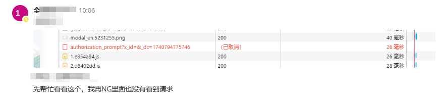

# 前端路由守卫与异步请求的竞态问题

## 背景介绍

### 业务场景

在开发企业级 Web 平台时，通常需要实现严格的授权控制。在我们的 MSS-Portal 项目中，有这样一个典型场景：

### 功能需求

1. **授权检查**：用户访问平台时，调用 `check_agree` 接口验证授权状态
2. **区域化处理**：

   - 国内用户：展示授权协议 HTML 内容
   - 海外用户：展示服务经理信息，提醒邮件激活
3. **实现方式**：所有检查逻辑在路由守卫中完成

## 问题分析

### 问题现象

在开发过程中发现，授权检查请求总是被意外中断，具体表现为：

1. F12 开发者工具显示请求被取消
2. 后端 Nginx 未记录到请求日志
3. 控制台报错："Request cancelled due to route jump"



### 问题定位

通过在 axios 拦截器中添加日志，定位到关键代码：

```typescript
// 路由守卫代码
if (!store?.state?.auth?.isAgreedAgreement) {
  customerPerimissiomShowDialog(); // async 函数但未使用 await
}

// axios 配置
if (!GLOBAL_AJAX_URL.includes(config.url || '')) {
  // 请求被配置了中断处理
  config.cancelToken = new Axios.CancelToken((cancel: Canceler) => {});
}

// 授权弹窗的调用实现
export async function customerPerimissiomShowDialog() {
}
```

## 技术原理深入解析

### JavaScript 事件循环机制

```javascript
// 执行顺序示意
async function routerGuard(to, from, next) {
  console.log('1. 进入守卫'); // 同步代码
  if (!isAuthorized) {
    console.log('2. 检查授权'); // 同步代码
    customerPerimissiomShowDialog(); // 异步操作
    console.log('3. 发起请求'); // 同步代码
  }
  console.log('4. 继续路由'); // 同步代码
  next(); // 触发路由跳转
  // 5. 此时异步请求才开始执行，但路由已改变
}
```

### 事件循环中的任务优先级

1. **同步任务**：直接在主线程执行
2. **微任务(Microtasks)**：

   - Promise 回调
   - Process.nextTick
   - MutationObserver
3. **宏任务(Macrotasks)**：

   - setTimeout/setInterval
   - requestAnimationFrame
   - I/O 操作

## 解决方案

1. 使用 await 控制执行顺序

```javascript
if (!store?.state?.auth?.isAgreedAgreement) {
  await customerPerimissiomShowDialog(); // async 函数但未使用 await
}
```

1. 请求白名单配置

```javascript
// axios.config.ts
const GLOBAL_AJAX_URL = [
  '/api/v1/auth/check_agree',
  '/api/v1/auth/agreement_content',
  '/api/v1/auth/manager_info'
];

// axios 拦截器
axios.interceptors.request.use(config => {
  if (!GLOBAL_AJAX_URL.includes(config.url || '')) {
    const source = axios.CancelToken.source();
    config.cancelToken = source.token;
    // 存储取消令牌
    store.commit('addCancelToken', { url: config.url, token: source });
  }
  return config;
});
```

1. 独立 Axios 实例

```javascript
// auth.axios.ts
export const authAxios = axios.create({
  baseURL: process.env.VUE_APP_AUTH_API,
  timeout: 10000,
  headers: {
    'Content-Type': 'application/json'
  }
});

// 不添加取消令牌的拦截器
authAxios.interceptors.request.use(config => {
  // 仅添加认证等基础配置
  return config;
});
```

## 经验总结

1. **异步控制**

   - 在路由守卫中使用异步操作时，必须使用 await 等待完成
   - 理解 JavaScript 事件循环机制对于处理异步问题至关重要
2. **请求管理**

   - 合理使用请求取消机制，避免无效请求
   - 对关键请求实现白名单保护
   - 考虑使用独立的请求实例处理特殊场景
3. **性能优化**

   - 实现合理的缓存策略
   - 使用请求防抖避免重复请求
   - 适当预加载提升用户体验
4. **错误处理**

   - 完善的错误处理机制
   - 降级策略的实现
   - 用户友好的错误提示

这个案例很好地展示了前端异步编程中的常见陷阱，以及如何通过合理的编程实践来避免这些问题。在实际开发中，我们要始终记住 JavaScript 的异步特性，合理使用 async/await，这样才能写出更可靠的代码。
