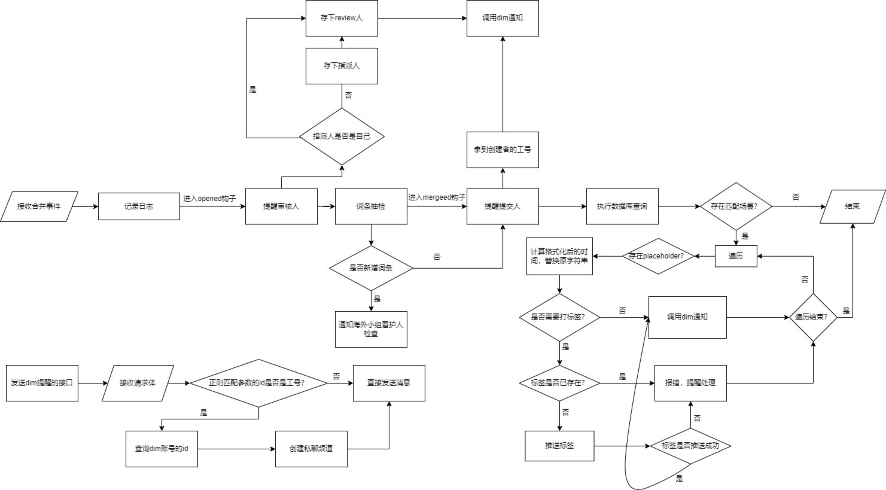
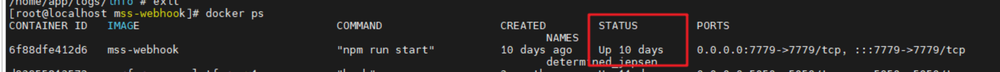
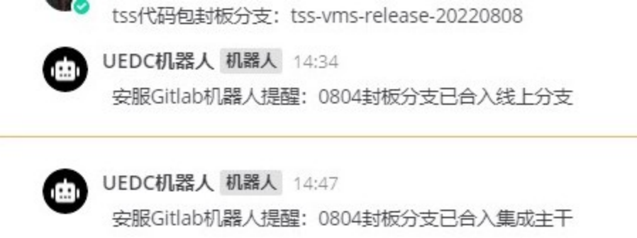
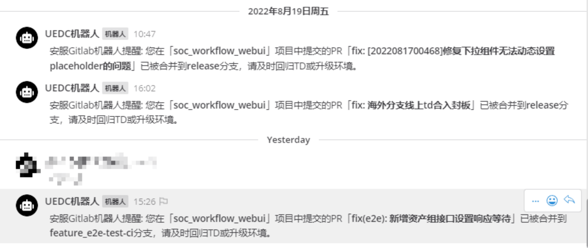
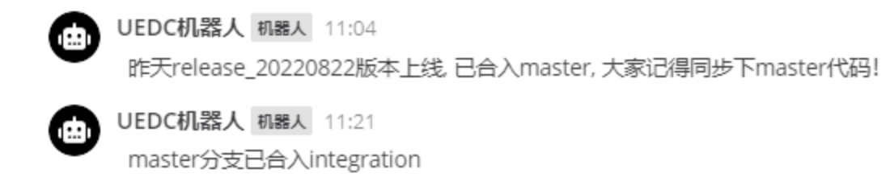
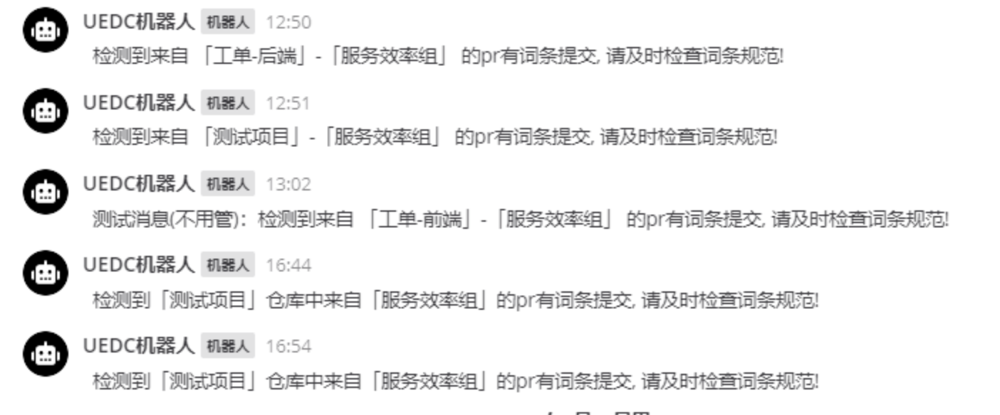
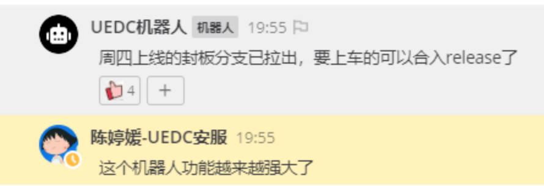
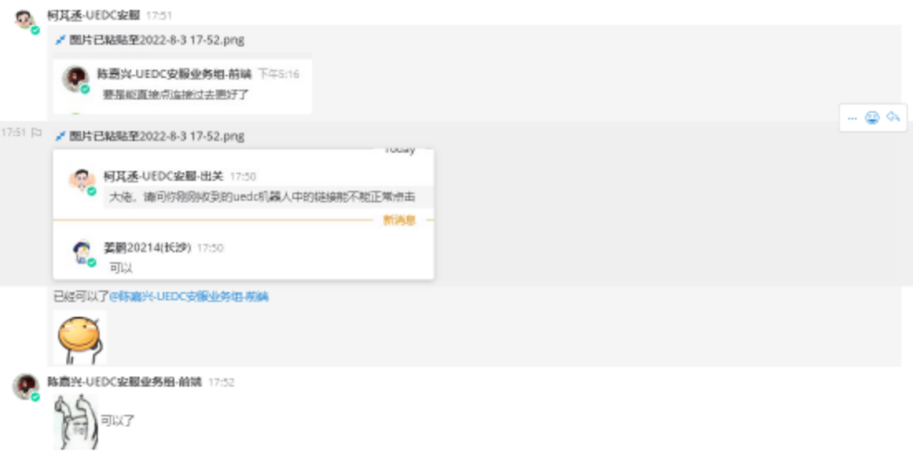

# 基于 Nestjs 和 TypeORM 的自动化机器人方案

## 一、概述及背景

项目起初源于我在安服小组群看到刘苏每次上线后都要合并代码，并进行人工通知，偶然间想到能不能用自动化的方式代替人工实现这个事情，于是查阅了 mattermost 和 gitlab 的文档以后，基于 express 实现了一个自动通知机器人的 demo 版本。由于是 demo 版本所以代码当时写的不便于维护，只能为安服小组带来便利，没有考虑到拓展性。和组长沟通过之后决定做成一个公共的项目开放给全体同学们使用，经过了技术预研之后，选用 **Nestjs 框架** 开始对项目进行重构，并使用 TypeORM 操作 mysql 数据库，通过数据库的持久化存储来提升数据的稳定性，同时也给更多的小组和产品线带来便利。

[自动化机器人项目重构 - 技术预研](https://docs.atrust.sangfor.com/pages/viewpage.action?pageId=208335773)

## 二、痛点

以下是之前在日常开发和协作中识别出来的一些痛点

1. 每一次发版上线后都需要 【负责人】在群聊中人工通知大家合代码，并在封板群中发出代码已合入的提醒，用于前后端同步消息后升级环境。
2. 在合并了上线代码后，【负责人】需要手动设置 tag，并推送到仓库，作为一次版本号的记录。
3. 版本号基于发版时间，而发版时间是不固定的，除了每周四以外周一也有可能发版，【负责人】在手动设置 tag 的时候可能存在输错的情况，耗时耗力。
4. 在开发流程中，开发人员经常需要手动将 PR 的链接发送给主程序员，提醒主程序员审核。
5. 在开发流程中，主程序员合并了 PR 以后，往往是人工通知开发人员已合并，如果因为工作忙而忘记通知了就会造成开发人员不知道 PR 合并状态从而及时回归自己的 TD 等情况。
6. 国际化流程规范从 7 月份刚开始在 mss 国内小组落地，出现过“机翻”、“词条命名不规范”等情况，保障国内的国际化质量和规范是海外小组成员需要重点关注的事情，然而国内小组的代码合入对于海外小组成员往往是无感知的事情，不能做到及时检验，会导致翻译平台没有识别到新增的词条从而在海外平台出现中文的情况。
7. 安服小组目前在大力推行 e2e 自动化测试，并已经设置了相应的流水线，流水线的用例执行情况对于每个人来说都是很模糊的，没有人会天天盯着流水线的任务运行情况，但是国内小组可能改了代码从而导致用例执行失败，需要及时的由对应的看护人修改用例的代码，保障自动化测试用例的运行成功率。

## 三、解决方案

针对以上痛点，该项目目前已开发了 7 个功能模块，每个痛点都有对应的解决方案。

1. 上线提醒：每一次发版上线之后，主程序员合并完代码，都会向**封板确认群**推送 **xxxx 封板已合入 xxx 分支的消息**。
2. 推送版本号到仓库：每一次发版上线，都会向仓库推送当前上线的版本
3. 动态计算时间：在推送标签或者推送消息的时候，会根据预设的时间格式化规则，来生成具体的时间，支持偏移量计算，前后推 x 月 x 日 x 时 x 分等等。比如：当天的日期、昨天的日期，20220811、0814 等等
4. 代码 review 的提醒：创建一个 PR 以后会对 PR 的指派人和需要的 review 人发起提醒，并附上 PR 的地址
5. PR 合并提醒：当创建者的 PR 被指派人点击合并以后会触发提醒，回归 TD 和升级环境
6. 抽检词条提醒：当国内小组创建了新增词条的 PR，会触发提醒通知国际化小组对应看护人去检查词条命名规范，是否有机翻，漏翻译中文等等。
7. 发送 dim 提醒的接口：暴露了一个发送提醒的接口，可以以 UEDC 机器人的账号像任何群组、频道、个人发送提醒。通过脚本将自动化用例执行情况发送到对应的群聊，提醒相关人员及时修复和闭环，起到了一定程度的保障质量的作用。

具体文档记录地址：[mss-webhook 已实现功能整理](https://docs.atrust.sangfor.com/pages/viewpage.action?pageId=217726631)

## 四、实现思路

## 五、落地效果

### 目前已接入的仓库：

1. ngsoc 前端
2. soc 前端
3. soc 后端
4. sdsp 前端

### 运行情况

目前稳定接收 PR 并处理 320+ 条/每天（均值），已经通过 docker 部署在 uedc 的服务器上。部署成功后已稳定运行 10 天

#### 封板确认群：

#### 私聊：

#### 安服小组群：

#### 词条抽检：

## 六、用户反馈收集

## 七、持续维护和改进

下面是一些一些已经识别到但当前没有落实解决方案的痛点，也可以说是未来的需求。

1. 项目上线以后，第二天需要手动创建封板分支合入线上分支 && 上线分支合入集成主干的 PR
2. 每周都要人为的拉 1-2 次封板分支，每个项目都是如此，项目越多就越多这样的人工操作，能不能通过自动化的方式，来节省人工操作，尽量少关注这一块。
3. 发版成功后自动推送的 tag 只有版本号，而没有具体的版本描述信息，开发人员在有需要进行版本回溯或者查代码的时候，不知道自己的代码是在哪一个版本上线的
4. PR 填写不规范的问题，能否通过自动化去校验
5. 经常见到有的人提交的 PR 以后，流水线没有通过，但是也没有及时的去修复，一直挂在那里，提了 PR 以后流水线执行失败了自己都不知道。
6. 扫描分支落后情况，有的人很早拉出了开发分支到本地，合入的时候发现已经落后了特性分支或封板分支几十个提交，这不符合流程规范，应该经过 rebase 以后合入主线
7. 当前的 mss-webhook 出于稳定性和可维护性的考虑将一些分支的参数放在了 mysql 中，这需要手动去插入数据，对于产品线接入显得有一些不方便，需要简化这个流程

具体文档记录在：[mss-webhook 需求记录和可行性分析](https://docs.atrust.sangfor.com/pages/viewpage.action?pageId=217719100)
