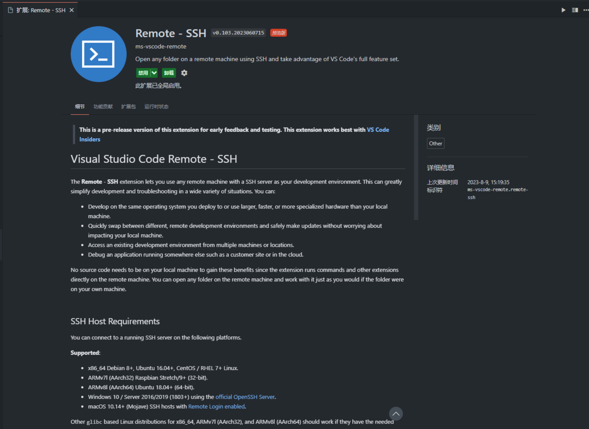
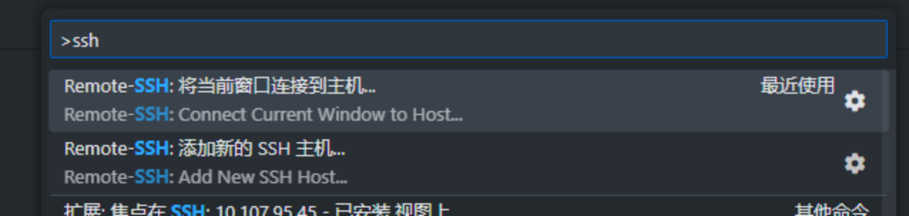
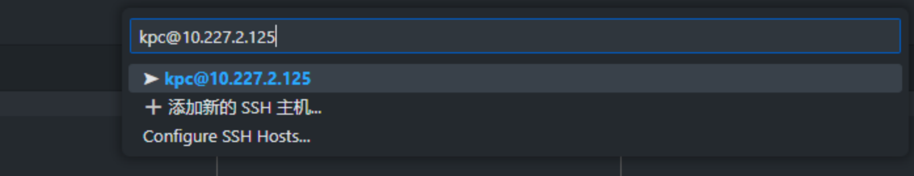
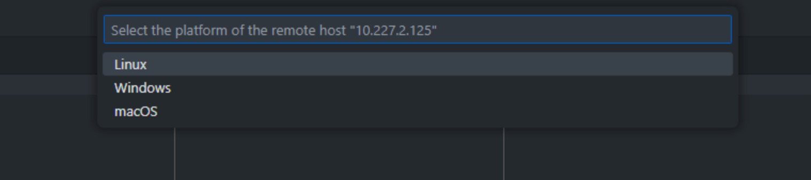
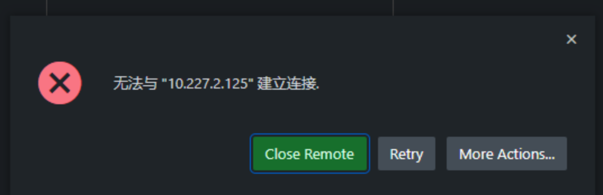
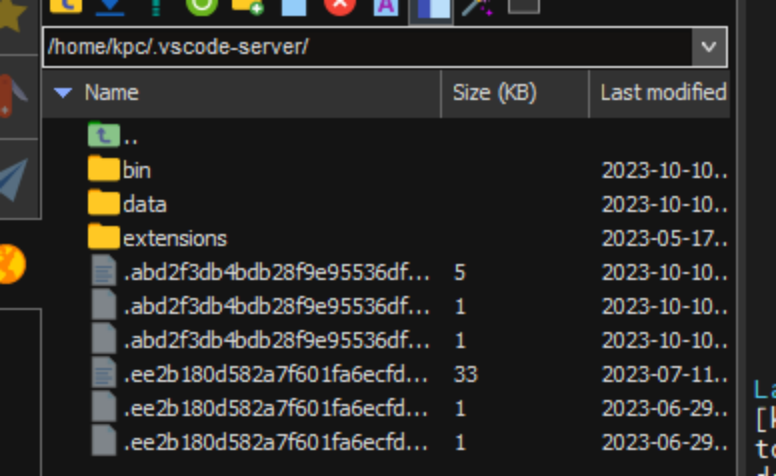
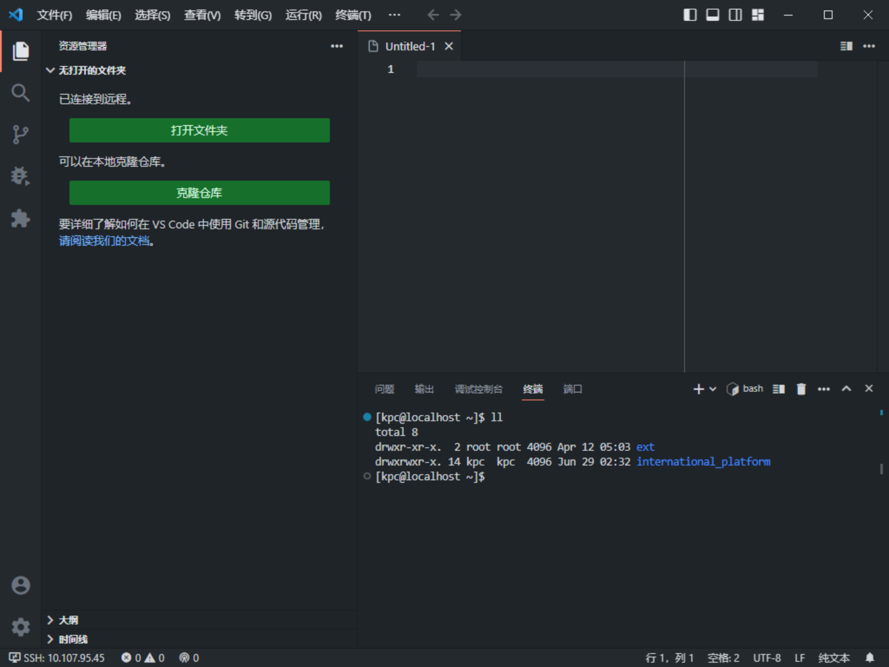
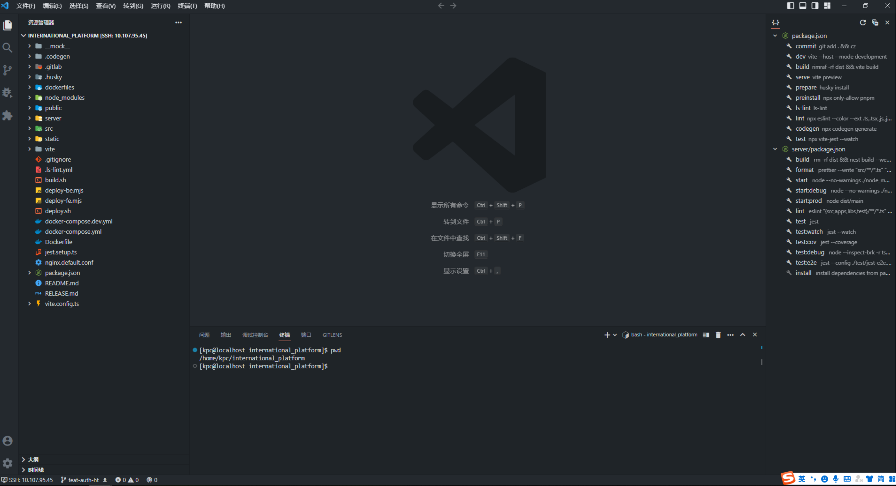

# 使用服务器进行开发-认识 RemoteSSH

### 介绍

RemoteSSH 是 vscode 提供的一款插件，作用是让本地的编辑器，访问某台服务器上的代码仓库，进行编码、调试、代码提交等操作。

如果你拥有一台个人服务器，就可以放心的使用服务器进行编码、调试，不管换几台电脑，都能保证开发环境不受影响。node、git、包括 vscode 扩展都是安装在服务端的，本地端只起到编辑的作用，十分方便。

有人可能好奇这个相比本地开发有什么优势呢。。。其实还是看具体开发的是什么东西，如果只是前端画画页面的工作，可能本地开发更方便。

但是当你开发的是一个 Node 服务，或者是一个全栈项目，需要依赖 mysql、MongoDB、redis 等应用，使用 windows 操作系统去配置本地环境是比较麻烦的一件事情（涉及到数据库版本、建表导数据、windows 装 docker 很麻烦等等问题。。。）

这时候通过 RemoteSSH 插件使用服务器来进行远程开发的优势就会很明显。直接在服务器上装好对应的依赖，再拉取仓库进行开发，开发以后也可以在本地直接通过浏览器输入 ip 访问环境、实时编译，并且远程开发会本地物理机的性能要求很低。

它的厉害之处是在于一台服务器可以给很多人使用，每个人都可以使用 RemoteSSH 进行连接：一套环境，N 个人开发。不需要在每个人电脑上都装一个 mysql、MongoDB、redis。。。。

如果你的工作环境会经常变、换电脑等等，那直接将代码和环境放在服务器上，不管换多少电脑只需要安装一个 vscode 就好了。。这种方式显然比本地开发更好，类似与 Docker 的 Dev Container 功能。

### 使用方法

使用方法很简单，安装插件后按下 Ctrl Shift P，输入 SSH，选择第一个

输入 用户名 @ip，回车

这时候会打开一个新的 vscode，如果弹窗问你这个服务器是什么操作系统，就选择 linux（一般 windows 和 macos 不会作为服务器，结合实际情况）

如果出现这个，说明你的服务器无法联通外网

因为使用 vscode 的 remote-ssh 的时候，会先检测服务器对应账号下是否存在 `vscode-server` 这个包

这个包包含了远程开发需要用到的东西，如果没有这个包则会发起自动下载安装，下载失败就会报错。

后续安装扩展的时候，也会自动安装在这个文件夹下面。

如果是使用公司的服务器，则需要自己手动安装下。步骤很简单，在这：[https://zhuanlan.zhihu.com/p/294933020](https://zhuanlan.zhihu.com/p/294933020)

如果是自己的服务器则不需要考虑这个问题。

当你服务器安装好环境（自动或手动都可），输入密码后，vscode 会显示已连接到远程

此时你本地的终端窗口已经可以访问到服务器上的所有内容了。直接开始克隆仓库，并进入。（我已经克隆过了）

这时候就可以开始愉快的开发了。。。

### Tips:

如果你是多人共用一台服务器，git 的 username 和 email 千万不要设置成全局的。。。。

之所以标注工程化，因为抹平开发环境的差异、降低新人配置环境成本一直是属于工程化的一个范畴。
