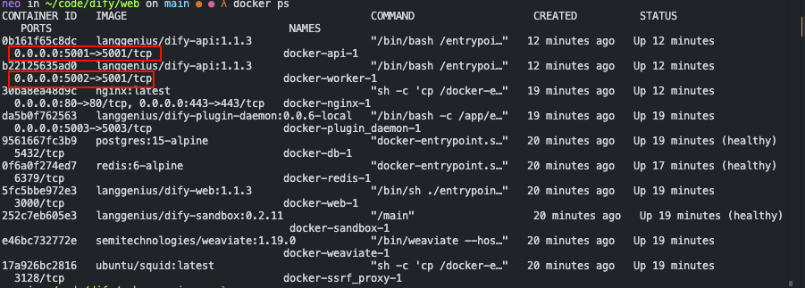

# 如何快速在本地启动 Dify Web 服务进行二次开发

## 项目介绍

Dify 是一个开源的 LLM (Large Language Model) 应用开发平台，采用前后端分离架构设计。该平台允许开发者快速构建基于大型语言模型的应用，无需复杂的底层实现。本文将为前端开发者提供在本地环境中启动 Dify Web 前端服务的详细步骤，便于二次开发和功能定制。

## 仓库架构简介

Dify 项目仓库主要由以下几个核心部分组成：

- `web`：前端代码，基于 Next.js 框架开发
- `api`：后端 API 服务，提供核心功能接口
- `worker`：处理异步任务的工作节点
- `docker`：容器化配置文件，用于快速部署服务

前端采用 Next.js + React 技术栈，使用 pnpm 作为包管理工具，依赖 Node.js 环境运行。

## 环境准备

### 必要工具

- Git：用于代码版本控制
- Node.js：推荐使用 v18 版本
- pnpm：推荐使用 v9 版本
- Docker 和 Docker Compose：用于启动后端服务

### 前端环境搭建步骤

1. **Fork 并克隆代码仓库**

```bash
git clone git@github.com:Perfecto_23/dify.git
cd dify
```

1. **配置 Node.js 环境**

切换到正确的 Node.js 版本（使用 fnm 或其他版本管理工具）

```bash
cd ./web
fnm use 18
npm i -g pnpm@9
```

1. **安装项目依赖**

```bash
pnpm i
```

1. **配置环境变量**

```bash
cp .env.local.example .env.local
```

> `.env.local` 文件包含连接后端 API 的配置项，默认指向 `http://localhost:5001`

## 启动本地服务

### 启动前端服务

1. **在 web 目录下执行启动命令**

```bash
pnpm dev
```

1. **服务启动后可通过以下地址访问：****http://localhost:3000**

### 配置后端服务（使用 Docker）

前端服务依赖后端 API，可通过 Docker 快速启动后端服务。

1. **准备 Docker 环境文件**

```bash
cd ../docker
cp .env.example .env
```

1. **修改 Docker Compose 配置**

需要映射 API 和 Worker 服务的端口到宿主机，编辑 `docker-compose.yml` 文件：

```yaml
services:
  # API service
  api:
    image: langgenius/dify-api:1.1.3
    restart: always
    ports:
      - "5001:5001"
    environment:
    # ...其他配置保持不变...

  # worker service
  worker:
    image: langgenius/dify-api:1.1.3
    restart: always
    ports:
      - "5002:5001"
    environment:
    # ...其他配置保持不变...
```

1. **启动 Docker 容器**

```bash
docker compose up -d
```

1. **验证容器启动状态**

```bash
docker ps
```



确保 `api` 容器映射了 5001 端口，`worker` 容器映射了 5002 端口。

1. **刷新浏览器访问前端**

现在可以正常访问 `http://localhost:3000` 并看到完整的 Dify 界面。

## 配置文件说明

### 前端配置文件 (.env.local)

前端的 `.env.local` 文件定义了连接后端 API 的地址和其他关键配置：

- `NEXT_PUBLIC_API_PREFIX`：API 服务地址，默认为 `http://localhost:5001`
- `NEXT_PUBLIC_PUBLIC_API_PREFIX`：公共 API 访问地址

### Docker 环境配置 (.env)

Docker 目录下的 `.env` 文件包含后端服务的配置项，包括数据库连接、第三方服务集成等信息。

## 常见问题排查

1. **前端启动成功但页面无法访问**：

   - 检查后端 API 服务是否正常启动
   - 验证 Docker 容器端口映射是否正确
   - 查看浏览器控制台是否有 API 连接错误
2. **依赖安装失败**：

   - 确认 Node.js 和 pnpm 版本正确
   - 尝试清除 pnpm 缓存：`pnpm store prune`
3. **Docker 服务启动失败**：

   - 检查端口冲突
   - 查看 Docker 日志：`docker logs docker-api-1`
   - 确认 Docker Compose 配置正确

## 总结

通过本指南，前端开发者可以快速在本地环境中启动 Dify Web 服务，便于二次开发和功能定制。完整的开发流程包括前端环境配置和后端 Docker 服务启动两个关键步骤。正确配置环境变量和端口映射是成功运行的关键。

希望本指南能帮助您顺利开始 Dify 的前端开发工作。如有更多问题，可参考 Dify 官方文档或社区资源。
