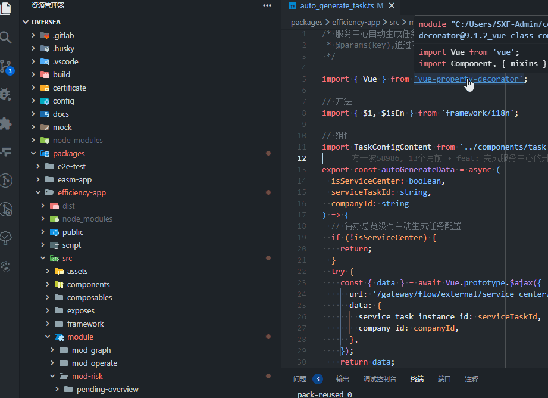

# 解决 VSCode 跳转 npm 依赖不刷新资源管理器的问题

在使用 vscode 的过程中，使用 ctrl 、command + 左键可以跳转到依赖中的源码位置，

以前这个操作会刷新资源管理器，把 node_modules 的文件目录自动展开给我们看。我们可以很方便看的 npm 包中到底有哪些文件。

就像这样：

但是从某个版本的 vscode 开始就不行了，点开 npm 包都不会展开文件树了，想看 npm 包中的其他文件都要手动去资源管理器里面一个个点开文件夹，感觉变呆了。

就像这样：

之前一直以为是 vscode 出 bug 了，这几天查了下 vscode 的官网的 updates，发现从 22 年 11 月的 1.74 版本开始多了一个配置项去控制资源管理器的自动更新，其中默认忽略了 `node_modules` 和 `browser_component`

所以如果习惯了让 npm 包自动展开的话，解决办法是在设置里搜索 `Auto Reveal`，然后删除 `**/node_modules` 即可。然后点开 npm 包的文件时资源管理器就会自动更新文件树了。
