# Mac 破解 Typora

# 一、安装

**1.首先到官网下载 Mac 版的 Typora, ****下载地址 ****：[https://typoraio.cn/](https://typoraio.cn/)**

（1）打开默认中文站

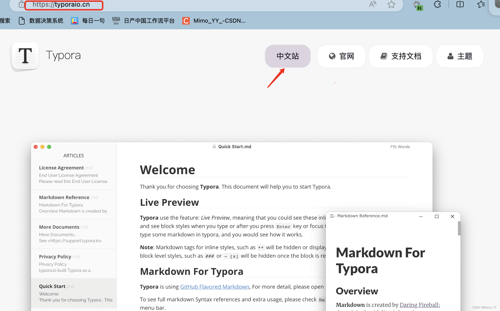

（2）往下滑，下载 Mac 版

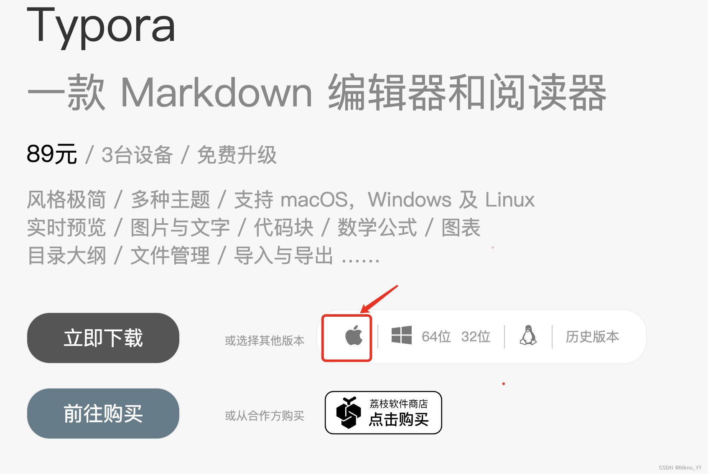

**2.下载完成后，会看到 Typora.dmg 文件，点击打开文件**

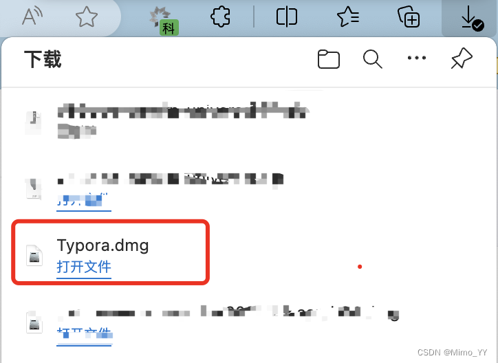

**3.打开 Typora.dmg 文件，鼠标落在左边 app 图标上，按住拖拽到右边图标，安装完成。**

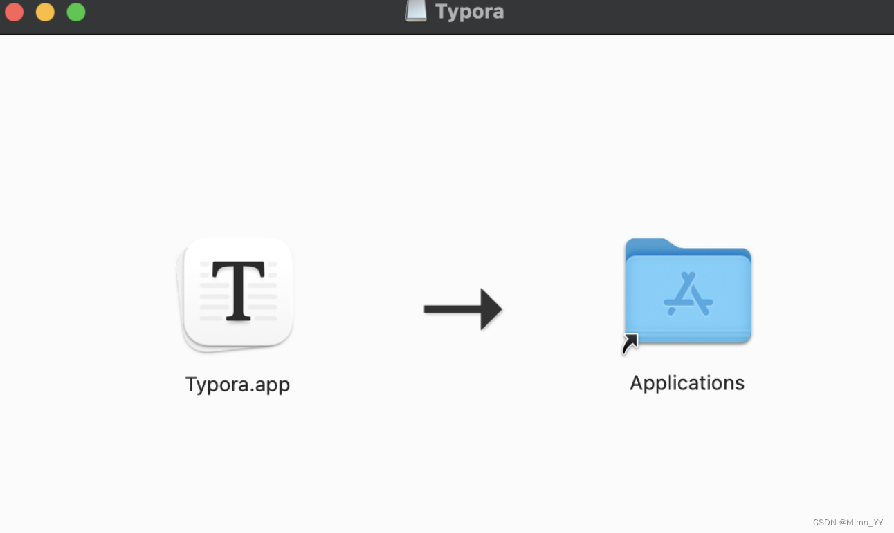

**4.打开启动台**

**，可以看到 Typora 软件已安装成功。**

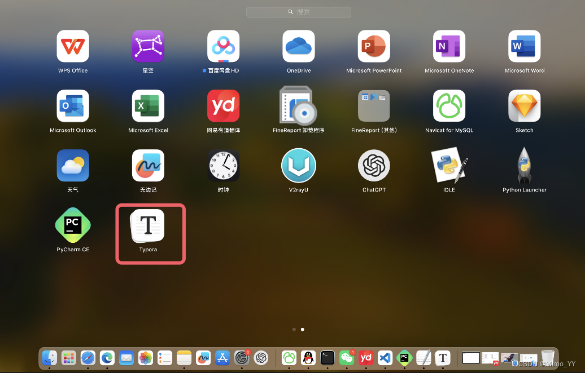

**5.点击 Typora 进入 app 的欢迎界面， 发现 未激活，只能试用 14 天 **。下面进行激活的操作。

### 二、激活

**1.打开访达**

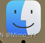

**，按快捷键 Command+Shift+G 打开搜索，**

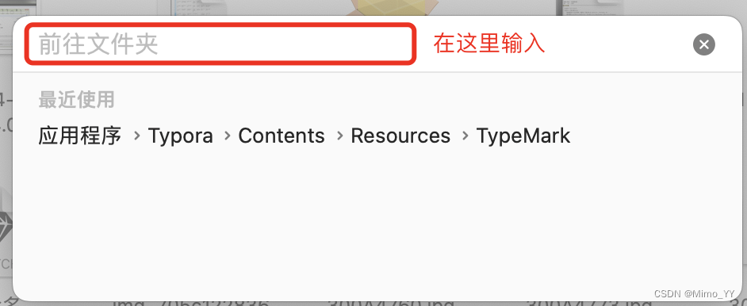

**2.在上图红框内输入 **`/Applications/Typora.app/Contents/Resources/TypeMark`
**点击回车，快速进入目录。**

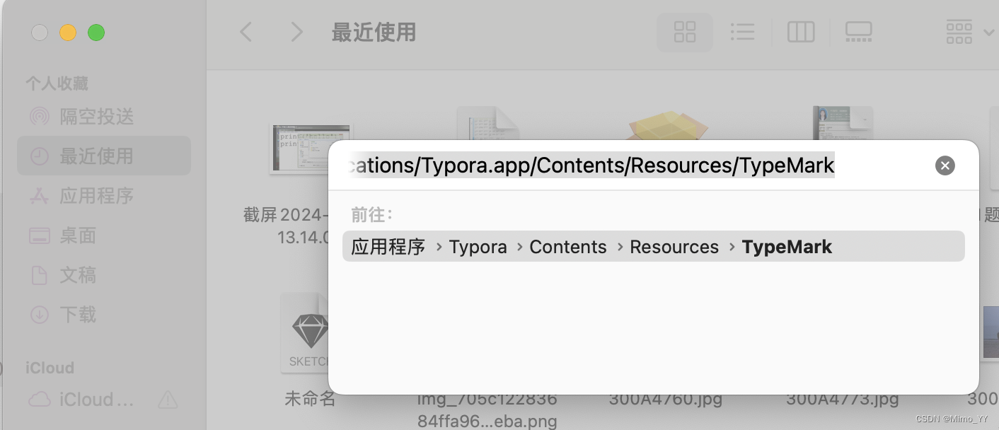

此时会看到搜索结果有很多，选第一个即可;

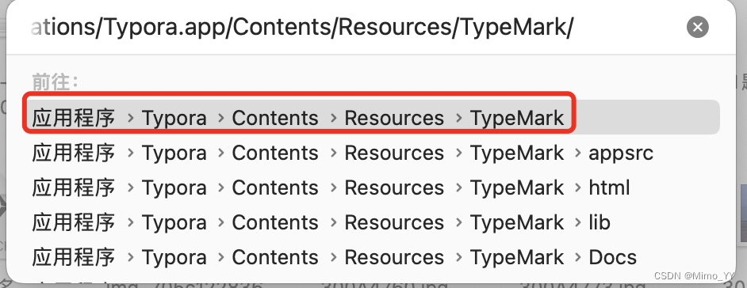

**3.选中后点击回车，跳转到该文件夹下；**
**打开文件：page-dist 文件夹–>static–>js–>LicenseIndex.开头的文件**

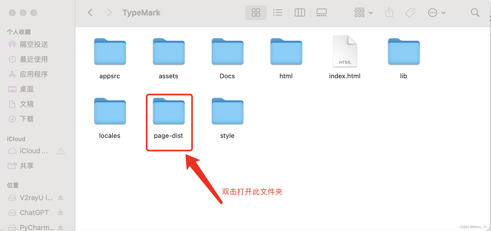

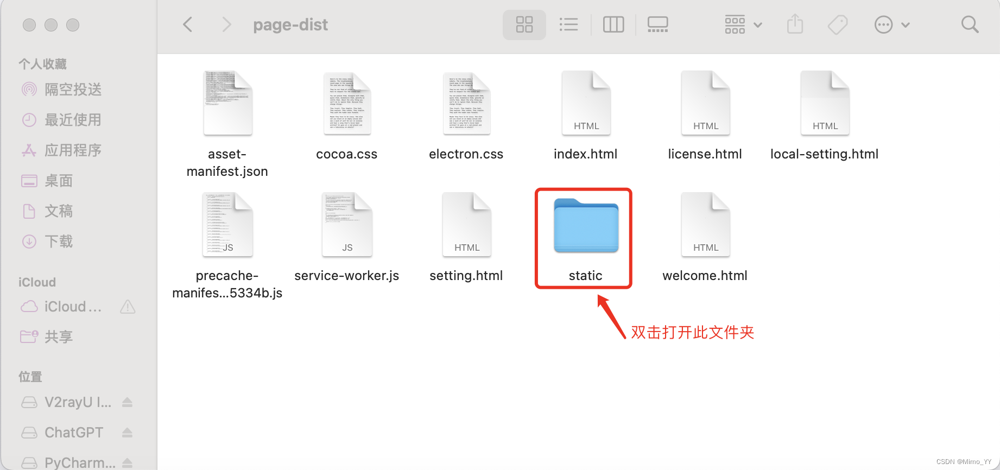

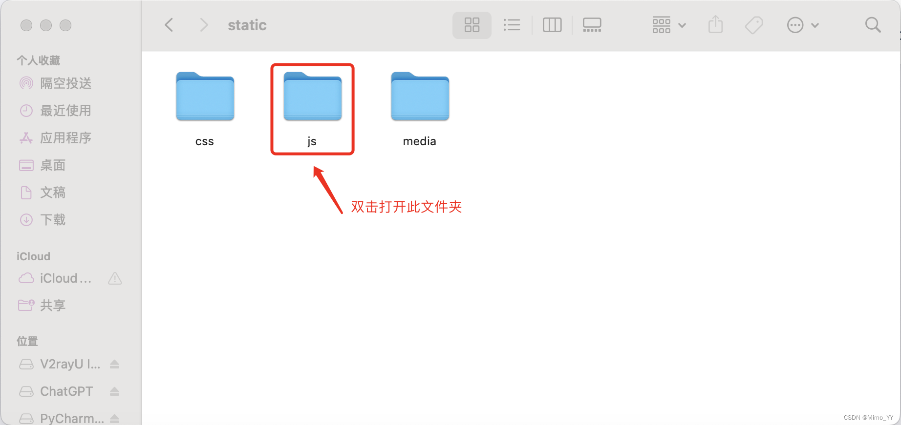

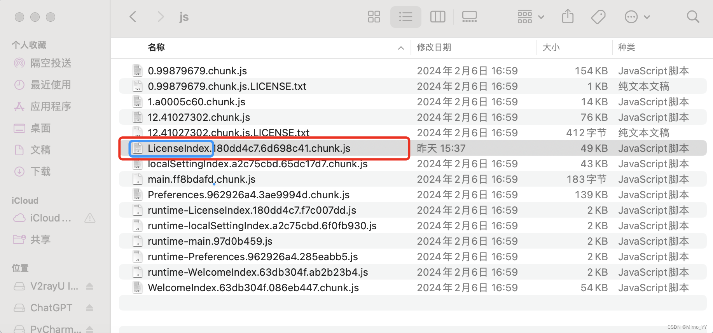

**4.选中该文件后右键（Mac 的右键：control+ 鼠标单击）–> 打开方式–> 用「文本编辑」打开**

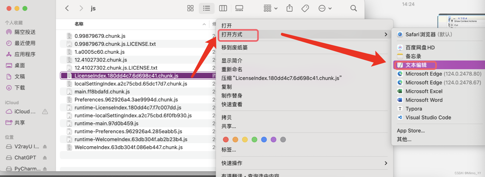

**5.打开后，点击顶部菜单栏「编辑」–>「查找」–>「查找」，进行搜索；**
搜索： `hasActivated="true"==e.hasActivated` ,
并将这段替换为 `hasActivated="true"=="true"` 。

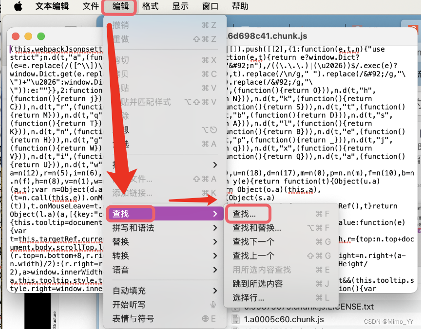

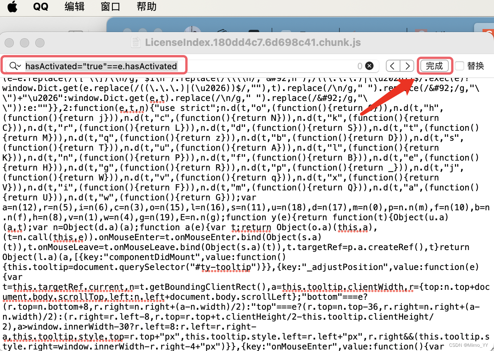

**6.替换后，参考黄色高亮部分，保存该文件，即可。**

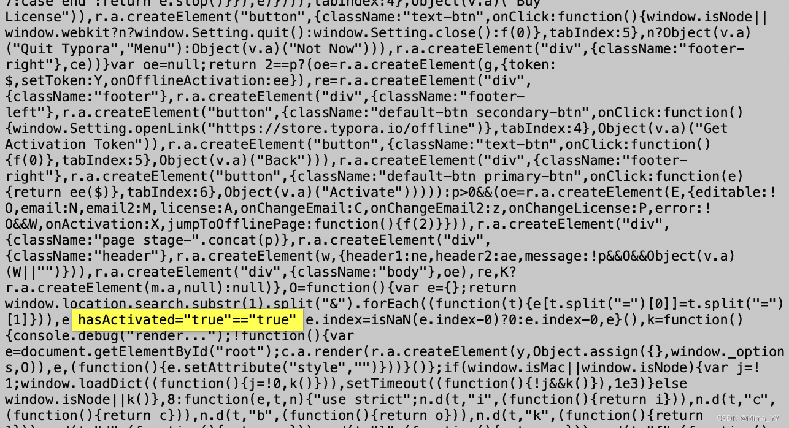

**7.保存后，重新打开 Typora 软件，欢迎界面撒花 🎉🎉🎉，显示已激活。okk 结束！！**

[注：参考文献：mac 安装并激活 Typora](https://www.jalen-qian.com/p/mac%E5%AE%89%E8%A3%85%E5%B9%B6%E6%BF%80%E6%B4%BBtypora/)
