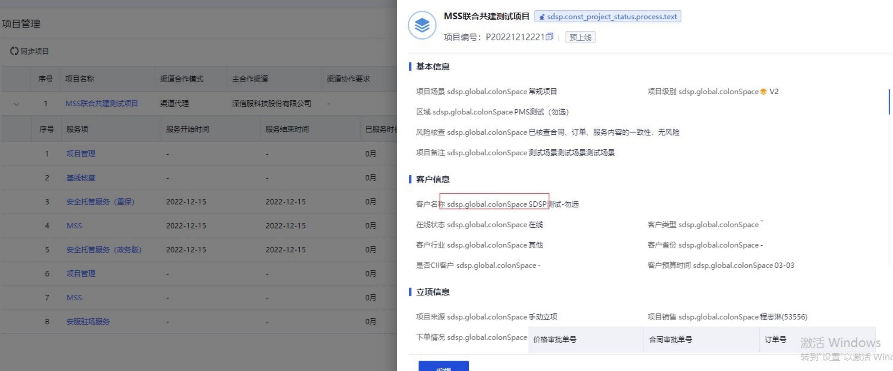
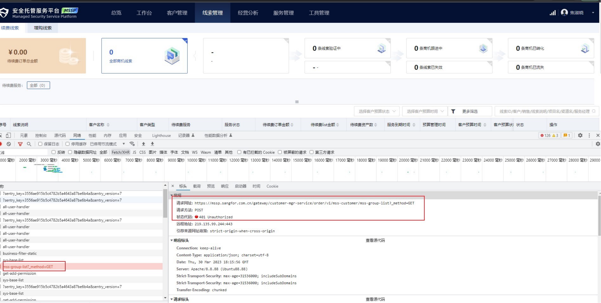
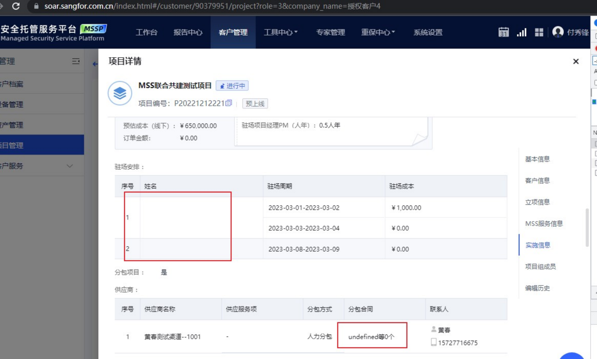
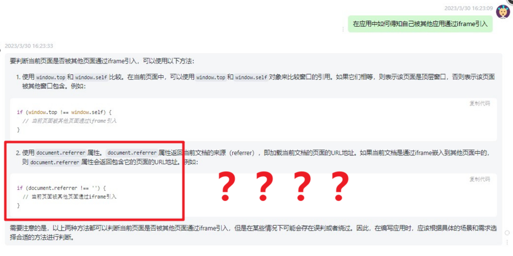
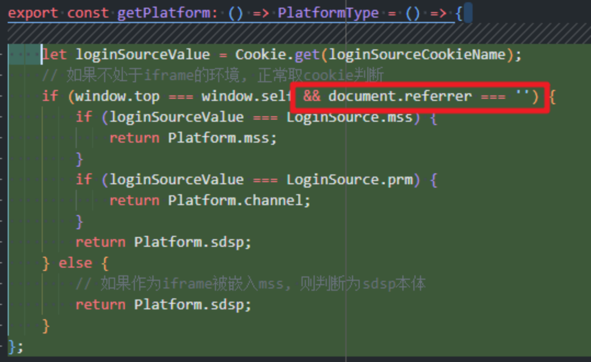
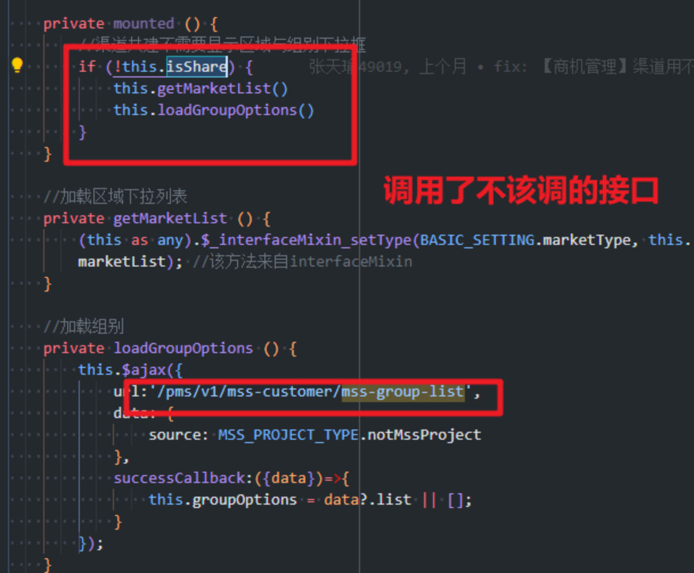
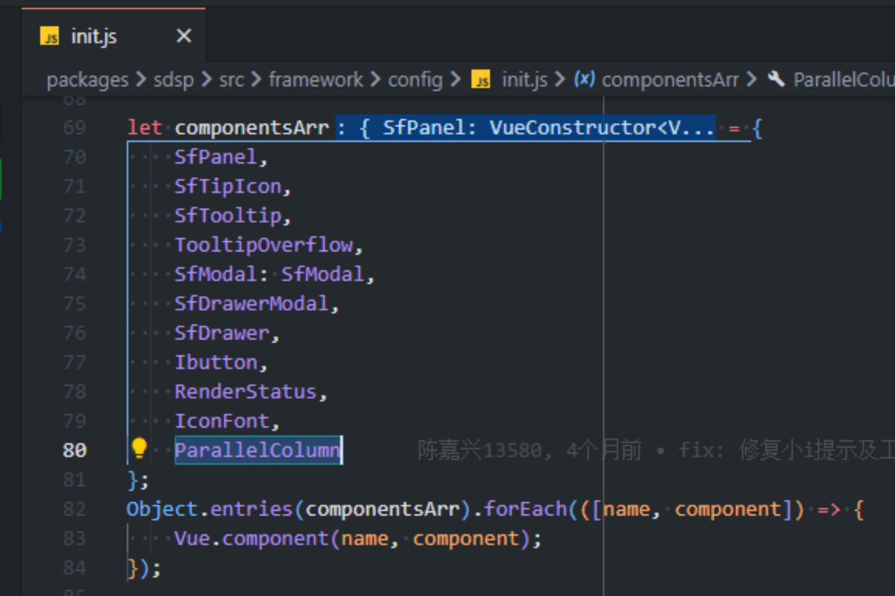
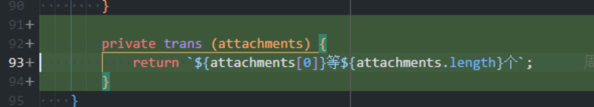
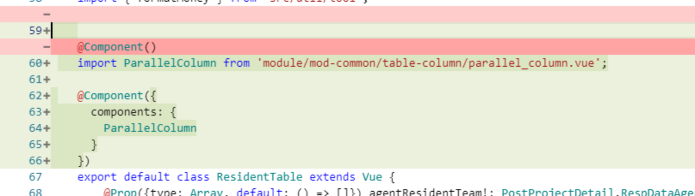
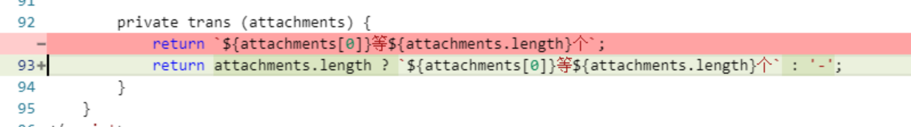

# MSSP 渠道版 23.03.30 前端线上问题排查记录

1. MSS 平台，客户管理，页面上复用 sdsp 的模块出现了一部分 key，国际化加载问题

1. 渠道平台调用了不该调用的接口，出了一堆报错

1. MSS 平台项目详情展示字段有问题

## 排查

1. 通过断点的方式发现是 sdsp 代码中 `getPlatform` 的逻辑出现了问题，不管什么情况下都会判断成 `sdsp本体`，导致渠道平台和 MSS 平台复用模块联邦的时候出现了问题。之所以出现问题是因为 ChatGPT 告诉我可以用 `document.referrer` 是否为空字符串来判断当前是否处于 iframe 下。

导致我写下了这样的代码

因为当 sdsp 单独运行的时候，不能去请求 mss 的 remoteEntry，需要运用自身的国际化方法，当 sdsp 作为 iframe 内嵌在 mss 中的时候，也要当做它是独立运行的才行。但是当它被渠道平台和 MSS 平台复用的时候，要请求 MSS 基座的 remoteEntry，否则无法复用相同的国际化函数。

正是因为写下了这个 `document.referrer` 的判断，导致它无论何时都能获取当前的域名 url，不为空然后返回 `Platform.sdsp`，所以所有平台相关的判断都失效了，导致一部分 sdsp 的词条的缺失。

1. 由于 `getPlatform` 不能返回正确的平台，所以导致组件中的一些判断逻辑也出现了异常比如

1. SDSP 单独运行的时候在全局挂载了 ParallelColumn 这个组件，但是 MSS 复用 SDSP 的时候并没有走这个 init.js，也没有这个全局挂载的组件，最终导致渲染不出来。

1. 没有判断后端接口返回空数组的情况，前端直接取【0】会得到 undefined

## 解决

1. 移除 `document.referrer` 的判断，返回正确的当前平台，词条得以正常加载，不会请求多余接口
2. 在 MSS 复用的地方单独引入一遍 SDSP 全局挂载的组件，得以正常渲染

1. 判断空数组，不展示 undefined，展示为中划线的占位符

