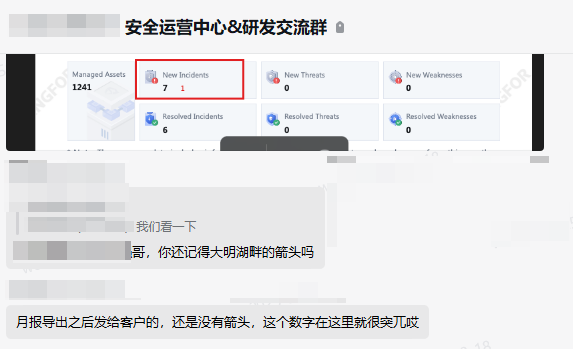
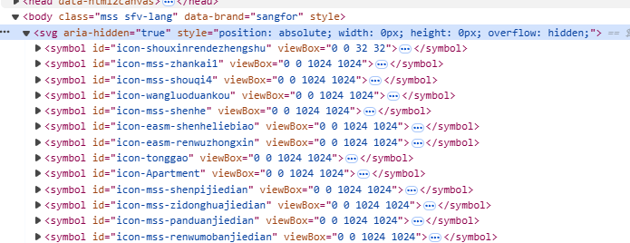
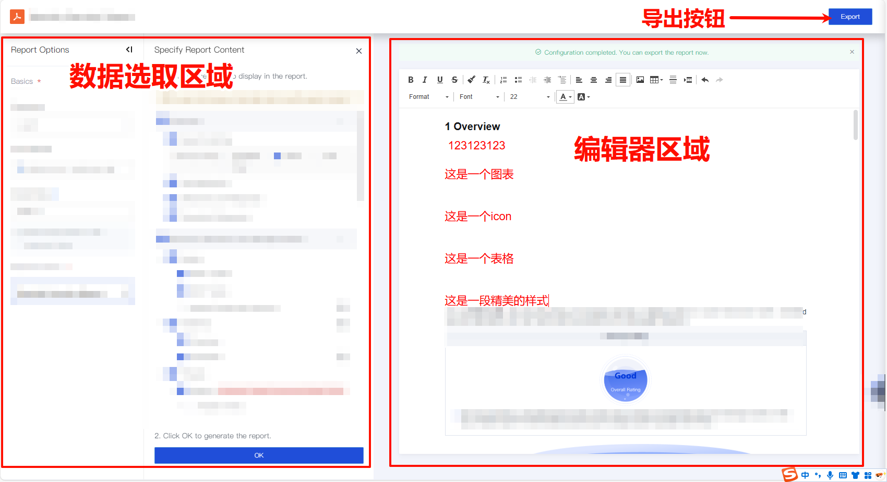
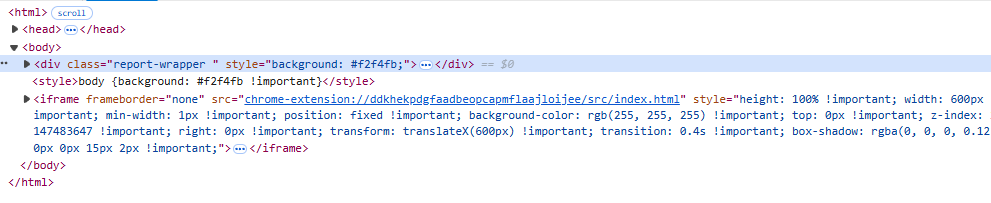
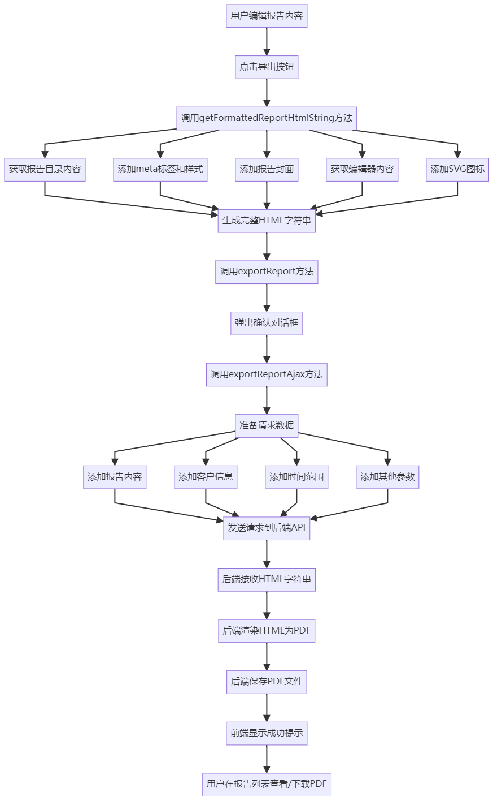
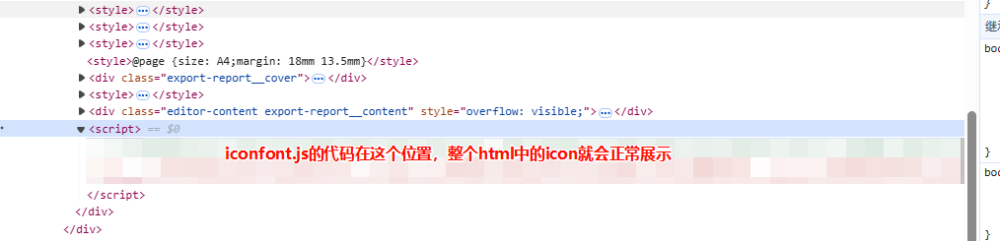
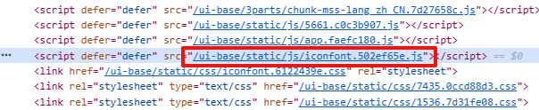
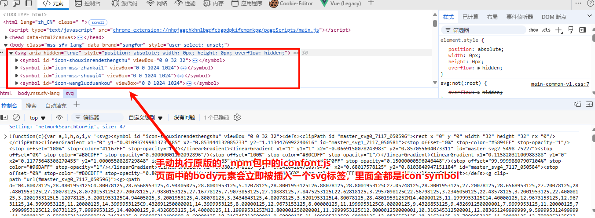
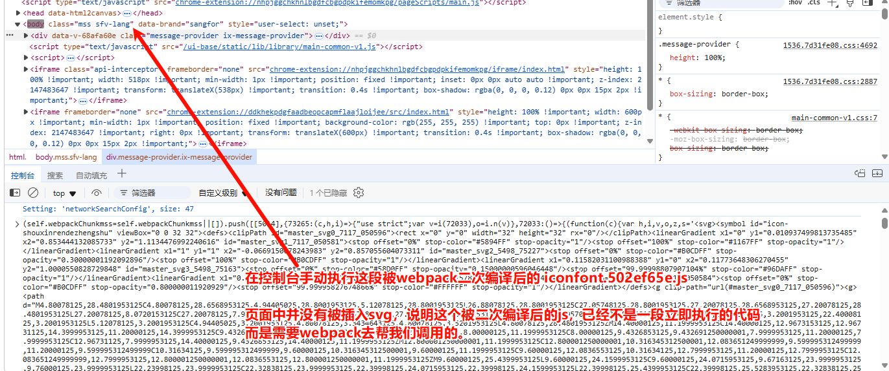

# 深度排查：iconfont 引入方式变更引发的 PDF 报告图标消失案例分析

# 背景：报告中心导出的 PDF 中图标消失问题

在软件开发中，即使是微小的技术栈变更也可能导致意想不到的连锁反应。24 年年底的时候，在安全运营平台项目中，有同事将 iconfont 引入方式从阿里巴巴 iconfont 平台切换为内部 npm 包后，报告中心的图标渲染功能突然失效，而这个问题在上线后两个月才被用户发现并报告。



这次改动看似微不足道：

```javascript
// 改动前：通过外部脚本引用
<script defer="defer" src="//hostname/static/js/iconfont.js"></script>

// 改动后：通过npm包引入
import 'node_modules/@xx/xxx/svg_symbol/iconfont.js';
```

但就是这个看似无害的变更，导致了报告导出功能中所有图标的消失。下面我将详细分析问题的根源和解决思路。

# 深入分析：两种 iconfont 加载方式的本质区别

首先，让我理解这两种加载方式的共同点：不管是外部脚本还是 npm 包引入，它们最终目的都是向 DOM 中注入 SVG 图标定义，以此来启用通过 Svg Symbol 使用 icon 图标的功能。



## 报告导出的工作原理

要理解问题所在，我们需要先了解从报告编辑，到报告导出功能的完整实现流程。

首先用户会在报告编辑页面，选取数据并人工编辑这份报告，至于报告编辑器的实现，这里暂且省略不谈。

然后，用户需要点击导出按钮，导出这个报告。



报告生成的方案是前端 + 后端共同实现的，前端会将编辑器中的所有 html+css 样式导出为一个长长的 HTML 字符串，通过接口发给后端。这个 html 字符串长这样，可以直接通过浏览器渲染：



后端会在服务端运行脚本，把接收到的 html 渲染成一个 pdf 报告并命名好存在服务器上，然后用户就可以在报告管理的列表自动刷新中，预览和下载自己刚刚导出的报告。流程图如下：



```markdown
```marmaid
graph TD
    A[用户编辑报告内容] --> B[点击导出按钮]
    B --> C[调用getFormattedReportHtmlString方法]
    C --> C1[获取报告目录内容]
    C --> C2[添加meta标签和样式]
    C --> C3[添加报告封面]
    C --> C4[获取编辑器内容]
    C --> C5[添加SVG图标]

    C1 --> D[生成完整HTML字符串]
    C2 --> D
    C3 --> D
    C4 --> D
    C5 --> D

    D --> E[调用exportReport方法]
    E --> F[弹出确认对话框]
    F --> G[调用exportReportAjax方法]

    G --> H[准备请求数据]
    H --> H1[添加报告内容]
    H --> H2[添加客户信息]
    H --> H3[添加时间范围]
    H --> H4[添加其他参数]

    H1 --> I[发送请求到后端API]
    H2 --> I
    H3 --> I
    H4 --> I

    I --> J[后端接收HTML字符串]
    J --> K[后端渲染HTML为PDF]
    K --> L[后端保存PDF文件]
    L --> M[前端显示成功提示]
    M --> N[用户在报告列表查看/下载PDF]
```

```

这个流程中最关键的部分是第2步：为了确保导出的HTML能够独立渲染（包括图标），系统需要收集所有必要的资源并嵌入HTML字符串中。


## 原有的图标处理机制

在改动前，报告导出功能会通过以下代码处理iconfont:

```

getAddScripts() {
// 添加必要的脚本到报告中
let vm = this;
[...document.scripts].forEach((item) => {
if (item.src.includes('iconfont.js')) {
$.ajax({
url: item.src,
method: 'GET',
dataType: 'text',
success(iconfont) {
vm.addScripts += `<script>${iconfont}<\/script>`;
},
});
}
});
}

```

这段代码会在导出前遍历页面中的所有script标签，找到包含 `iconfont.js` 的脚本，获取其内容并添加到导出的HTML字符串中。




## 为什么新方案失效了？

当我们将iconfont引入方式从外部脚本改为npm包引入时，问题出现了。要理解这个问题，需要先了解Webpack5是如何处理这种导入的。

### Webpack5对依赖的处理机制

假设项目入口文件有：

```

import 'node_modules/@xx/xxx/svg_symbol/iconfont.js'; // 引入图标库
import App from './App.vue';

new Vue({ render: h => h(App) }).$mount('#app');

```

```

// iconfont.js
var svgSprite = '<svg>...</svg>';
document.body.appendChild(svgSprite);

```

Webpack构建后的执行流程：

```

// Webpack 启动函数
(function(modules) {
// 模块缓存
var installedModules = {};

// require 函数定义
function __webpack_require__(moduleId) {
// 检查模块是否已加载
if(installedModules[moduleId]) {
return installedModules[moduleId].exports;
}
// 创建新模块
var module = installedModules[moduleId] = {
exports: {}
};

```
// 执行模块函数
modules[moduleId].call(
  module.exports, 
  module, 
  module.exports, 
  __webpack_require__
);

return module.exports;
```

}

// 加载入口模块
return __webpack_require__("./src/main.js");
})({
// iconfont 模块
"./node_modules/@xx/xxx/svg_symbol/iconfont.js": (function(module, exports) {
(function() {
// 实际插入 SVG 的代码
var svgSprite = '<svg>...</svg>';
document.body.appendChild(svgSprite);
})();
}),

// 入口模块
"./src/main.js": (function(module, exports, __webpack_require__) {
__webpack_require__("./node_modules/@xx/xxx/svg_symbol/iconfont.js");
var App = __webpack_require__("./src/App.vue");
new Vue({ render: h => h(App) }).$mount('#app');
})
});

```

当代码中含有 `import 'node_modules/@xx/xxx/svg_symbol/iconfont.js';` 时，Webpack5会进行以下处理：

1. **模块解析**：Webpack首先识别这是一个JavaScript模块导入，并解析其路径。

2. **文件读取与解析**：Webpack读取iconfont.js文件内容，并将其解析为抽象语法树(AST)。

3. **代码转换**：通过loader链对代码进行处理（如果配置了相关loader）。

4. **模块合并**：将处理后的代码作为一个模块，合并到Webpack的依赖图谱中。

5. **代码分割与优化**：根据配置进行代码分割、Tree Shaking等优化。

6. **资源输出**：最终将代码打包到输出文件中，通常是一个带有哈希值的JS文件，如`iconfont-f7e5d9a3.js`。

Webpack 会将 `iconfont.js` 的代码包装在一个函数中，并将其作为一个模块添加到依赖图中。这个模块只有在 Webpack 运行时环境加载到这个依赖的时候才会运行。

也就是说，当Webpack执行到`webpack_require("./node_modules/@xx/xxx/svg_symbol/iconfont.js")`时，才会调用 `iconfont` 模块，将SVG内容写入body。

Webpack 的运行时环境负责管理模块的加载、依赖关系和执行顺序。它会确保所有的依赖模块都加载完成后，再执行当前模块的代码。


### 导致问题的关键变化

这种处理方式导致了几个关键变化，直接影响了原有的图标处理机制：

1. **文件名变化**：通过import引入后，Webpack会对文件进行编译并添加哈希值，导致文件名不再包含原始的"iconfont.js"字符串。
	

2. **执行时机变化**：`iconfont.js` 不再是页面加载时立即执行，而是由 Webpack 的运行时环境控制，作为模块依赖被执行。

3. **作用域隔离**：代码被包装在Webpack的模块系统中，拥有自己的作用域，不再直接暴露在全局环境。

4. **执行顺序控制**：插入SVG的时机与模块加载顺序相关，由Webpack的依赖图谱决定，而非HTML中script标签的顺序。


### 两种引入方式的对比


下面贴上手动执行两个js的不同效果的图片

#### 静态资源引入方式：



#### 现在的import引入方式：



这些变化导致了原本用于识别和提取iconfont.js内容的代码失效，因为它依赖于在DOM中查找特定src属性的script标签，而这种标签在新的构建系统中不再存在。所以即使修改判断条件为`item.src.includes('iconfont')`，**问题仍未解决，因为即使找到了正确的脚本，其执行机制已经发生了根本变化**。


# 解决方案：直接复用DOM中的SVG元素

经过分析，我最终采用了一个更加直接高效的解决方案：既然iconfont.js的本质是向body中注入SVG元素，那么我可以直接从当前页面获取这些SVG元素，并将它们添加到导出的HTML中。

```

getIconSvgOuterHtml() {
// 从当前页面读取 SVG 图标导出
let vm = this;
const svgs = document.querySelectorAll('body > svg');

// 将所有选中的 SVG 元素的外层 HTML 转换为字符串并拼接
const svgString = Array.from(svgs)
.map((svg) => svg.outerHTML) // 获取每个 SVG 的完整 HTML 字符串
.join(''); // 用空字符串拼接
vm.iconSvgOuterHtml += svgString;
}

```

这种方案巧妙地规避了iconfont加载方式变化带来的影响，直接从运行时DOM中获取已经注入的SVG和Symbol元素，确保导出的HTML中包含所有必要的图标定义。


# 方案对比与权衡

我在解决这个问题的过程中，考虑了以下几种方案：

1. **恢复静态资源引入方式**：需要改回原先的webpack配置，比较复杂，而且可能带来缓存策略的劣化问题。

2. **修改Webpack配置**：让 `iconfont.js` 以特定方式加载，但会增加构建配置的复杂性。

3. **采用当前方案**：直接获取 DOM 中的 SVG 元素，简单直接，虽然会增加 HTML 字符串的体积，但保证了图标的正确显示。

最终我选择方案3的主要原因是它对现有系统的侵入性最小，同时也是最可靠的解决方案。


# 总结

这个看似简单的 iconfont 引入方式变更，揭示了前端构建系统、资源加载与功能实现之间的复杂关系。即使是看似简单的依赖引入方式变更，也可能对系统的某些功能产生意外影响。通过深入分析问题根源并采取适当的解决方案，修复图标渲染问题的同时，还加深了对前端资源处理机制的理解。

作为前端开发工程，我们需要深入理解不同资源加载方式（如script标签、import语句）在浏览器和构建工具中的处理差异，理解技术栈各层面的工作原理，并能灵活应对各种异常情况，是每个高级前端工程师必备的能力。

对于复杂系统的工程化变更，我们需要确保测试覆盖所有关键功能流程。希望这个案例分析能为大家处理类似问题提供有益的参考。

```
